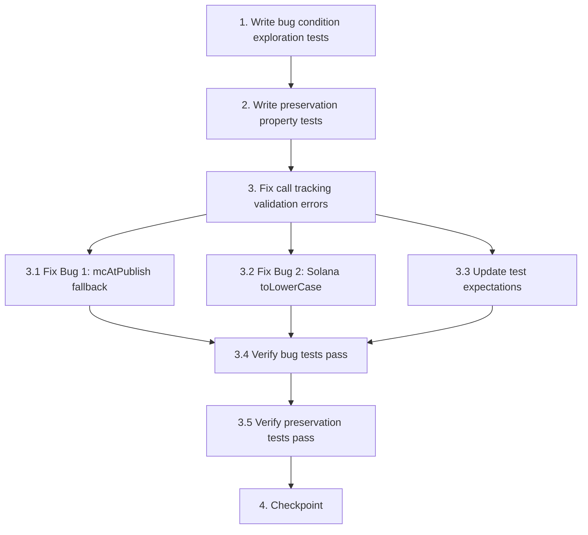

# Implementation Plan

## Overview

This task list implements fixes for two validation bugs in the call tracking system:
- Bug 1: mcAtPublish fallback logic fails when published call is not found
- Bug 2: Solana address normalization incorrectly lowercases Base58 strings

The implementation follows the bugfix workflow: write exploration tests to confirm bugs → write preservation tests to protect existing behavior → implement fixes → verify all tests pass.

## Tasks

- [x] 1. Write bug condition exploration tests
  - **Property 1: Bug Condition** - mcAtPublish Defaults and Solana Case Preservation
  - **CRITICAL**: These tests MUST FAIL on unfixed code - failure confirms the bugs exist
  - **DO NOT attempt to fix the tests or the code when they fail**
  - **NOTE**: These tests encode the expected behavior - they will validate the fixes when they pass after implementation
  - **GOAL**: Surface counterexamples that demonstrate the bugs exist
  - **Scoped PBT Approach**: Test concrete failing cases to ensure reproducibility
  
  **Bug 1 Test Cases:**
  - Test `TrackPublishedCallUseCase.execute()` when `PublishedCallRepository.findByChainAndAddress()` returns `null`
  - Assert that `mcAtPublish` should be `0` (from Expected Behavior Property 1)
  - Mock the repository to return `null` for a specific chain/address combination
  - Run test on UNFIXED code
  - **EXPECTED OUTCOME**: Test FAILS with "mcAtPublish must be a non-negative finite number"
  - Document counterexample: tracking fails when published call not found
  
  **Bug 2 Test Cases:**
  - Test `NormalizedAddress.fromSolana()` with mixed-case address `'EPjFWdd5AufqSSqeM2qN1xzybapC8G4wEGGkZwyTDt1v'`
  - Assert that stored value should preserve original case (from Expected Behavior Property 2)
  - Test reconstruction via `fromChainHint()` with the stored value
  - Run test on UNFIXED code
  - **EXPECTED OUTCOME**: Test FAILS - stored value is lowercased, reconstruction fails with "Invalid Solana address"
  - Document counterexample: Solana address corruption through lowercasing
  
  Mark task complete when tests are written, run on unfixed code, and failures are documented
  - _Requirements: 1.1, 1.3, 1.4, 1.5, 1.6, 1.7_

- [x] 2. Write preservation property tests (BEFORE implementing fix)
  - **Property 2: Preservation** - EVM Normalization and Valid mcAtCall Handling
  - **IMPORTANT**: Follow observation-first methodology
  - Observe behavior on UNFIXED code for non-buggy inputs
  - Write property-based tests capturing observed behavior patterns from Preservation Requirements
  - Property-based testing generates many test cases for stronger guarantees
  
  **Observation Cases:**
  - Observe: `NormalizedAddress.fromEvm('0xAbC123')` returns lowercase `'0xabc123'` on unfixed code
  - Observe: `TrackPublishedCallUseCase.execute()` with valid `published.mcAtCall=50000` uses that value on unfixed code
  - Observe: `TrackedPublishedCall.create()` with negative `mcAtPublish` throws validation error on unfixed code
  
  **Property Tests to Write:**
  - For all valid mixed-case EVM addresses, `fromEvm()` must lowercase them (from Preservation Requirements)
  - For all valid published calls with `mcAtCall` set, use that value as `mcAtPublish` (from Preservation Requirements)
  - For all tracked call creations with valid `mcAtPublish`, validation must succeed (from Preservation Requirements)
  - For all negative or non-finite `mcAtPublish` values, validation must fail (from Preservation Requirements)
  
  Run tests on UNFIXED code
  - **EXPECTED OUTCOME**: Tests PASS (confirms baseline behavior to preserve)
  
  Mark task complete when tests are written, run, and passing on unfixed code
  - _Requirements: 3.1, 3.2, 3.3, 3.4, 3.5, 3.6, 3.7, 3.8, 3.9_

- [x] 3. Fix call tracking validation errors

  - [x] 3.1 Fix Bug 1: Correct mcAtPublish fallback logic in TrackPublishedCallUseCase
    - File: `apps/backend/src/token/call-tracking/application/handlers/track-published-call.use-case.ts`
    - Locate the expression `const mcAtPublish = published?.mcAtCall ?? 0;` (around lines 38-41)
    - Replace with explicit conditional to handle null published call: `const mcAtPublish = published ? (published.mcAtCall ?? 0) : 0;`
    - Add explicit type annotation for safety: `const mcAtPublish: number = ...`
    - Verify TypeScript infers `mcAtPublish` as `number`, not `number | undefined`
    - _Bug_Condition: isBugCondition1(input) where input.published IS null_
    - _Expected_Behavior: For all inputs where published is null, mcAtPublish SHALL equal 0 (Property 1)_
    - _Preservation: For all inputs where published.mcAtCall is set, continue to use that value (Property 4)_
    - _Requirements: 1.1, 1.3, 2.1, 2.2, 2.3, 3.1, 3.2, 3.3_

  - [x] 3.2 Fix Bug 2: Remove toLowerCase() from NormalizedAddress.fromSolana()
    - File: `apps/backend/src/token/identity/normalized-address.vo.ts`
    - Locate `NormalizedAddress.fromSolana()` method (around lines 51-62)
    - Find the return statement: `return new NormalizedAddress({ value: raw.toLowerCase(), chain: ChainFamily.SOLANA });`
    - Replace with: `return new NormalizedAddress({ value: raw, chain: ChainFamily.SOLANA });`
    - Preserve Base58 validation logic (32-byte check)
    - Do NOT modify `fromEvm()` method (must continue to lowercase)
    - _Bug_Condition: isBugCondition2(input) where input.chain == 'solana' AND addressContainsUppercaseCharacters(input.address)_
    - _Expected_Behavior: For all valid Solana addresses, preserve original case-sensitive Base58 string (Property 2)_
    - _Preservation: For all EVM addresses, continue to lowercase (Property 3)_
    - _Requirements: 1.4, 1.5, 1.6, 1.7, 2.4, 2.5, 2.6, 2.7, 3.4, 3.5, 3.6, 3.7_

  - [x] 3.3 Update existing test expectations for Solana case preservation
    - File: `apps/backend/src/token/normalization/domain/value-objects/normalization-vos.spec.ts`
    - Locate test: `'accepts valid Solana and normalizes to lowercase'` (around line 53)
    - Update test name to: `'accepts valid Solana and preserves case'`
    - Update assertion from: `expect(NormalizedAddress.fromSolana(SOLANA).value).toBe(SOLANA_LOWER);`
    - To: `expect(NormalizedAddress.fromSolana(SOLANA).value).toBe(SOLANA);`
    - Verify test constant `SOLANA` uses the correct case-sensitive value `'EPjFWdd5AufqSSqeM2qN1xzybapC8G4wEGGkZwyTDt1v'`
    - _Requirements: 2.4, 2.5, 2.6, 2.7_

  - [x] 3.4 Verify bug condition exploration tests now pass
    - **Property 1: Expected Behavior** - mcAtPublish Defaults and Solana Case Preservation
    - **IMPORTANT**: Re-run the SAME tests from task 1 - do NOT write new tests
    - The tests from task 1 encode the expected behavior
    - When these tests pass, it confirms the expected behavior is satisfied
    
    **Verification Steps:**
    - Re-run Bug 1 test: `TrackPublishedCallUseCase.execute()` with `published=null`
    - **EXPECTED OUTCOME**: Test PASSES - `mcAtPublish` is `0`
    - Re-run Bug 2 test: `NormalizedAddress.fromSolana()` with mixed-case address
    - **EXPECTED OUTCOME**: Test PASSES - case is preserved, reconstruction succeeds
    
    Document that fixes resolve the counterexamples from task 1
    - _Requirements: 2.1, 2.2, 2.3, 2.4, 2.5, 2.6, 2.7_

  - [x] 3.5 Verify preservation tests still pass
    - **Property 2: Preservation** - EVM Normalization and Valid mcAtCall Handling
    - **IMPORTANT**: Re-run the SAME tests from task 2 - do NOT write new tests
    - Run preservation property tests from step 2
    - **EXPECTED OUTCOME**: All tests PASS (confirms no regressions)
    
    **Verification Steps:**
    - Verify EVM address lowercasing still works
    - Verify valid `mcAtCall` values still used correctly
    - Verify validation still enforces constraints
    - Verify no behavioral changes for non-buggy inputs
    
    Confirm all preservation tests still pass after fixes
    - _Requirements: 3.1, 3.2, 3.3, 3.4, 3.5, 3.6, 3.7, 3.8, 3.9_

- [x] 4. Checkpoint - Ensure all tests pass
  - Run the full test suite to verify no regressions
  - Verify bug condition tests pass (confirms bugs are fixed)
  - Verify preservation tests pass (confirms no behavioral changes for valid inputs)
  - Verify existing unit tests pass (confirms no breaking changes)
  - Document any test failures and address them before completion
  - Ask the user if questions arise about test results or edge cases


## Task Dependency Graph



```json
{
  "waves": [
    {
      "name": "Exploration",
      "tasks": ["1", "2"]
    },
    {
      "name": "Implementation",
      "tasks": ["3.1", "3.2", "3.3"]
    },
    {
      "name": "Verification",
      "tasks": ["3.4", "3.5", "4"]
    }
  ]
}
```

## Notes

- **Test-First Approach**: Tasks 1 and 2 write tests BEFORE implementing fixes to confirm bugs exist and establish baseline behavior
- **Property-Based Testing**: Both bug condition and preservation tests use property-based testing for comprehensive coverage
- **Expected Failures**: Task 1 tests are EXPECTED to fail on unfixed code - this confirms the bugs exist
- **Observation First**: Task 2 tests observe actual behavior on unfixed code before writing preservation tests
- **Two-Phase Verification**: After fixes, re-run the same tests from tasks 1 and 2 to verify correctness and preservation
- **No Migration Included**: This task list does not include database migration for existing corrupted Solana addresses - those records will fail reconstruction after the fix
