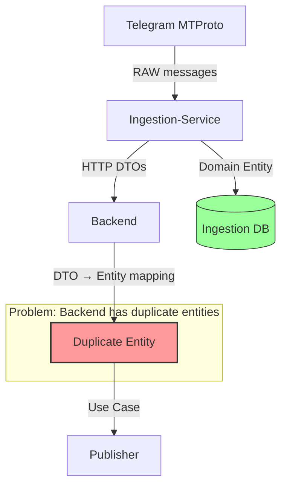
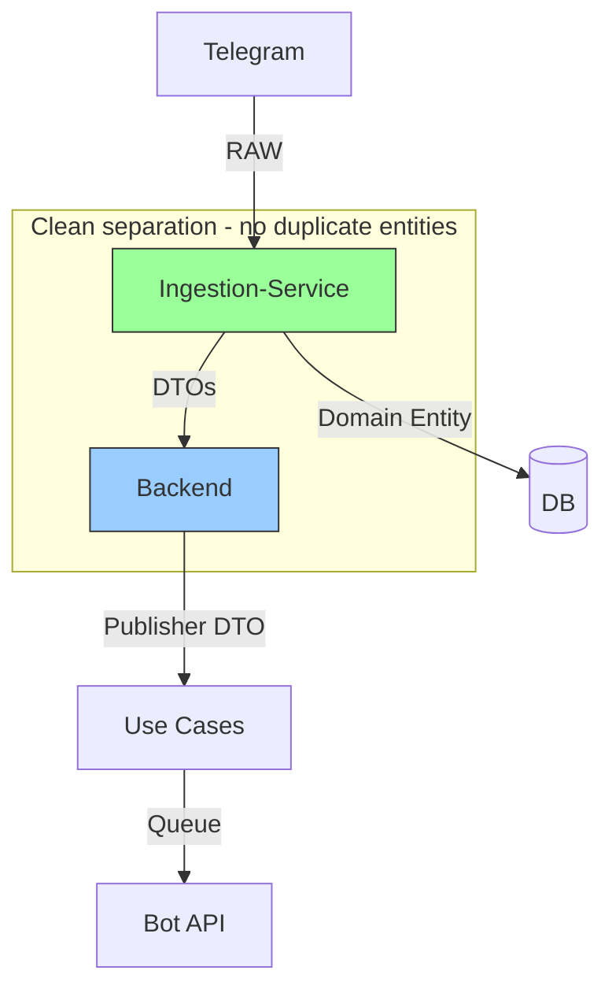

# Technical Design Document: Crypto-News Entity Cleanup

**Feature:** crypto-news-entity-cleanup  
**Status:** Draft  
**Last Updated:** 2026-09-08

## Overview

### Problem Statement

Post db-separation (2026-09-08), the backend maintains **duplicate domain entities** for crypto-news data owned by ingestion-service. This creates:

- **Maintenance burden** — Changes must be synced manually across 2 locations
- **DRY violation** — Same entities defined in backend + ingestion-service
- **Risk of divergence** — Duplicate code can drift over time
- **Confusion** — Unclear which definition is source of truth

### Solution Approach

Remove duplication by choosing one of three architectural strategies:

1. **Strategy 1 (Pure DTO)** — Backend uses DTOs only, no entity dependencies
2. **Strategy 2 (Shared Package)** — Extract domain to separate package
3. **Strategy 3 (Direct Import)** — Backend imports entities from ingestion-service

**Recommended:** Strategy 1 for clean architecture, Strategy 3 for speed.

### Success Criteria

- Zero duplicate entity definitions in codebase
- All tests pass (2784 total)
- Backend boots successfully
- No regressions in crypto-news pipeline
- Documentation reflects architecture choice

---

## Architecture

### Current State (Problematic)



**File Structure (Current):**

```
apps/ingestion-service/src/telegram/crypto-news/domain/
├── entities/crypto-news-message.entity.ts ← SOURCE OF TRUTH
└── value-objects/crypto-news-media.vo.ts ← SOURCE OF TRUTH

apps/backend/src/telegram/ingestion/crypto-news/domain/
├── entities/crypto-news-message.entity.ts ← DUPLICATE (@deprecated)
└── value-objects/crypto-news-media.vo.ts ← DUPLICATE (@deprecated)
```

### Target State: Strategy 1 (Pure DTO)



**Data Flow:**

```
1. Ingestion-Service:
   - Receives RAW message from Telegram
   - Creates domain entity: CryptoNewsMessage
   - Persists to DB via TypeORM entity
   - Serves HTTP API with DTOs

2. Backend:
   - Fetches DTOs from ingestion HTTP API
   - Maps DTO → Publisher DTO (EnqueueMessageDto)
   - Use case accepts Publisher DTO
   - Enqueues to publisher queue
   - No entity dependencies
```

### Target State: Strategy 3 (Direct Import)

```mermaid
graph TB
    IS[Ingestion-Service]
    BE[Backend]

    IS -->|exports entities| BE
    IS -->|DTOs| BE
    BE -->|imports| IS

    style IS fill:#9f9,stroke:#333
    style BE fill:#9cf,stroke:#333

    subgraph "Monorepo workspace imports"
        IS -.->|@alpha-meta-token-scanner/ingestion-service| BE
    end
```

**Data Flow:**

```
1. Ingestion-Service:
   - Owns domain entities
   - Exports from src/index.ts
   - Serves HTTP API with DTOs

2. Backend:
   - Imports entities: import { CryptoNewsMessage } from '@alpha-meta-token-scanner/ingestion-service'
   - Maps DTO → Ingestion entity
   - Use case accepts ingestion entity
   - No duplicate files
```

---

## Components and Interfaces

### Strategy 1: Pure DTO Components

#### 1. HTTP DTO (existing)

**Location:** `apps/backend/src/telegram/crypto-news-integration/domain/dtos/crypto-news-message.dto.ts`

```typescript
export interface CryptoNewsMessageDto {
  channelId: string;
  messageId: number;
  content: string; // FILTERED content
  publishedAt: string; // ISO date from HTTP
  ingestedAt: string;
  media: CryptoNewsMessageMediaDto[];
  // ... other fields
}

export interface CryptoNewsMessageMediaDto {
  index: number;
  type: 'photo' | 'video' | 'document';
  url?: string; // Media file URL
  mimeType?: string;
  fileSize?: number;
}
```

**Purpose:** HTTP contract between ingestion-service and backend.

#### 2. Publisher DTO (new)

**Location:** `apps/backend/src/telegram/crypto-news-publisher/domain/dtos/enqueue-message.dto.ts`

```typescript
export interface EnqueueMessageDto {
  channelId: string;
  messageId: number;
  content: string;
  publishedAt: Date; // Date object (not ISO string)
  ingestedAt: Date;
  media: EnqueueMessageMediaDto[];
  matchedKeywords: Keyword[]; // Embedded from matching
  // ... other domain fields
}

export interface EnqueueMessageMediaDto {
  index: number;
  type: 'photo' | 'video' | 'document';
  filePath: string; // Resolved file path
  mimeType?: string;
  fileSize?: number;
}
```

**Purpose:** Internal DTO for publisher use cases.

#### 3. Use Case (modified)

**Location:** `apps/backend/src/telegram/crypto-news-publisher/application/handlers/enqueue-matching-message.use-case.ts`

```typescript
export interface EnqueueMatchingMessageInput {
  readonly message: EnqueueMessageDto; // Changed from entity
}

@Injectable()
export class EnqueueMatchingMessageUseCase {
  async execute(input: EnqueueMatchingMessageInput): Promise<void> {
    // Create queue entry from DTO
    const queueEntry = PublisherQueueEntry.create({
      messageId: input.message.messageId,
      channelId: input.message.channelId,
      content: input.message.content,
      // ...
    });

    await this.queueRepo.save(queueEntry);
  }
}
```

#### 4. Scheduler (modified)

**Location:** `apps/backend/src/telegram/crypto-news-integration/application/scheduling/enqueue-matching-cron.scheduler.ts`

```typescript
@Injectable()
export class EnqueueMatchingCronScheduler {
  private mapToPublisherDto(
    dto: FilteredCryptoNewsMessage,
    matchedKeywords: Keyword[],
  ): EnqueueMessageDto {
    return {
      channelId: dto.channelId,
      messageId: dto.messageId,
      content: dto.content, // Already FILTERED
      publishedAt: new Date(dto.publishedAt), // ISO → Date
      ingestedAt: new Date(dto.ingestedAt),
      media: dto.media.map((m) => ({
        index: m.index,
        type: m.type,
        filePath: this.resolveMediaFilePath(dto.channelId, dto.messageId, m),
        mimeType: m.mimeType,
        fileSize: m.fileSize,
      })),
      matchedKeywords, // Embed
    };
  }

  async tick(): Promise<void> {
    const messages = await this.cryptoNewsService.fetchFiltered();

    for (const msg of messages) {
      const keywords = this.matchKeywords(msg);
      if (keywords.length === 0) continue;

      const dto = this.mapToPublisherDto(msg, keywords);
      await this.enqueueUseCase.execute({ message: dto });
    }
  }
}
```

### Strategy 3: Direct Import Components

#### 1. Ingestion Exports (new)

**Location:** `apps/ingestion-service/src/index.ts`

```typescript
export { CryptoNewsMessage } from './telegram/crypto-news/domain/entities/crypto-news-message.entity';
export { CryptoNewsMedia } from './telegram/crypto-news/domain/value-objects/crypto-news-media.vo';
```

#### 2. Backend Imports (modified)

**Location:** All backend files using crypto-news entities

```typescript
// Before
import { CryptoNewsMessage } from 'telegram/ingestion/crypto-news/domain/entities/...';

// After
import { CryptoNewsMessage } from '@alpha-meta-token-scanner/ingestion-service';
```

---

## Data Models

### Domain Entity (Ingestion-Service ONLY)

```typescript
// apps/ingestion-service/src/telegram/crypto-news/domain/entities/crypto-news-message.entity.ts

export class CryptoNewsMessage extends AggregateRoot<string> {
  private readonly _channelId: string;
  private readonly _messageId: number;
  private readonly _content: string; // RAW content
  private readonly _publishedAt: Date;
  private readonly _ingestedAt: Date;
  private readonly _media: CryptoNewsMedia[];

  private constructor(props: CryptoNewsMessageProps) {
    super(props.id);
    this._channelId = props.channelId;
    this._messageId = props.messageId;
    this._content = props.content;
    this._publishedAt = props.publishedAt;
    this._ingestedAt = props.ingestedAt;
    this._media = props.media;
  }

  static create(props: CreateCryptoNewsMessageProps): CryptoNewsMessage {
    // Validation + invariants
    return new CryptoNewsMessage({
      ...props,
      id: `${props.channelId}:${props.messageId}`,
    });
  }

  // Getters
  get channelId(): string {
    return this._channelId;
  }
  get messageId(): number {
    return this._messageId;
  }
  get content(): string {
    return this._content;
  }
  // ... other getters
}
```

**Ownership:** Ingestion-service ONLY  
**Strategy 1:** Backend never imports this  
**Strategy 3:** Backend imports from ingestion workspace

### TypeORM Entity (Ingestion-Service ONLY)

```typescript
// apps/ingestion-service/src/telegram/crypto-news/infrastructure/persistence/typeorm/entities/crypto-news-message.entity.ts

@Entity('crypto_news_messages')
export class CryptoNewsMessageEntity {
  @PrimaryColumn()
  id: string; // format: "channelId:messageId"

  @Column()
  channel_id: string;

  @Column()
  message_id: number;

  @Column('text')
  content: string;

  @Column({ type: 'timestamp' })
  published_at: Date;

  @Column({ type: 'timestamp' })
  ingested_at: Date;

  @OneToMany(() => CryptoNewsMessageMediaEntity, (media) => media.message)
  media: CryptoNewsMessageMediaEntity[];
}
```

**Ownership:** Ingestion-service ONLY  
**Backend:** Never touches this (no tables)

### Publisher DTO (Strategy 1 Backend)

```typescript
// apps/backend/src/telegram/crypto-news-publisher/domain/dtos/enqueue-message.dto.ts

export interface EnqueueMessageDto {
  channelId: string;
  messageId: number;
  content: string; // FILTERED content (from scheduler)
  publishedAt: Date; // Date object
  ingestedAt: Date;
  media: EnqueueMessageMediaDto[];
  matchedKeywords: Keyword[]; // Embedded
}

export interface EnqueueMessageMediaDto {
  index: number;
  type: 'photo' | 'video' | 'document';
  filePath: string; // Resolved path
  mimeType?: string;
  fileSize?: number;
}
```

**Ownership:** Backend publisher module  
**Purpose:** Internal DTO for use cases

---

## Correctness Properties

### Property 1: Single Source of Truth

**Invariant:** Crypto-news entities have exactly ONE definition in codebase.

**Verification:**

```bash
# MUST return exactly 1 result
grep -r "class CryptoNewsMessage" apps/*/src/
# Expected: apps/ingestion-service/src/telegram/crypto-news/domain/entities/crypto-news-message.entity.ts
```

**Test:** N/A (structural property)

### Property 2: No Breaking Changes

**Invariant:** Existing crypto-news pipeline works unchanged.

**Verification:**

```bash
# Enqueue flow
npm test -- enqueue-matching-cron.scheduler
npm test -- enqueue-matching-message.use-case

# Publisher flow
npm test -- process-next-queued-article.use-case
```

**Property-Based Test:**

```typescript
describe('Enqueue flow (property-based)', () => {
  it('GIVEN filtered message WHEN enqueued THEN appears in queue', async () => {
    fc.assert(
      fc.asyncProperty(cryptoNewsMessageArb(), async (msg) => {
        const dto = mapToPublisherDto(msg, ['BTC']);
        await enqueueUseCase.execute({ message: dto });

        const queued = await queueRepo.findByMessageId(msg.messageId);
        expect(queued).toBeDefined();
        expect(queued.status).toBe('PENDING');
      }),
    );
  });
});
```

### Property 3: Type Safety Preserved

**Invariant:** Backend compiles with zero TypeScript errors.

**Verification:**

```bash
cd apps/backend && npx tsc --noEmit
# Exit code MUST be 0
```

**Test:** CI pipeline enforces this

---

## Error Handling

### Scenario 1: HTTP DTO Fetch Fails

**Error:** Ingestion-service unavailable or returns 500

**Handler:**

```typescript
// EnqueueMatchingCronScheduler
async tick(): Promise<void> {
  try {
    const messages = await this.cryptoNewsService.fetchFiltered();
    // ... process
  } catch (error) {
    this.logger.error('Failed to fetch crypto-news messages', error);
    // Skip this tick, retry next cron interval
    return;
  }
}
```

**Mitigation:**

- Cron runs every minute (retry automatically)
- Backend logs error
- No data loss (ingestion-service has data)

### Scenario 2: DTO Mapping Fails

**Error:** Unexpected DTO shape (API contract changed)

**Handler:**

```typescript
private mapToPublisherDto(dto: FilteredCryptoNewsMessage, keywords: Keyword[]): EnqueueMessageDto {
  if (!dto.channelId || !dto.messageId) {
    throw new InvalidCryptoNewsMessageError('Missing required fields');
  }

  // ... rest of mapping
}
```

**Mitigation:**

- Validation at mapping boundary
- Error logged + skipped
- Tests verify DTO shape

### Scenario 3: Use Case Rejects DTO

**Error:** Queue entry creation fails

**Handler:**

```typescript
// EnqueueMatchingMessageUseCase
async execute(input: EnqueueMatchingMessageInput): Promise<void> {
  try {
    const queueEntry = PublisherQueueEntry.create({
      messageId: input.message.messageId,
      // ...
    });
    await this.queueRepo.save(queueEntry);
  } catch (error) {
    this.logger.error('Failed to enqueue message', { messageId: input.message.messageId, error });
    throw new EnqueueFailedError('Failed to create queue entry', error);
  }
}
```

**Mitigation:**

- Error bubbles to scheduler
- Scheduler logs + continues with next message
- Message retried next cron tick

---

## Security Considerations

### Data Privacy

**No change** — No new data storage or access patterns

### Authentication

**No change** — HTTP API already secured (if needed)

### Authorization

**No change** — No new permissions or roles

---

## Performance Considerations

### Build Time

**Strategy 1:**

- Adds 1 publisher DTO file
- **Impact:** Negligible (<1% build time increase)

**Strategy 3:**

- Changes imports only
- **Impact:** None (same dependency graph)

### Runtime

**Strategy 1:**

- Adds DTO mapping step (HTTP DTO → Publisher DTO)
- **Overhead:** ~1ms per message (negligible)

**Strategy 3:**

- No runtime change (same entity)
- **Overhead:** None

### Memory

**No impact** — Entity count unchanged, just location

---

## Monitoring and Observability

### Metrics to Track

1. **Enqueue success rate** — % of messages successfully enqueued
2. **Publish success rate** — % of queued messages published
3. **Pipeline latency** — Time from ingestion → publish

### Logs to Add

**Strategy 1:**

```typescript
this.logger.debug('Mapped HTTP DTO to Publisher DTO', {
  channelId: dto.channelId,
  messageId: dto.messageId,
  matchedKeywords: keywords.length,
});
```

### Alerts

**No new alerts needed** — Existing publisher alerts cover this

---

## Alternative Designs Considered

### Alternative 1: Keep Duplicate Entities

**Description:** Do nothing, accept duplication

**Pros:** Zero effort  
**Cons:** Technical debt persists, DRY violation, confusion

**Rejected:** Does not solve the problem

### Alternative 2: Strategy 2 (Shared Package)

**Description:** Extract domain to `@alpha-meta-token-scanner/crypto-news-domain`

**Pros:** Type safety, single definition  
**Cons:** Couples services, shared ownership, microservices harder

**Rejected:** Introduces coupling where clean separation is better

**Exception:** Use only if entities are truly shared domain (NOT this case)

---

## Implementation Phases

See `tasks.md` for detailed phases.

**Strategy 1 (Recommended):**

1. ✅ Phase 1: Mark entities deprecated (DONE)
2. Phase 2: Create publisher DTOs (30 min)
3. Phase 3: Refactor use case (1-2 hrs)
4. Phase 4: Update scheduler (1 hr)
5. Phase 5: Remove repos (2-3 hrs)
6. Phase 6: Delete mappers (30 min)
7. Phase 7: Delete entities (15 min)
8. Phase 8: Clean event handlers (1 hr)
9. Phase 9: Update docs (1 hr)

**Total:** 7-9 hours

**Strategy 3 (Alternative):**

1. Phase 1: Export entities (15 min)
2. Phase 2: Update imports (30 min)
3. Phase 3: Delete duplicates (15 min)
4. Phase 4: Verify tests (30 min)

**Total:** 1-2 hours

---

## Testing Strategy

### Unit Tests

**Coverage areas:**

- DTO mapping (HTTP DTO → Publisher DTO)
- Use case with new signature
- Scheduler tick logic

**Example:**

```typescript
describe('mapToPublisherDto', () => {
  it('converts HTTP DTO to Publisher DTO', () => {
    const httpDto: FilteredCryptoNewsMessage = {
      channelId: '-1001234567890',
      messageId: 123,
      publishedAt: '2026-09-08T12:00:00Z', // ISO string
      // ...
    };

    const publisherDto = scheduler['mapToPublisherDto'](httpDto, []);

    expect(publisherDto.publishedAt).toBeInstanceOf(Date);
    expect(publisherDto.channelId).toBe(httpDto.channelId);
  });
});
```

### Integration Tests

**Coverage areas:**

- Full enqueue flow: HTTP → DTO → use case → queue
- Full publish flow: queue → LLM → Bot API

**Example:**

```typescript
describe('Crypto-news pipeline (integration)', () => {
  it('enqueues and publishes message', async () => {
    // Arrange: Mock ingestion HTTP API
    mockIngestionApi.get('/api/crypto-news/messages').reply(200, [mockDto]);

    // Act: Run scheduler
    await scheduler.tick();

    // Assert: Message in queue
    const queued = await queueRepo.findAll();
    expect(queued).toHaveLength(1);

    // Act: Run publisher
    await publisher.tick();

    // Assert: Message published to Telegram
    expect(mockTelegramBot.sendMessage).toHaveBeenCalledWith({
      chat_id: '@test_channel',
      text: expect.stringContaining(mockDto.content),
    });
  });
});
```

### E2E Tests (Optional)

**Scenario:** Full crypto-news pipeline

**Steps:**

1. Ingestion-service receives message
2. Persists to DB
3. Backend fetches via HTTP
4. Matches keywords
5. Enqueues to publisher queue
6. LLM transforms (if enabled)
7. Publishes to Telegram

**Verification:**

- Message appears in Telegram channel
- Queue entry marked PUBLISHED
- No errors in logs

---

## Rollback Plan

### Strategy 1 Rollback

**Per-phase:**

- Phase 2-3: Revert use case changes, restore entity imports
- Phase 4: Restore `mapToEntity()` method
- Phase 5: Re-add repo providers
- Phase 6-7: Restore deleted files from git

**Full rollback:**

```bash
git revert <merge-commit-sha>
npm run build && npm test
npm run start:dev  # Verify backend boots
```

### Strategy 3 Rollback

```bash
# Restore duplicate entities from git
git checkout HEAD~1 -- apps/backend/src/telegram/ingestion/crypto-news/domain/

# Remove ingestion imports, restore relative paths
# (manual update in affected files)

# Rebuild
npm run build && npm test
```

---

## Documentation Updates

### Files to Update

1. **Root AGENTS.md:**
   - Remove mention of "duplicate shadow entities"
   - Document strategy chosen (Strategy 1 or 3)
   - Note crypto-news uses DTOs (if Strategy 1)

2. **Backend AGENTS.md:**
   - Document publisher DTO pattern (if Strategy 1)
   - OR document entity imports from ingestion (if Strategy 3)
   - Update entity count

3. **Ingestion AGENTS.md:**
   - Note entities are NOT exported (Strategy 1)
   - OR note entities ARE exported (Strategy 3)
   - Backend uses DTOs/entities

4. **Migration Plan:**
   - File: `.omo/plans/crypto-news-domain-entity-migration.md`
   - Mark status: COMPLETE
   - Add completion date
   - Link to this spec

---

## Open Questions

1. **Q:** Is `CryptoNewsMessageRepository` actually used?  
   **Status:** Need to investigate (Phase 5)  
   **Impact:** Determines if repos can be deleted

2. **Q:** Is event `crypto-news.message.ingested` still emitted?  
   **Status:** Need to check (Phase 8)  
   **Impact:** Determines if event handler can be deleted

3. **Q:** Should KOL entities follow same pattern?  
   **Status:** Deferred (out of scope)  
   **Impact:** Future work, similar migration

---

## References

- `.kiro/specs/crypto-news-entity-cleanup/requirements.md` — Requirements
- `.kiro/specs/crypto-news-entity-cleanup/tasks.md` — Implementation phases
- `.omo/completed/crypto-news-architecture-clarification.md` — Corrected model
- `.omo/analysis/ingestion-service-scope-audit.md` — Scope verification
- `apps/backend/AGENTS.md` — Backend architecture
- `apps/ingestion-service/AGENTS.md` — Ingestion architecture

---

## Revision History

| Version | Date       | Author  | Changes                                                        |
| ------- | ---------- | ------- | -------------------------------------------------------------- |
| 1.0     | 2026-09-08 | Kiro AI | Initial design with 3 strategies, reformatted to Kiro standard |
