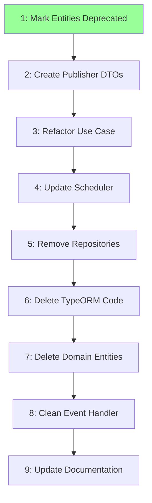

# Implementation Plan: Crypto-News Entity Cleanup

## Task Dependency Graph

```json
{
  "waves": [
    {
      "id": 1,
      "tasks": [1]
    },
    {
      "id": 2,
      "tasks": [2]
    },
    {
      "id": 3,
      "tasks": [3]
    },
    {
      "id": 4,
      "tasks": [4]
    },
    {
      "id": 5,
      "tasks": [5]
    },
    {
      "id": 6,
      "tasks": [6]
    },
    {
      "id": 7,
      "tasks": [7]
    },
    {
      "id": 8,
      "tasks": [8]
    },
    {
      "id": 9,
      "tasks": [9]
    }
  ]
}
```



## Overview

Implementation tasks for removing duplicate crypto-news entities from backend. Two strategies available:

- **Strategy 1 (Pure DTO):** Tasks 1-9, 7-9 hours — Clean architecture
- **Strategy 3 (Direct Import):** Tasks 101-104, 1-2 hours — Quick fix

Choose based on priorities (clean separation vs. speed).

## Tasks

### Strategy 1: Pure DTO (Recommended)

- [x] 1. Mark entities as deprecated
  - **Status:** Complete (2026-09-08)
  - **Effort:** 2 hours
  - **Risk:** Low
  - **Validates:** FR1 (Single Source of Truth)
  - [x] 1.1 Add `@deprecated DUPLICATE` JSDoc to backend entity files
  - [x] 1.2 Create `CryptoNewsMessageDto` for HTTP consumption
  - [x] 1.3 Fix path alias import issues
  - [x] 1.4 Verify backend compiles and runs
  - **Evidence:** `.omo/completed/crypto-news-entity-deprecation.md`
  - _Requirements: FR1, NFR1_

- [ ] 2. Create publisher DTOs
  - **Effort:** 30 minutes
  - **Risk:** Low
  - **Dependencies:** Task 1
  - **Validates:** FR3 (Type Safety)
  - [ ] 2.1 Create `EnqueueMessageDto` interface
    - Location: `apps/backend/src/telegram/crypto-news-publisher/domain/dtos/enqueue-message.dto.ts`
    - Fields: channelId, messageId, content, publishedAt (Date), media, matchedKeywords
  - [ ] 2.2 Create `EnqueueMessageMediaDto` interface
    - Fields: index, type, filePath, mimeType, fileSize
  - [ ] 2.3 Export from barrel file
    - Update: `apps/backend/src/telegram/crypto-news-publisher/domain/dtos/index.ts`
  - [ ] 2.4 Verify TypeScript compiles
    - Command: `cd apps/backend && npx tsc --noEmit`
  - **Acceptance:** DTO file exists with correct interfaces, TypeScript compiles (zero errors), no runtime dependencies
  - **Verification:** `ls apps/backend/src/telegram/crypto-news-publisher/domain/dtos/enqueue-message.dto.ts && cd apps/backend && npx tsc --noEmit`
  - _Requirements: FR3_

- [ ] 3. Refactor use case
  - **Effort:** 1-2 hours
  - **Risk:** Medium
  - **Dependencies:** Task 2
  - **Validates:** FR2 (No Breaking Changes), FR4 (Test Coverage)
  - [ ] 3.1 Update `EnqueueMatchingMessageInput` interface signature
    - Change: `readonly message: CryptoNewsMessage` → `readonly message: EnqueueMessageDto`
    - Remove: `matchedKeywords` field (now embedded in DTO)
  - [ ] 3.2 Remove entity imports
    - Delete: `import { CryptoNewsMessage } from 'telegram/ingestion/...'`
    - Add: `import { EnqueueMessageDto } from '../../domain/dtos'`
  - [ ] 3.3 Update `execute()` method implementation
    - Access DTO fields directly (no entity getters)
  - [ ] 3.4 Update unit test fixtures
    - Replace entity creation with DTO object literals
  - [ ] 3.5 Run use case test suite
    - Command: `npm test -- enqueue-matching-message.use-case`
  - **Files:** `enqueue-matching-message.use-case.ts`, `enqueue-matching-message.use-case.spec.ts`
  - **Acceptance:** Use case accepts `EnqueueMessageDto`, all unit tests pass, no entity imports in publisher module, queue entry creation works
  - **Verification:** `npm test -- enqueue-matching-message.use-case && grep -r "CryptoNewsMessage" apps/backend/src/telegram/crypto-news-publisher/`
  - _Requirements: FR2, FR4_

- [ ] 4. Update scheduler
  - **Effort:** 1 hour
  - **Risk:** Medium
  - **Dependencies:** Task 3
  - **Validates:** FR2 (No Breaking Changes)
  - [ ] 4.1 Delete `mapToEntity()` method (~50 lines of dead code)
  - [ ] 4.2 Create `mapToPublisherDto()` method
    - Input: `FilteredCryptoNewsMessage` (HTTP DTO) + `Keyword[]`
    - Output: `EnqueueMessageDto`
    - Logic: ISO string → Date, resolve media file paths, embed keywords
  - [ ] 4.3 Update imports (remove entities, add DTOs)
  - [ ] 4.4 Update `tick()` method to use new mapping
  - [ ] 4.5 Run scheduler tests
    - Command: `npm test -- enqueue-matching-cron.scheduler`
  - **Files:** `enqueue-matching-cron.scheduler.ts`
  - **Acceptance:** Scheduler maps DTO → DTO (not DTO → entity), all tests pass, no entity imports, enqueue flow works end-to-end
  - **Verification:** `npm test -- enqueue-matching-cron.scheduler && grep -r "CryptoNewsMessage\|CryptoNewsMedia" apps/backend/src/telegram/crypto-news-integration/`
  - _Requirements: FR2_

- [ ] 5. Remove repositories
  - **Effort:** 2-3 hours (includes investigation)
  - **Risk:** High (DI graph changes)
  - **Dependencies:** Task 4
  - **Validates:** FR1 (Single Source of Truth), NFR1 (Maintainability)
  - [ ] 5.1 Investigate repository usage
    - Search: `grep -r "CryptoNewsMessageRepository" apps/backend/src/`
    - Check constructor injections
    - Check if `.save()`, `.findById()` are actually called
  - [ ] 5.2 Make deletion decision based on usage
  - [ ] 5.3 If UNUSED: Delete repository port
    - File: `crypto-news-message.repository.ts`
  - [ ] 5.4 If UNUSED: Delete in-memory implementation
    - File: `in-memory-crypto-news-message.repository.ts`
  - [ ] 5.5 If UNUSED: Remove provider registrations
    - File: `crypto-news-persistence.module.ts`
  - [ ] 5.6 If UNUSED: Update use case constructor (remove injection)
  - [ ] 5.7 If USED: Document why (code comment)
  - [ ] 5.8 If USED: Keep as `@deprecated` shim
  - [ ] 5.9 Verify backend boots without DI errors
    - Command: `npm run start:dev`
  - **Acceptance:** Investigation complete (usage documented), decision made (delete vs keep), backend builds successfully, backend boots without DI errors, all tests pass
  - **Verification:** `npm run build && npm run start:dev && npm test`
  - _Requirements: FR1, NFR1_

- [ ] 6. Delete TypeORM code
  - **Effort:** 30 minutes
  - **Risk:** Low
  - **Dependencies:** Task 5
  - **Validates:** FR1 (Single Source of Truth)
  - [ ] 6.1 Verify no DB writes exist
    - Search: `grep -r "save\|update\|delete" apps/backend/src/telegram/ingestion/crypto-news/ | grep -i "message"`
    - Expected: Zero matches (backend has no tables)
  - [ ] 6.2 Delete TypeORM mappers
    - Files: `crypto-news-message.mapper.ts`, `crypto-news-message.mapper.spec.ts`
  - [ ] 6.3 Delete TypeORM repositories (if exist)
  - [ ] 6.4 Update module providers (if needed)
  - [ ] 6.5 Verify build succeeds
    - Command: `npm run build && npm test`
  - **Acceptance:** All TypeORM code removed, build succeeds, tests pass
  - **Verification:** `ls apps/backend/src/telegram/ingestion/crypto-news/infrastructure/persistence/typeorm/ && npm run build && npm test`
  - _Requirements: FR1_

- [ ] 7. Delete domain entities
  - **Effort:** 15 minutes
  - **Risk:** Low
  - **Dependencies:** Task 6
  - **Validates:** FR1 (Single Source of Truth), NFR1 (Maintainability)
  - [ ] 7.1 Final usage check (MUST be zero)
    - Search: `grep -r "from.*crypto-news-message\.entity" apps/backend/src/`
    - Search: `grep -r "from.*crypto-news-media\.vo" apps/backend/src/`
    - Expected: Zero matches
  - [ ] 7.2 Delete entity files
    - Files: `crypto-news-message.entity.ts`, `crypto-news-message.entity.spec.ts`
  - [ ] 7.3 Delete value object files
    - File: `crypto-news-media.vo.ts`
  - [ ] 7.4 Clean up empty directories
    - Directories: `domain/entities/`, `domain/value-objects/`, `domain/`
  - [ ] 7.5 Verify build succeeds
    - Command: `npm run build && npm test`
  - **Acceptance:** All entity files deleted, no broken imports, build succeeds, all tests pass
  - **Verification:** `ls apps/backend/src/telegram/ingestion/crypto-news/domain/ && npm run build && npm test`
  - _Requirements: FR1, NFR1_

- [ ] 8. Clean event handler
  - **Effort:** 1 hour
  - **Risk:** Low
  - **Dependencies:** Task 7
  - **Validates:** FR1 (Single Source of Truth)
  - [ ] 8.1 Check if event is emitted
    - Search: `grep -r "crypto-news\.message\.ingested" apps/ingestion-service/src/`
    - Search: `grep -r "CryptoNewsMessageIngestedEvent" apps/backend/src/`
  - [ ] 8.2 Make deletion decision
  - [ ] 8.3 If NOT emitted: Delete handler (dead code)
    - File: `crypto-news-message-ingested.handler.ts`
  - [ ] 8.4 If NOT emitted: Remove from providers
    - File: `crypto-news-publisher.module.ts`
  - [ ] 8.5 If IS emitted: Update to use DTOs (keep functional)
  - [ ] 8.6 Verify backend boots
    - Command: `npm run start:dev`
  - **Acceptance:** Investigation complete, decision made (delete vs update), build succeeds, tests pass
  - **Verification:** `npm run build && npm test && npm run start:dev`
  - _Requirements: FR1_

- [ ] 9. Update documentation
  - **Effort:** 1 hour
  - **Risk:** Low
  - **Dependencies:** Task 8
  - **Validates:** FR5 (Documentation)
  - [ ] 9.1 Update root AGENTS.md
    - Remove mention of "duplicate shadow entities"
    - Document Strategy 1 (Pure DTO) chosen
    - Note crypto-news uses DTOs (Opción A)
  - [ ] 9.2 Update backend AGENTS.md
    - Document publisher DTO pattern
    - Note crypto-news entities live ONLY in ingestion
    - Update entity count (39 → verify final)
  - [ ] 9.3 Update ingestion AGENTS.md
    - Note entities are NOT exported (Strategy 1)
    - Backend uses DTOs for consumption
  - [ ] 9.4 Mark migration plan complete
    - File: `.omo/plans/crypto-news-domain-entity-migration.md`
    - Status: COMPLETE
    - Add completion date
    - Link to this spec
  - [ ] 9.5 Run docs staleness check
    - Command: `npm run docs:check` (if exists)
  - **Acceptance:** All AGENTS.md files updated, migration plan marked complete, docs check passes, architecture clearly documented
  - **Verification:** `npm run docs:check`
  - _Requirements: FR5_

### Strategy 3: Direct Import (Quick Alternative)

- [ ] 101. Export entities
  - **Effort:** 15 minutes
  - **Risk:** Low
  - **Validates:** FR1 (Single Source of Truth)
  - [ ] 101.1 Create barrel export in ingestion-service
    - File: `apps/ingestion-service/src/index.ts`
    - Export: `CryptoNewsMessage`, `CryptoNewsMedia`
  - [ ] 101.2 Verify TypeScript compiles
    - Command: `cd apps/backend && npx tsc --noEmit`
  - **Acceptance:** Entities exported from ingestion, TypeScript compiles
  - **Verification:** `cat apps/ingestion-service/src/index.ts && cd apps/backend && npx tsc --noEmit`
  - _Requirements: FR1_

- [ ] 102. Update backend imports
  - **Effort:** 30 minutes
  - **Risk:** Low
  - **Dependencies:** Task 101
  - **Validates:** FR3 (Type Safety)
  - [ ] 102.1 Update use case imports
    - Before: `import { CryptoNewsMessage } from 'telegram/ingestion/...'`
    - After: `import { CryptoNewsMessage } from '@alpha-meta-token-scanner/ingestion-service'`
  - [ ] 102.2 Update scheduler imports
  - [ ] 102.3 Update any other imports
  - [ ] 102.4 Verify TypeScript compiles
    - Command: `cd apps/backend && npx tsc --noEmit`
  - **Files:** `enqueue-matching-message.use-case.ts`, `enqueue-matching-cron.scheduler.ts`
  - **Acceptance:** All imports updated, no relative paths to deleted entities, TypeScript compiles
  - **Verification:** `cd apps/backend && npx tsc --noEmit`
  - _Requirements: FR3_

- [ ] 103. Delete duplicates
  - **Effort:** 15 minutes
  - **Risk:** Low
  - **Dependencies:** Task 102
  - **Validates:** FR1 (Single Source of Truth), NFR1 (Maintainability)
  - [ ] 103.1 Verify no local imports remain
    - Search: `grep -r "ingestion/crypto-news/domain" apps/backend/src/`
    - Expected: Zero matches
  - [ ] 103.2 Delete entire domain directory
    - Directory: `apps/backend/src/telegram/ingestion/crypto-news/domain/`
  - [ ] 103.3 Clean up empty directories
    - Directory: `apps/backend/src/telegram/ingestion/crypto-news/` (if empty)
  - [ ] 103.4 Verify build succeeds
    - Command: `npm run build && npm test`
  - **Acceptance:** Duplicate entities deleted, backend builds, no broken imports
  - **Verification:** `npm run build && npm test`
  - _Requirements: FR1, NFR1_

- [ ] 104. Verify and document
  - **Effort:** 30 minutes
  - **Risk:** Low
  - **Dependencies:** Task 103
  - **Validates:** FR2 (No Breaking Changes), FR4 (Test Coverage), FR5 (Documentation)
  - [ ] 104.1 Run full test suite
    - Command: `npm run build && npm test && npm run test:e2e`
  - [ ] 104.2 Verify backend boots
    - Command: `npm run start:dev`
  - [ ] 104.3 Update AGENTS.md files
    - Document Strategy 3 (Direct Import) chosen
    - Backend imports entities from ingestion-service
    - Note duplication resolved
    - Can migrate to Strategy 1 later if desired
  - [ ] 104.4 Document strategy choice
  - **Files:** `AGENTS.md`, `apps/backend/AGENTS.md`, `apps/ingestion-service/AGENTS.md`
  - **Acceptance:** All tests pass, backend boots successfully, documentation updated, strategy choice documented
  - **Verification:** `npm run build && npm test && npm run test:e2e && npm run start:dev`
  - _Requirements: FR2, FR4, FR5_

## Notes

### Common Issues

**Issue:** "Cannot find module '@alpha-meta-token-scanner/ingestion-service'"  
**Fix:**

```bash
npm install  # Reinstall workspaces
npm run build  # Build ingestion-service
```

**Issue:** "Circular dependency detected"  
**Fix:** Review import chains, ensure one-way dependency (backend → ingestion only)

**Issue:** "Tests fail with module resolution errors"  
**Fix:** Update `jest.config.js` moduleNameMapper to handle new imports

**Issue:** "Runtime errors in compiled JS"  
**Fix:** Use relative imports or configure tsconfig-paths

### Rollback Procedures

**Strategy 1 Rollback:**

```bash
# Revert specific phase commit
git revert <phase-commit-sha>
npm run build && npm test

# Full rollback
git revert <merge-commit-sha>
npm run build && npm test
npm run start:dev  # Verify
```

**Strategy 3 Rollback:**

```bash
# Restore duplicate entities from git
git checkout HEAD~1 -- apps/backend/src/telegram/ingestion/crypto-news/domain/

# Remove ingestion imports, restore relative paths
# (Update imports manually in affected files)

# Rebuild
npm run build && npm test
```
