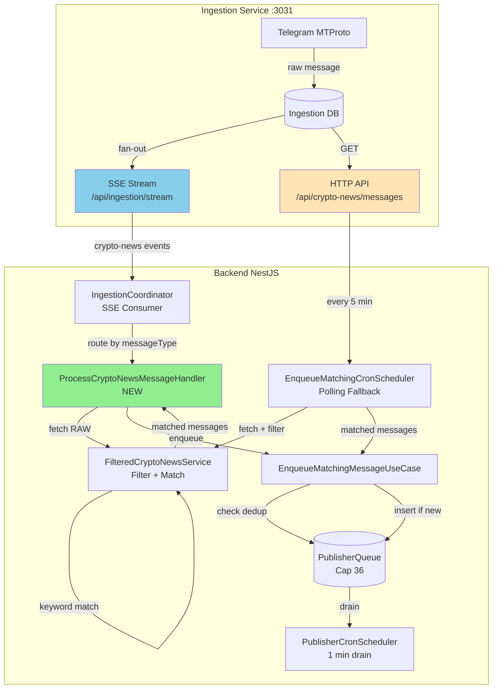

# Design Document: Crypto-News SSE Latency Reduction

## Overview

This feature replaces polling-based crypto-news message discovery with event-driven SSE consumption to reduce publishing latency from ~2 minutes (worst case) to ~5-10 seconds. The backend currently polls the ingestion-telegram HTTP API every minute via `EnqueueMatchingCronScheduler`. By adding a real-time SSE handler that processes `messageType='crypto-news'` events immediately, matched messages are enqueued within seconds of ingestion.

The design maintains **Opción A architecture invariants**:

- Ingestion-service stores RAW content (no filters)
- Backend applies `ContentFilterService` + keyword matching on-read
- The 3-flag control system (`matchingEnabled`, `llmEnabled`, `publishingEnabled`) remains unchanged
- Publisher behavior (queue cap 36, 1-minute drain cycle) is untouched

Polling is **retained as a fallback** mechanism to catch messages missed during SSE reconnection gaps, running at a reduced frequency (default 5 minutes, configurable).

### Key Architectural Decisions

1. **Dual-path ingestion (SSE primary + polling fallback)**: SSE provides real-time delivery, polling ensures eventual consistency during disconnections
2. **Shared deduplication logic**: Both paths use identical `PublisherQueueEntry` status checks to prevent duplicate enqueues
3. **Independent configuration flags**: `USE_SSE_CRYPTO_NEWS` (enable/disable SSE) and `CRYPTO_NEWS_POLLING_INTERVAL_MINUTES` (fallback frequency) are decoupled for operational flexibility
4. **Zero impact on downstream pipeline**: Publisher cron, queue cap, LLM generation, and publishing logic remain unchanged
5. **Latency measurement at enqueue time**: Calculates `Date.now() - message.ingestedAt` to verify <10s target with INFO/WARN logging

### Success Criteria

- **Latency**: 90% of messages enqueued within 10 seconds of `ingestedAt` timestamp (logged per-message)
- **Reliability**: Zero message loss during SSE disconnections (fallback polling catches gaps)
- **Deduplication**: Zero duplicate enqueues across SSE and polling paths (idempotent by `channelId:messageId` status check)
- **Backward compatibility**: System operates correctly when SSE is disabled (polls at 1-minute interval as before)

## Architecture

### High-Level System Architecture



### Data Flow Comparison

**BEFORE (Polling-only)**:

```
Telegram → Ingestion DB (RAW)
    ↓ (up to 60s polling delay)
EnqueueMatchingCronScheduler polls /api/crypto-news/messages
    → FilteredCryptoNewsService (fetch + filter + match)
    → EnqueueMatchingMessageUseCase (dedup + enqueue)
    → PublisherQueue
```

**AFTER (SSE primary + polling fallback)**:

```
Path A (SSE - real-time):
Telegram → Ingestion DB (RAW)
    ↓ (<1s SSE push)
IngestionCoordinator receives 'crypto-news' event
    → ProcessCryptoNewsMessageHandler
    → FilteredCryptoNewsService (fetch + filter + match)
    → EnqueueMatchingMessageUseCase (dedup + enqueue)
    → PublisherQueue

Path B (Polling - fallback every 5 min):
EnqueueMatchingCronScheduler polls /api/crypto-news/messages
    → FilteredCryptoNewsService (fetch + filter + match)
    → EnqueueMatchingMessageUseCase (dedup + enqueue, skips if already queued)
    → PublisherQueue
```

### Configuration Model

Three environment variables control the dual-path behavior:

| Variable                               | Type    | Default | Purpose                                               |
| -------------------------------------- | ------- | ------- | ----------------------------------------------------- |
| `USE_SSE_CRYPTO_NEWS`                  | boolean | `true`  | Enable/disable SSE event subscription for crypto-news |
| `CRYPTO_NEWS_POLLING_INTERVAL_MINUTES` | number  | `5`     | Fallback polling frequency (minutes)                  |
| `matchingEnabled`                      | DB flag | `true`  | Master control for both SSE and polling (existing)    |

**Truth Table (4 combinations)**:

| USE_SSE | matchingEnabled | Behavior                                                               |
| :-----: | :-------------: | ---------------------------------------------------------------------- |
| `true`  |     `true`      | **Full pipeline**: SSE real-time + polling every 5 min (fallback)      |
| `true`  |     `false`     | **All paused**: Both SSE handler and polling scheduler skip processing |
| `false` |     `true`      | **Polling-only fallback**: Polls every 1 minute (pre-feature behavior) |
| `false` |     `false`     | **All paused**: No ingestion                                           |

**Operational modes**:

- **Production (default)**: `USE_SSE_CRYPTO_NEWS=true` → <10s latency, 5-min fallback safety net
- **Rollback mode**: `USE_SSE_CRYPTO_NEWS=false` → reverts to 1-minute polling if SSE has issues
- **Pause mode**: `matchingEnabled=false` → stops all crypto-news ingestion (SSE handler and polling scheduler both skip)

### Deduplication Strategy

Both SSE and polling paths share the **same deduplication logic** via `PublisherQueueEntry` status checks. Before enqueueing, query `PublisherQueueRepository.findByChannelIdAndMessageId(channelId, messageId)`:

| Status                             | Action      | Reason                                                                                   |
| ---------------------------------- | ----------- | ---------------------------------------------------------------------------------------- |
| `null` (no entry)                  | **Enqueue** | New message, never seen                                                                  |
| `PENDING`                          | **Skip**    | Already in queue waiting to publish                                                      |
| `PUBLISHED`                        | **Skip**    | Already published successfully                                                           |
| `FAILED` + blocking reason\*       | **Skip**    | Content is problematic (e.g., "non-Latin character", "policy", "blacklist", "honeypot")  |
| `FAILED` + non-blocking reason\*\* | **Enqueue** | Transient failure (e.g., "Expired: exceeded 24h", "Rate limit", "LLM generation failed") |

\* **Blocking reasons** (content-related, permanent): checked via `isBlockingFailureReason(reason)` from `shared/deduplication/domain/constants/blocking-failure-reasons.ts`

\*\* **Non-blocking reasons** (operational, transient): allow retry with fresh entry

This **hybrid deduplication** ensures:

- **Idempotency**: Same message arriving via SSE + polling → only one entry created
- **Smart retry**: Expired/rate-limited content can be re-attempted when conditions improve
- **Permanent blocks**: Policy/honeypot violations never re-enqueue

**Example scenarios**:

1. **Happy path (SSE + polling no-op)**:
   - T=0s: Message arrives → SSE handler enqueues → status=`PENDING`
   - T=300s: Polling finds same message → checks status=`PENDING` → skips (already queued)

2. **SSE missed during reconnection**:
   - T=0s: Message arrives → SSE disconnected → not processed
   - T=300s: Polling finds message → status=`null` → enqueues successfully

3. **Expired entry retry**:
   - T=0s: Message enqueued → status=`PENDING`
   - T=24h: TTL scheduler marks status=`FAILED` ("Expired: exceeded 24h")
   - T=25h: Same content appears again → checks status=`FAILED` + reason="Expired" → `isBlockingFailureReason("Expired")=false` → **allows re-enqueue**

4. **Blacklisted content permanent block**:
   - T=0s: Message enqueued → matches blacklist → status=`FAILED` ("Blacklist match: 'scam'")
   - T=1h: Same content appears again → checks status=`FAILED` + reason="Blacklist match" → `isBlockingFailureReason("Blacklist")=true` → **skips re-enqueue**

## Components and Interfaces

### New Component: ProcessCryptoNewsMessageHandler

**Location**: `apps/backend/src/telegram/crypto-news-integration/application/handlers/process-crypto-news-message.handler.ts`

**Responsibility**: Handle real-time SSE events for `messageType='crypto-news'`, apply filters + keyword matching, and enqueue matched messages.

**Class Signature**:

```typescript
@Injectable()
export class ProcessCryptoNewsMessageHandler {
  constructor(
    private readonly filteredNewsService: FilteredCryptoNewsService,
    private readonly enqueueUseCase: EnqueueMatchingMessageUseCase,
    private readonly matchingConfigRepo: MatchingConfigRepository,
    private readonly queueRepo: PublisherQueueRepository,
  ) {}

  /**
   * Process a single crypto-news message from SSE stream.
   *
   * Pipeline:
   * 1. Check matchingEnabled flag (skip if disabled)
   * 2. Check PublisherQueueEntry deduplication (skip if already queued/published)
   * 3. Fetch RAW message from ingestion-telegram (via FilteredCryptoNewsService)
   * 4. Apply ContentFilterService + keyword matching
   * 5. Enqueue if matched (via EnqueueMatchingMessageUseCase)
   * 6. Log latency (Date.now() - ingestedAt)
   *
   * @param raw - TelegramRawMessage from SSE stream (messageType='crypto-news')
   * @returns void (errors logged, not thrown)
   */
  async handle(raw: TelegramRawMessage): Promise<void>;

  /**
   * Calculate and log ingestion latency.
   *
   * @param ingestedAt - Timestamp from ingestion-telegram (when message was stored)
   * @param channelId - For log correlation
   * @param messageId - For log correlation
   * @returns void (logs INFO if <10s, WARN if ≥10s)
   */
  private logLatency(
    ingestedAt: Date,
    channelId: string,
    messageId: number,
  ): void;
}
```

**Dependencies**:

- `FilteredCryptoNewsService` - Fetch RAW message + apply filters + keyword matching
- `EnqueueMatchingMessageUseCase` - Enqueue matched messages to publisher queue
- `MatchingConfigRepository` - Read `matchingEnabled` flag
- `PublisherQueueRepository` - Check deduplication status before enqueueing

**Key Design Decisions**:

1. **Defensive error boundary**: Wraps entire `handle()` in try/catch, logs errors without throwing (prevents one bad message from crashing SSE stream)
2. **Deduplication before expensive ops**: Checks `PublisherQueueEntry` status BEFORE calling `FilteredCryptoNewsService` (avoids redundant HTTP fetch + filter work)
3. **Reuses existing services**: No new HTTP client or filter logic — delegates to `FilteredCryptoNewsService` for consistency with polling path
4. **Latency measurement at enqueue**: Calculates `Date.now() - ingestedAt` immediately after enqueue, logs with channelId/messageId for debugging

### Modified Component: IngestionCoordinator

**Location**: `apps/backend/src/telegram/ingestion/shared/application/ingestion-coordinator.service.ts`

**Current Behavior**: Routes SSE messages by `messageType`:

- `'kol'` → `KolIngestionOrchestratorUseCase.onMessageReceived(raw)`
- `'crypto-news'` → skip with log message (line ~80: `"Crypto-news SSE persistence skipped..."`)

**Modified Behavior**: Replace skip-with-log with handler invocation:

```typescript
// OLD (line ~80):
this.logger.warn(
  'Crypto-news SSE persistence skipped: ingestion-telegram owns ' +
    'crypto-news messages/sources/media in its own DB (Opción A — ' +
    'backend persists nothing, filters apply on-read).',
);

// NEW:
this.logger.log(
  `[ROUTE-DEBUG] Routing to crypto-news handler for ${raw.peerId}:${raw.messageId}`,
);
await this.cryptoNewsHandler.handle(raw);
this.logger.log(
  `[ROUTE-DEBUG] ✅ Crypto-news handler completed for ${raw.peerId}:${raw.messageId}`,
);
```

**Changes Required**:

1. **Inject `ProcessCryptoNewsMessageHandler`** in constructor
2. **Replace skip-with-log** with `await this.cryptoNewsHandler.handle(raw)` in `route()` method
3. **Add error boundary** (same pattern as KOL handler): catch, log ERROR, do NOT throw

**Why modify routing instead of using event bus?**

- Consistency with KOL handler pattern (direct use case call, no bus)
- Fix-1 compliance (raw text must NOT cross event bus per ToS §4.3)
- Simpler data flow (no need to define new domain event)

### Modified Component: EnqueueMatchingCronScheduler

**Location**: `apps/backend/src/telegram/crypto-news-integration/application/scheduling/enqueue-matching-cron.scheduler.ts`

**Current Behavior**: Runs every 1 minute (`@Cron(CronExpression.EVERY_MINUTE)`), fetches 50 messages, filters, enqueues matches.

**Modified Behavior**: Dynamic cron interval based on `USE_SSE_CRYPTO_NEWS` flag:

| USE_SSE_CRYPTO_NEWS | Interval                                               | Rationale                                           |
| :-----------------: | ------------------------------------------------------ | --------------------------------------------------- |
|       `true`        | `CRYPTO_NEWS_POLLING_INTERVAL_MINUTES` (default 5 min) | SSE handles real-time, polling is fallback only     |
|       `false`       | 1 minute (original)                                    | Polling is primary path, needs aggressive frequency |

**Implementation Approach**:

NestJS `@Cron` decorators are **static** (evaluated at module load, cannot change at runtime). Options:

1. **Option A (Recommended)**: Use `SchedulerRegistry.addCronJob()` to register interval dynamically at `onApplicationBootstrap()`
2. **Option B**: Keep `@Cron(CronExpression.EVERY_MINUTE)` but add early-return guard that skips non-interval ticks
3. **Option C**: Remove `@Cron` entirely, use `setInterval()` in `onApplicationBootstrap()`

**Chosen: Option A** (clearest semantics, leverages NestJS scheduler):

```typescript
@Injectable()
export class EnqueueMatchingCronScheduler implements OnApplicationBootstrap {
  constructor(
    private readonly schedulerRegistry: SchedulerRegistry,
    private readonly config: ConfigService,
    // ... existing deps
  ) {}

  async onApplicationBootstrap(): Promise<void> {
    const useSse = this.config.get<boolean>(
      'app.ingestion.useSseCryptoNews',
      true,
    );
    const pollingInterval = this.config.get<number>(
      'app.cryptoNews.pollingIntervalMinutes',
      5,
    );

    const intervalMinutes = useSse ? pollingInterval : 1;
    const cronExpression = `*/${intervalMinutes} * * * *`; // Every N minutes

    const job = new CronJob(cronExpression, () => void this.tick());
    this.schedulerRegistry.addCronJob('crypto-news-polling', job);
    job.start();

    this.logger.log(
      `Crypto-news polling initialized: interval=${intervalMinutes} min, ` +
        `SSE=${useSse ? 'enabled (fallback mode)' : 'disabled (primary mode)'}`,
    );
  }

  // Remove @Cron decorator from tick() — now scheduled dynamically
  async tick(): Promise<void> {
    // ... existing logic unchanged
  }
}
```

**Changes Required**:

1. **Inject `SchedulerRegistry`** from `@nestjs/schedule`
2. **Read config** for `useSseCryptoNews` and `pollingIntervalMinutes`
3. **Register dynamic cron** in `onApplicationBootstrap()` with computed interval
4. **Remove `@Cron` decorator** from `tick()` method (prevent double-scheduling)
5. **Log effective interval** at bootstrap for operational visibility

**Deduplication Note**: No changes to `tick()` logic — already uses `EnqueueMatchingMessageUseCase`, which checks `PublisherQueueEntry` status. SSE-enqueued messages are automatically skipped by polling.

### Modified Component: app.config.ts

**Location**: `apps/backend/src/shared/common/config/app.config.ts`

**Current Relevant Fields**:

```typescript
{
  ingestion: {
    useSse: boolean; // USE_SSE_INGESTION (for KOL messages)
    useMock: boolean; // USE_MOCK_INGESTION
    serviceUrl: string; // INGESTION_TELEGRAM_URL
  }
}
```

**New Fields**:

```typescript
{
  ingestion: {
    useSse: boolean;                // Existing (KOL)
    useMock: boolean;               // Existing
    serviceUrl: string;             // Existing
    useSseCryptoNews: boolean;      // NEW: USE_SSE_CRYPTO_NEWS
  },
  cryptoNews: {                     // NEW nested group
    pollingIntervalMinutes: number; // NEW: CRYPTO_NEWS_POLLING_INTERVAL_MINUTES
  }
}
```

**Validation Rules**:

1. `USE_SSE_CRYPTO_NEWS`: boolean, default `true`
2. `CRYPTO_NEWS_POLLING_INTERVAL_MINUTES`: number, min 1, max 60, default 5

**Example `.env` addition**:

```bash
# Crypto-news SSE latency reduction
USE_SSE_CRYPTO_NEWS=true                         # Enable real-time SSE for crypto-news
CRYPTO_NEWS_POLLING_INTERVAL_MINUTES=5           # Fallback polling frequency (minutes)
```

## Data Models

### TelegramRawMessage (Existing)

Used by both SSE and polling paths (no changes):

```typescript
interface TelegramRawMessage {
  readonly peerId: string; // Channel ID (e.g., "-1001234567890")
  readonly messageId: number; // Telegram message ID
  readonly text: string; // Message content (for crypto-news; empty for KOL)
  readonly occurredAt: Date; // When message was sent on Telegram
  readonly entities?: ReadonlyArray<{
    // Formatting (bold, links)
    readonly type: string;
    readonly offset: number;
    readonly length: number;
    readonly url?: string;
  }>;
  readonly media?: ReadonlyArray<{
    // Media attachments
    readonly type: 'photo' | 'video';
    readonly filePath: string; // Local path or HTTP URL
    readonly fileSize: number | null;
    readonly mimeType: string | null;
    readonly index: number;
  }>;
  readonly groupedId?: bigint | string; // Album group ID
}
```

**SSE Payload Transformation** (handled by `TelegramSseListenerAdapter`):

- Ingestion-service emits `MessagePayload` with `messageType: 'crypto-news'`
- `payloadToRawMessage()` converts to `TelegramRawMessage` format
- `text` field is **populated** for crypto-news (unlike KOL which has empty text per fix-1)

### FilteredCryptoNewsMessage (Existing)

Output of `FilteredCryptoNewsService.getMatchingMessages()` (no changes):

```typescript
interface FilteredCryptoNewsMessage extends CryptoNewsMessageDto {
  readonly content: string; // FILTERED content (after ContentFilterService)
  readonly matchedKeywords: Keyword[]; // Keywords that triggered inclusion
  readonly hasMedia: boolean; // Whether message has photo/video
}
```

### EnqueueMessageDto (Existing)

Input to `EnqueueMatchingMessageUseCase` (no changes):

```typescript
interface EnqueueMessageDto {
  readonly channelId: string;
  readonly messageId: number;
  readonly content: string; // FILTERED content
  readonly publishedAt: Date; // Telegram send time
  readonly ingestedAt: Date; // Ingestion-service storage time
  readonly media: Array<{
    readonly index: number;
    readonly type: 'photo' | 'video' | 'document';
    readonly filePath: string;
    readonly mimeType?: string;
    readonly fileSize?: number;
  }>;
  readonly matchedKeywords: Keyword[]; // Embedded for queue entry
}
```

### PublisherQueueEntry (Existing)

Queue entry entity with status-based deduplication (no changes):

```typescript
export class PublisherQueueEntry extends AggregateRoot<string> {
  status:
    | 'PENDING'
    | 'SCHEDULED'
    | 'PUBLISHING'
    | 'PUBLISHED'
    | 'FAILED'
    | 'BLOCKED';
  lastError: string | null;
  queuedAt: Date; // For TTL expiration (24h)
  // ... other fields
}
```

**Deduplication Query**:

```typescript
const existing = await queueRepo.findByChannelIdAndMessageId(
  channelId,
  messageId,
);
```

**Deduplication Logic** (pseudo-code):

```typescript
if (!existing) {
  return 'ENQUEUE'; // New message
}
if (existing.status === 'PENDING' || existing.status === 'PUBLISHED') {
  return 'SKIP'; // Already queued or published
}
if (existing.status === 'FAILED') {
  if (isBlockingFailureReason(existing.lastError)) {
    return 'SKIP'; // Permanent content block (policy, blacklist, honeypot)
  }
  return 'ENQUEUE'; // Transient failure (expired, rate limit) — retry allowed
}
```

## Error Handling

### Error Categories and Strategies

| Error Type                                | Where                                                   | Strategy                                                               | Example                                     |
| ----------------------------------------- | ------------------------------------------------------- | ---------------------------------------------------------------------- | ------------------------------------------- |
| **SSE connection failure**                | `TelegramSseListenerAdapter`                            | Auto-reconnect with exponential backoff (1s → 30s cap)                 | Network timeout, ingestion-telegram restart |
| **Invalid SSE payload**                   | `ProcessCryptoNewsMessageHandler`                       | Log ERROR, skip message, continue stream                               | Malformed JSON, missing `channelId`         |
| **FilteredCryptoNewsService failure**     | `ProcessCryptoNewsMessageHandler`                       | Log ERROR, skip message, continue (fallback polling will retry)        | Ingestion-service HTTP 500, timeout         |
| **EnqueueMatchingMessageUseCase failure** | Both handlers                                           | Log ERROR, skip message (idempotent — polling will retry if transient) | DB connection lost, validation error        |
| **MatchingConfig load failure**           | Both handlers                                           | Log ERROR, skip tick (prevents incorrect state)                        | DB query timeout                            |
| **Dynamic cron registration failure**     | `EnqueueMatchingCronScheduler.onApplicationBootstrap()` | Log FATAL, throw (blocks app startup)                                  | Invalid cron expression                     |

### SSE-Specific Error Handling

**Reconnection Flow** (handled by `TelegramSseListenerAdapter.subscribe()`):

```typescript
while (true) {
  try {
    yield * this.connectAndStream(streamUrl, channelIds);
  } catch (error) {
    const delay = this.calculateBackoff(); // 1s → 2s → 4s → ... → 30s cap
    this.logger.warn(
      `SSE connection failed (attempt ${this.reconnectAttempts}), reconnecting in ${delay}ms`,
      error instanceof Error ? error.message : String(error),
    );
    await this.sleep(delay);
  }
}
```

**Gap Coverage**: Messages arriving during reconnection gap are caught by fallback polling (runs every 5 min).

### Handler Error Boundaries

**ProcessCryptoNewsMessageHandler.handle()** (defensive design):

```typescript
async handle(raw: TelegramRawMessage): Promise<void> {
  try {
    // 1. Check matchingEnabled (skip if disabled)
    // 2. Check deduplication (skip if already queued/published)
    // 3. Fetch + filter + match (FilteredCryptoNewsService)
    // 4. Enqueue if matched (EnqueueMatchingMessageUseCase)
    // 5. Log latency
  } catch (error) {
    this.logger.error(
      `Failed to process crypto-news message ${raw.peerId}:${raw.messageId}: ${
        error instanceof Error ? error.message : String(error)
      }`,
      error instanceof Error ? error.stack : undefined,
    );
    // Do NOT throw — prevents single bad message from crashing SSE stream
  }
}
```

**IngestionCoordinator.route()** (same pattern as KOL handler):

```typescript
try {
  await this.cryptoNewsHandler.handle(raw);
} catch (error) {
  this.logger.error(
    `Failed to route crypto-news message ${raw.peerId}:${raw.messageId}: ${
      error instanceof Error ? error.message : String(error)
    }`,
    error instanceof Error ? error.stack : undefined,
  );
  // Do NOT throw — defensive error boundary
}
```

### Latency Measurement Error Handling

**Calculation Failure** (e.g., invalid `ingestedAt` timestamp):

```typescript
private logLatency(ingestedAt: Date, channelId: string, messageId: number): void {
  try {
    if (!ingestedAt || !(ingestedAt instanceof Date) || isNaN(ingestedAt.getTime())) {
      this.logger.warn(
        `Invalid ingestedAt for ${channelId}:${messageId}: ${ingestedAt} — skipping latency log`,
      );
      return;
    }

    const latencyMs = Date.now() - ingestedAt.getTime();
    const latencySec = (latencyMs / 1000).toFixed(2);

    if (latencyMs < 10_000) {
      this.logger.log(
        `✅ Latency ${latencySec}s for ${channelId}:${messageId} (target <10s met)`,
      );
    } else {
      this.logger.warn(
        `⚠️ Latency ${latencySec}s for ${channelId}:${messageId} (target <10s MISSED)`,
      );
    }
  } catch (error) {
    this.logger.error(
      `Failed to calculate latency for ${channelId}:${messageId}: ${
        error instanceof Error ? error.message : String(error)
      }`,
    );
    // Non-critical — continue without latency log
  }
}
```

## Testing Strategy

### Unit Tests

**ProcessCryptoNewsMessageHandler** (`process-crypto-news-message.handler.spec.ts`):

1. **Happy path**: Message matched → enqueued → latency logged INFO
2. **No keyword match**: FilteredCryptoNewsService returns empty → skip enqueue
3. **MatchingConfig disabled**: Skip early, no fetch/filter
4. **Already queued (status=PENDING)**: Dedup check skips enqueue
5. **Already published (status=PUBLISHED)**: Dedup check skips enqueue
6. **Failed with blocking reason**: Dedup check skips enqueue (e.g., "blacklist")
7. **Failed with non-blocking reason**: Dedup allows re-enqueue (e.g., "Expired")
8. **FilteredCryptoNewsService throws**: Error logged, no throw, no enqueue
9. **EnqueueMatchingMessageUseCase throws**: Error logged, no throw
10. **Latency <10s**: INFO log emitted
11. **Latency ≥10s**: WARN log emitted
12. **Invalid ingestedAt**: Latency log skipped with WARN

**EnqueueMatchingCronScheduler** (`enqueue-matching-cron.scheduler.spec.ts`):

1. **Dynamic cron registration (SSE enabled)**: Interval = 5 min (or config value)
2. **Dynamic cron registration (SSE disabled)**: Interval = 1 min
3. **SchedulerRegistry.addCronJob() called with correct expression**
4. **Bootstrap logs effective interval**
5. **tick() skips when matchingEnabled=false** (existing test, unchanged)

**Modified IngestionCoordinator** (`ingestion-coordinator.service.spec.ts`):

1. **Crypto-news message routed to handler**: `messageType='crypto-news'` → `ProcessCryptoNewsMessageHandler.handle()` called
2. **Handler error boundary**: Handler throws → error logged, no propagation
3. **KOL routing unchanged**: `messageType='kol'` → `KolIngestionOrchestratorUseCase` called (regression test)

### Integration Tests

**End-to-end SSE flow** (`crypto-news-sse-latency.integration.spec.ts`):

1. **Setup**: Mock SSE stream emitting crypto-news events
2. **Test**: SSE event → IngestionCoordinator → ProcessCryptoNewsMessageHandler → FilteredCryptoNewsService → EnqueueMatchingMessageUseCase
3. **Verify**: PublisherQueueEntry created with status=PENDING, latency logged
4. **Teardown**: Disconnect SSE stream

**Deduplication across SSE + polling** (`deduplication-hybrid.integration.spec.ts`):

1. **Setup**: Create PublisherQueueEntry with status=PENDING
2. **Test**: SSE handler + polling scheduler both process same message (channelId:messageId)
3. **Verify**: Only ONE entry in DB (first wins, second skipped), logs show dedup skip
4. **Repeat**: With status=PUBLISHED, FAILED+blocking, FAILED+non-blocking

**Fallback polling during SSE gap** (`sse-gap-recovery.integration.spec.ts`):

1. **Setup**: Start SSE subscription, disconnect after 2 messages
2. **Test**: Send 5 messages (2 during SSE, 3 during gap)
3. **Wait**: 5 minutes (trigger polling tick)
4. **Verify**: All 5 messages enqueued (SSE got 2, polling got 3 missed ones)

**Flag-driven behavior** (`crypto-news-config-flags.integration.spec.ts`):

1. **USE_SSE_CRYPTO_NEWS=true + matchingEnabled=true**: SSE handler processes, polling runs every 5 min
2. **USE_SSE_CRYPTO_NEWS=true + matchingEnabled=false**: SSE handler skips, polling skips
3. **USE_SSE_CRYPTO_NEWS=false + matchingEnabled=true**: SSE subscription inactive, polling runs every 1 min
4. **USE_SSE_CRYPTO_NEWS=false + matchingEnabled=false**: No ingestion

### Property-Based Tests

Not applicable for this feature. Reasons:

- **Infrastructure wiring**: Feature configures SSE subscription + polling scheduler (no pure functions with universal properties)
- **External dependencies**: Relies on ingestion-telegram HTTP/SSE (mocked in tests, not suitable for PBT input generation)
- **State machine behavior**: Deduplication logic is status-based (already covered by hybrid logic unit tests with example-based cases)

Alternative: **Comprehensive example-based tests** cover all deduplication states, error paths, and configuration combinations (see unit + integration tests above).

---

_This design document provides the technical foundation for implementing crypto-news SSE latency reduction. All components reuse existing services (FilteredCryptoNewsService, EnqueueMatchingMessageUseCase, deduplication logic) to ensure consistency with the polling path. The dual-path architecture (SSE primary + polling fallback) guarantees zero message loss while achieving <10s latency in the happy path._
