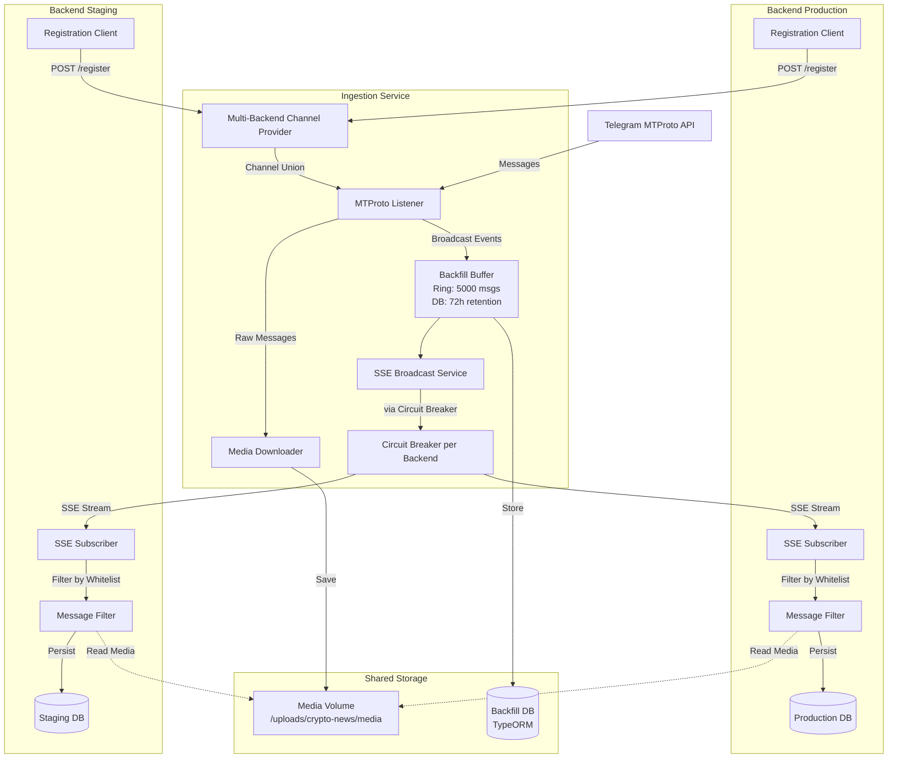
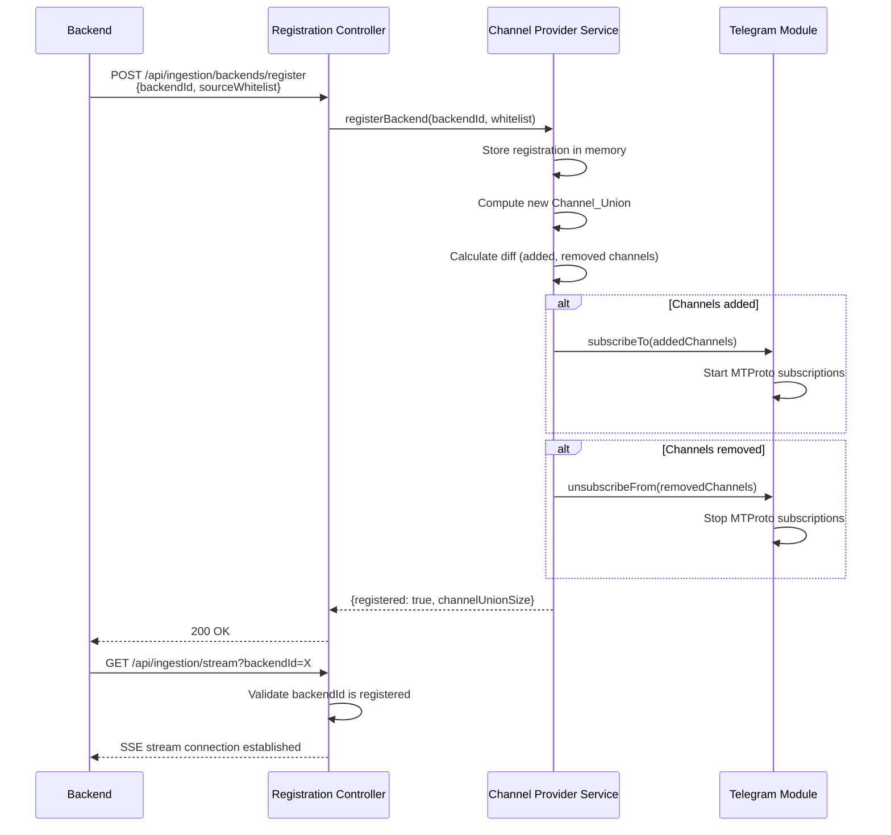
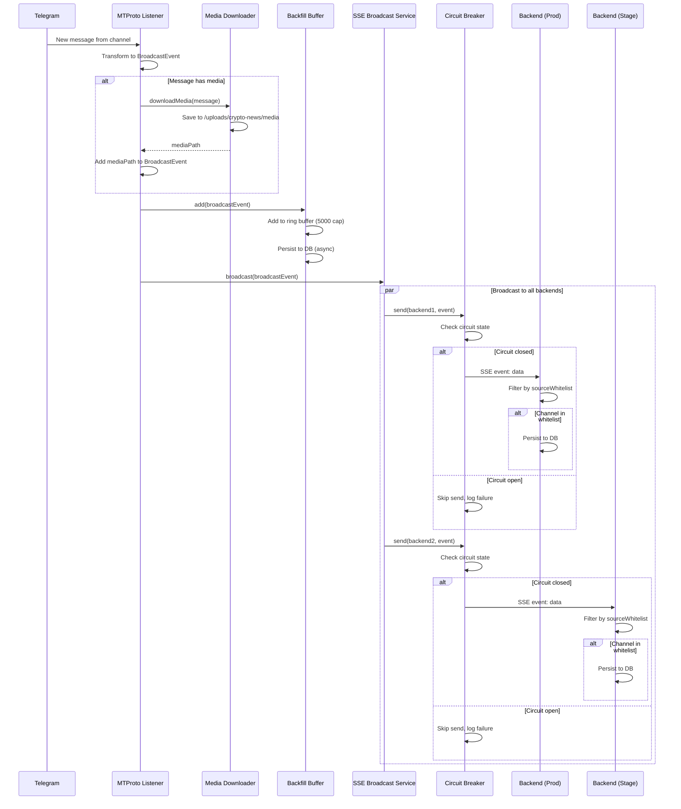

# Design Document: Shared Ingestion Service with Multi-Backend Broadcast

## Overview

This document details the technical design for enabling a single ingestion-service instance to broadcast Telegram messages to multiple backend instances (production and staging) via Server-Sent Events (SSE). The design eliminates duplicate MTProto connections, media downloads, and ingestion processing while maintaining backend independence.

## High-Level Architecture

### System Components



### Sequence Diagrams

#### Backend Registration Flow



#### Message Broadcast Flow



## API Contracts

### Backend Registration Endpoint

```typescript
// POST /api/ingestion/backends/register
// Location: apps/ingestion-service/src/stream/api/http/backend-registration.controller.ts

interface RegisterBackendRequest {
  backendId: string; // Unique identifier (e.g., "production", "staging")
  sourceWhitelist: string[]; // Array of Telegram channel/user IDs
  apiVersion?: string; // API version for future compatibility (default: "v1")
}

interface RegisterBackendResponse {
  registered: boolean;
  channelUnionSize: number; // Total unique channels across all backends
  message?: string; // Optional info message
}
```

### SSE Stream Endpoint

```typescript
// GET /api/ingestion/stream?backendId={id}&lastSeenTimestamp={ts}
// Location: apps/ingestion-service/src/stream/api/http/sse-stream.controller.ts

// Event Types:
// 1. broadcast - Real-time message
// 2. backfill - Missed message during reconnection
// 3. backfill-complete - End of backfill sequence
// 4. backfill-unavailable - Disconnection > 72h
// 5. heartbeat - Keep-alive every 30s
```

## Data Structures

### BroadcastEvent Schema

```typescript
// Location: apps/ingestion-service/src/stream/domain/broadcast-event.vo.ts

export class BroadcastEvent {
  readonly eventId: string; // UUID v4
  readonly timestamp: number; // Unix timestamp (ms)
  readonly channelId: string; // Source Telegram channel/user ID
  readonly messageId: number; // Telegram message ID
  readonly content: string; // Message text content
  readonly title?: string; // Optional message title
  readonly mediaPath?: string; // Optional relative path to media file
  readonly publishedAt: number; // Unix timestamp (ms)

  static fromTelegramMessage(
    channelId: string,
    msg: TelegramRawMessage,
    mediaPath?: string,
  ): BroadcastEvent;

  toJSON(): Record<string, any>;
  static fromJSON(json: string): BroadcastEvent;
}
```

## Architecture Decision Records

### ADR-1: SSE vs WebSocket

**Decision:** Use Server-Sent Events (SSE)

**Rationale:**

- Unidirectional flow (ingestion→backends only)
- Built-in reconnection with EventSource API
- Already used in project (StreamModule)
- Simpler protocol than WebSocket

### ADR-2: Ring Buffer + DB Hybrid

**Decision:** Hybrid approach — in-memory ring buffer (5000 msgs) + DB persistence

**Rationale:**

- O(1) lookup for recent messages (<2h)
- DB persistence survives restarts
- Bounded memory (25MB @ 5KB/msg)
- Covers typical disconnect scenarios

### ADR-3: Circuit Breaker Pattern

**Decision:** Per-backend circuit breaker (3 failure threshold, 5min timeout)

**Rationale:**

- Fail fast after 3 consecutive failures
- Auto-recovery via half-open state
- Isolates failures (one backend doesn't block others)
- Standard pattern for distributed systems

### ADR-4: Backend-Side Filtering

**Decision:** Backends filter messages locally against their whitelist

**Rationale:**

- Simpler server logic
- Backend autonomy
- Easier to add new backends
- Flexible filtering rules per backend

### ADR-5: Channel Union Strategy

**Decision:** Subscribe to union of all whitelists, unsubscribe only when unused

**Rationale:**

- Staging independence (can add test channels)
- Production unaffected by staging decisions
- Single MTProto session respects rate limits
- Slight traffic overhead acceptable for independence

## Implementation Phases

### Phase 1: Backend Registration & Channel Union (4-6h)

- Create BackendRegistration entity
- Create registration endpoint
- Modify BackendChannelProviderService for multi-backend
- Implement channel union computation
- 15+ unit tests

### Phase 2: SSE Broadcast Infrastructure (6-8h)

- Create SSEBroadcastService
- Create SSEStreamController
- Implement BackendCircuitBreakerService
- Add heartbeat mechanism
- Wire into TelegramModule
- 20+ unit tests

### Phase 3: Backfill Buffer (5-7h)

- Create BackfillMessageEntity (TypeORM)
- Create BackfillBufferService (ring buffer)
- Implement persist/restore logic
- Add cleanup cron job
- Modify SSEStreamController for backfill
- 15+ unit tests

### Phase 4: Integration & Observability (3-4h)

- Create StreamStatusController
- Add Prometheus metrics
- Update HealthModule
- E2E tests
- Metrics dashboard

### Phase 5: Backward Compatibility (4-5h)

- Add feature flag
- Implement legacy fallback
- Migration guide
- Staging validation
- Rollback procedure

**Total: 22-30 hours**

## Testing Strategy

- **Unit Tests:** 50+ (buffer, union, circuit breaker, serialization)
- **Integration Tests:** 30+ (broadcast, backfill, channel updates)
- **E2E Tests:** 10+ (full flows, failure scenarios)
- **Property-Based Tests:** 4 (correctness properties)

## Deployment Strategy

**Week 1:** Staging only (feature flag on)  
**Week 2:** Production parallel mode (registration + legacy)  
**Week 3:** Production new mode only  
**Week 4:** Cleanup (remove legacy code)

## Monitoring

**Metrics:**

- `ingestion_active_backends` (gauge)
- `ingestion_broadcast_total` (counter)
- `ingestion_broadcast_failures` (counter)
- `ingestion_channel_union_size` (gauge)
- `ingestion_backfill_buffer_size` (gauge)
- `ingestion_backfill_requests_total` (counter)

**Alerts:**

- Critical: active_backends < 2 for 5min
- Warning: broadcast_failures > 10/min
- Warning: buffer_size > 4000

---

**Document Version:** 1.0  
**Last Updated:** 2026-09-03  
**Status:** Ready for Implementation
