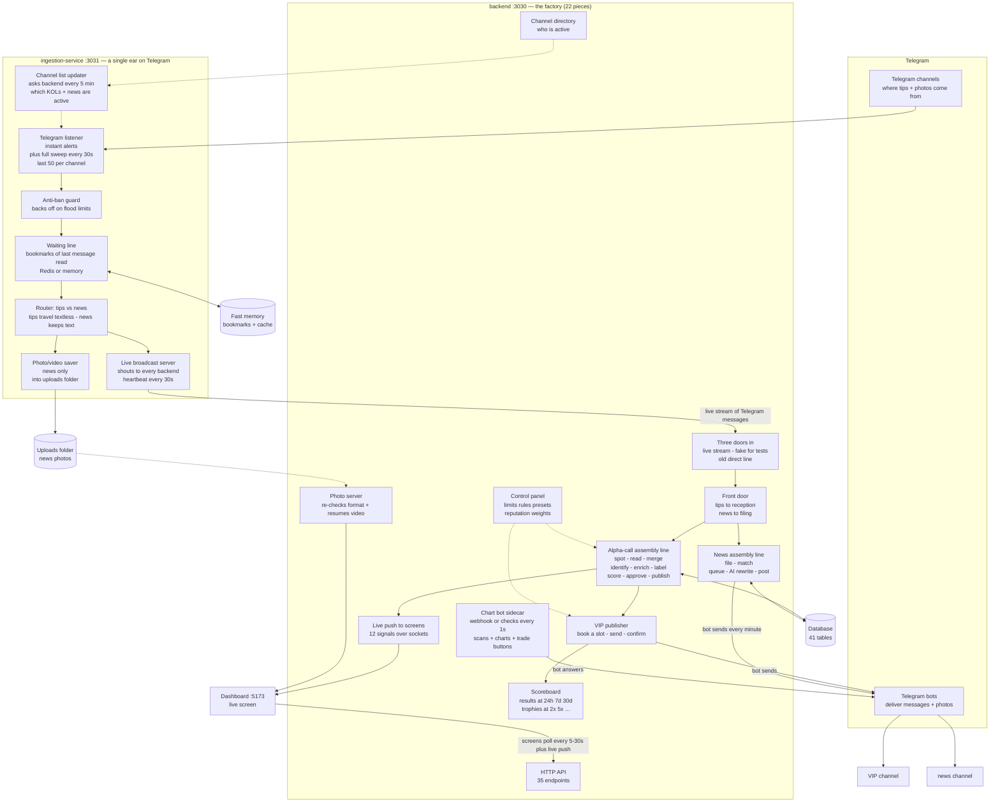
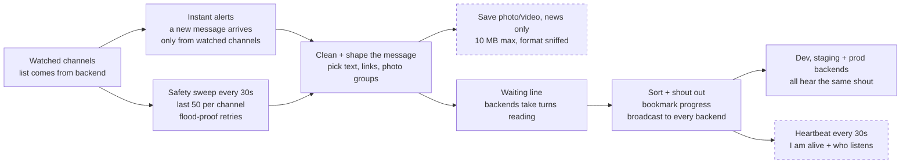
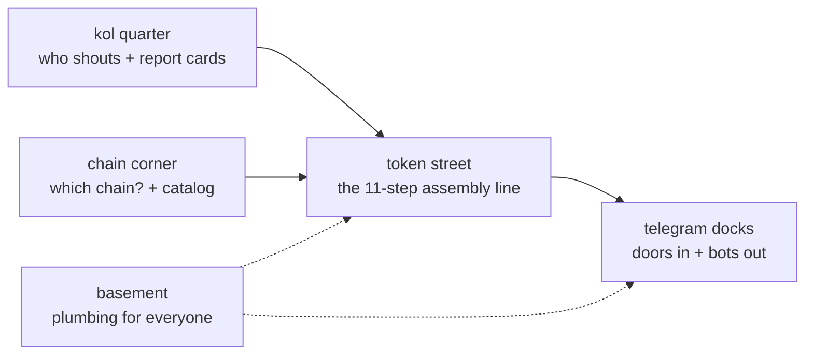
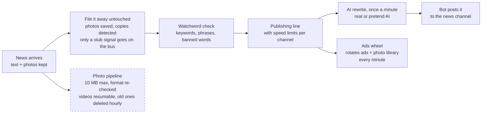

# Alpha Meta Token Scanner

> Real-time pipeline that discovers, validates, and republishes on-chain token alpha-calls from Telegram KOL channels — with a live operations dashboard.

[](https://github.com/bryanstevensacosta/onchain-bot/actions/workflows/ci.yml)


One MTProto session ingests Telegram → SSE fan-out → NestJS pipeline (extract → enrich → score → gate → publish to a VIP channel) → React dashboard over REST + WebSocket.

---

## Index

- [Apps](#apps)
- [Quickstart](#quickstart)
- [Service URLs](#service-urls)
- [How it works](#how-it-works)
- [Commands](#commands)
- [Configuration](#configuration)
- [Testing](#testing)
- [Deploy](#deploy)
- [Health & monitoring](#health--monitoring)
- [Troubleshooting](#troubleshooting)
- [Glossary](#glossary)
- [Docs](#docs)
- [Contributing](#contributing)
- [Requirements](#requirements)
- [License](#license)

---

## Apps

| App                   | Stack                                                                                                                  | Port    | Version | Tests                  |
| --------------------- | ---------------------------------------------------------------------------------------------------------------------- | ------- | ------- | ---------------------- |
| **backend**           | NestJS 11 · TypeORM · Postgres · EventEmitter · Socket.IO — 22 modules, 41 entities, 35 controllers, 13 data providers | `:3030` | 1.3.2   | 173 Jest specs + 2 e2e |
| **ingestion-service** | NestJS 11 · MTProto (GramJS) → SSE fan-out — one session serves N backends                                             | `:3031` | 1.0.0   | 15 specs + 5 e2e       |
| **frontend**          | React 18 · Vite 5 · TanStack Query · Socket.IO · Tailwind — 6 routes, 12 features, 11 entities                         | `:5173` | 1.3.2   | 23 Vitest files        |

---

## Quickstart

```bash
npm install                  # workspaces install (apps/*)
npm run docker:up            # postgres :5432 + redis :6379 + pgAdmin :5050

npm run dev                  # backend :3030 + frontend :5173 (port-cleanup first)

# Ingestion runs separately (own terminal — single MTProto session):
cd apps/ingestion-service && npm run start:dev   # :3031
```

> First run needs env files: `apps/backend/.env` (or `.env.dev`) and `apps/ingestion-service/.env` with Telegram API credentials (`my.telegram.org`). Never commit them.
> No Telegram credentials yet? Run the backend in mock mode instead: `npm run dev:mock -w @alpha-meta-token-scanner/backend` — CLI fixtures in, no MTProto needed.

---

## Service URLs

| Service                    | URL                                                         |
| -------------------------- | ----------------------------------------------------------- |
| Backend API                | http://localhost:3030                                       |
| Ingestion SSE stream       | http://localhost:3031/api/ingestion/stream                  |
| Ingestion health           | http://localhost:3031/api/health                            |
| Frontend                   | http://localhost:5173                                       |
| Postgres / Redis / pgAdmin | `localhost:5432` / `localhost:6379` / http://localhost:5050 |

---

## How it works

### System overview



The backend front door opens in 3 ways (picked by flag):

| Door                                                           | Flag                      | How it works                                                                                                                                           |
| -------------------------------------------------------------- | ------------------------- | ------------------------------------------------------------------------------------------------------------------------------------------------------ |
| Live stream (recommended)                                      | `USE_SSE_INGESTION=true`  | Connects to `GET {serviceUrl}/api/ingestion/stream`, retries 1 s→30 s, filters channels locally, 60 s history timeout (broken end-to-end, see caveats) |
| Fake feed (CLI/tests)                                          | `USE_MOCK_INGESTION=true` | Pretend feed + test endpoints (`POST /dev/inject-message`, `GET /dev/queue-status`) + `scripts/cli/*` inject/record/replay                             |
| Old direct line (rollback-only, default when both flags false) | both false                | Backend listens to Telegram itself — risks kicking out the main session (`AUTH_KEY_DUPLICATED`)                                                        |

### Ingestion-service deep dive



Known rough edges (lossy by design): if you disconnect you miss messages (no replay, history refill always fails); the router never asks "seen before?" so sweeps can double-deliver; the night-shift quiet hours are configured but nobody enforces them; a fresh start replays up to 50 old messages as new (worse if fast memory is down); the 5-min channel refresh crashes into "already running" → adding a channel needs a restart; `/api/health` always smiles 200 — trust `/ready` + `/live` instead.

### Alpha-call pipeline (the money path)

```mermaid
flowchart LR
    KOL["Tip from a KOL channel"] --> ORCH["Reception: direct handoff<br/>raw text never touches the shared bus"]
    ORCH --> EXT["1 Spot candidates<br/>find contracts, tickers, links<br/>main contract = first found<br/>confidence: contract 0.4 + ticker 0.15<br/>+ details 0.35 + name 0.1<br/>signal: candidates found"]
    EXT --> PAR["2 Read the tip<br/>ticker, name, numbers, chart<br/>multi-tip messages collapse to one<br/>signal: tip read"]
    PAR --> NORM["3 Merge duplicates<br/>one card per coin<br/>newest info wins, max 5000 cards<br/>signal: coin card ready"]
    NORM --> DET["4 Which blockchain?<br/>asks Alchemy (EVM) + Helius (Solana)<br/>remembers the answer<br/>signal: chain known"]
    DET --> ENR["5 Fetch market data<br/>7 sources in order, first answer wins<br/>DexS, GeckoT, CoinGecko, CMC<br/>Birdeye, Mobula, Moralis<br/>remembers 5 min<br/>signal: market data attached (or failed)"]
    ENR --> CLS["6 Label it<br/>safe coin by default<br/>scam if looks like a rug<br/>unknown if too little data<br/>danger weights 40 / 20 / 10 / 3<br/>signal: labeled"]
    CLS --> SCO["7 Score 0-100<br/>starts at 50, plus bonuses<br/>minus danger penalties<br/>x KOL reputation 0.85-1.15<br/>scam caps at 5<br/>signal: scored"]
    SCO --> GATE["8 Eight checkpoints<br/>any fail = rejected<br/>rules refresh every 30s<br/>signal: accepted / rejected"]
    GATE -- "accepted" --> RES["9 Post to VIP<br/>book a slot, send via bot<br/>confirm posted (or failed)<br/>max 1 message per min, long texts split<br/>signal: posted (or failed)"]
    RES --> TRK["10 Follow-up<br/>check price at 24h, 7d, 30d<br/>decide if it can be reposted"]
    RES --> ACH["11 Trophies<br/>peak price vs price at post<br/>2x, 5x... get posted<br/>signal: trophy earned"]
    SCO -.-> HON["Scam detective on the side<br/>checks taxes, can you sell?<br/>can the owner drain it?<br/>signal: detective verdict"]

    style HON stroke-dasharray:5
```



Checkpoints in order (zero complaints = ACCEPTED): valid address → high enough score → label allowed → not blacklisted → no honeypot smell → risk within budget → enough data → chain supported. The checkpoint uses a cheap smell test — the full scam detective runs on the side and always reports its verdict.

Finding the ticker symbol (one sanctioned shortcut): saved names → DexScreener → GeckoTerminal → CoinGecko → Moralis → Helius → channel name → `ANON`; a coin with no symbol is stopped before posting (the scoreboard tolerates it by design).

### Signals traveling on the bus (exact names)

| Story moment                       | Signal name                                                    |
| ---------------------------------- | -------------------------------------------------------------- |
| 1 candidates spotted               | `extraction.candidates.extracted`                              |
| 2 tip read                         | `parsing.call.parsed`                                          |
| 3 coin card ready                  | `normalization.call.normalized`                                |
| 4 chain known                      | `chain-detection.chain.detected`                               |
| 5 market data attached (or failed) | `enrichment.token.enriched` + `enrichment.token.failed`        |
| 6 labeled                          | `classification.token.classified`                              |
| 7 scored                           | `scoring.token.scored` (carries the math `breakdown[]`)        |
| 8 accepted / rejected              | `vip-call.approval.approved` / `vip-call.approval.rejected`    |
| detective verdict                  | `honeypot.analysis.completed`                                  |
| 9 posted / failed                  | `publishing.telegram.published` / `publishing.telegram.failed` |
| trophies                           | `achievement.register.call`, `achievement.call.reached`        |
| story starts                       | `telegram.message.ingested`                                    |

Ghost name warning: `filters.token.approved/rejected` still appears in old docs and the demo seed script, but nothing in the code shouts it — the real shout is `vip-call.approval.*`. Listening to the ghost hears silence.

### Backend neighborhoods (bounded contexts, `apps/backend/src`)

The factory floor is split into neighborhoods. Every house is built the same: HTTP doors outside, workshop inside, private vault (its own tables), letters (signals) in and out. House rule: nobody touches a neighbor's vault — they only exchange letters (two known fence-peeks: the chart bot borrows the chain + market workshops directly, and follow-ups peek at the control panel).



**token/ street — the assembly line (10 houses + shared ID types)**

| House               | Does                                            |
| ------------------- | ----------------------------------------------- |
| `intake/extraction` | 1 spot candidates in the text                   |
| `intake/parsing`    | 2 read the tip into fields                      |
| `normalization`     | 3 merge duplicates, one card per coin           |
| `enrichment`        | 5 fetch market data from 7 sources              |
| `classification`    | 6 label it safe / scam / unknown                |
| `scoring`           | 7 score 0–100 with the math attached            |
| `vip-call-approval` | 8 eight checkpoints, accept or reject           |
| `honeypot`          | scam detective working on the side              |
| `call-tracking`     | 10 follow-up at 24 h / 7 d / 30 d + repost gate |
| `achievement`       | 11 trophies at 2x, 5x...                        |
| `identity/`         | shared ID cards only (no house, no doors)       |

**kol/ quarter — the shouters (4 houses)**

| House        | Does                                                                                                                                                                                                                |
| ------------ | ------------------------------------------------------------------------------------------------------------------------------------------------------------------------------------------------------------------- |
| `identity`   | KOL registry (pause / resume / blacklist) + the reception desk hosting the direct handoff + the channel directory feeding the ear service (wiring file has it commented out, yet it still loads through side doors) |
| `reputation` | report cards per KOL (mentions, quality, drawdown → 0..1 + confidence), refreshed every 15 min; step 7 multiplies by it                                                                                             |
| `source`     | "who said it" labels stapled to each card                                                                                                                                                                           |
| `stats`      | empty lot — its 4 doors answer "stub"; screens use the report cards instead                                                                                                                                         |

**chain/ corner — the map room (2 houses + shared ID types)**

| House       | Does                                                                                            |
| ----------- | ----------------------------------------------------------------------------------------------- |
| `detection` | asks Alchemy (Ethereum-style) + Helius (Solana) which chain an address lives on, then remembers |
| `registry`  | static catalog of supported chains; gates what step 5 may ask                                   |
| `identity/` | shared chain ID cards only                                                                      |

**telegram/ docks — doors in, bots out**

| House                       | Does                                                                                             |
| --------------------------- | ------------------------------------------------------------------------------------------------ |
| `ingestion`                 | front door: three entries (live stream, fake feed, old direct line) + filing news away untouched |
| `vip-calls/vip-channel`     | VIP publisher: book a slot → bot sends → confirm, plus the stuck-booking cleaner                 |
| `vip-calls/vip-decisions`   | verdict listeners (log-only, no doors — the real trigger lives in vip-channel)                   |
| `vip-calls/vip-achievement` | trophy posters (no doors, works purely on letters)                                               |
| `chain-dexter-bot`          | chart bot sidecar (`/x` `/z` `/c` scans + charts + trade buttons)                                |
| `crypto-news-publisher`     | news line: watchwords → queue → AI rewrite → bot                                                 |
| `crypto-news-ads`           | ads wheel + photo library                                                                        |
| `shared/` + `extensions/`   | bot plug + message formatter                                                                     |

**Basement — plumbing everybody uses**

| Pipe                               | Does                                                                                                                                       |
| ---------------------------------- | ------------------------------------------------------------------------------------------------------------------------------------------ |
| `shared/ws`                        | live push to screens (12 signals)                                                                                                          |
| `settings/`                        | control panel: word lists, limits, presets, audit trail — the only house built without the standard workshop pattern; screens edit it live |
| `data-provider/`                   | 13 price / chain / scam / trading helpers behind one plug                                                                                  |
| `health/`                          | the smile endpoint                                                                                                                         |
| `shared/llm`                       | AI plug (real or pretend) used by the news line                                                                                            |
| `shared/deduplication`             | copy finder, wired on the news path                                                                                                        |
| `shared/cache`                     | fast memory (Redis) + coin icons                                                                                                           |
| `shared/identicon`                 | auto-drawn coin avatars                                                                                                                    |
| `shared/kernel` + `shared/filters` | house rules (aggregates, value objects, error → HTTP mapping)                                                                              |
| `dev/`                             | workshop: fake feed + letter seeder for demos                                                                                              |
| `dashboard/`                       | closed floor: KPI code exists but unwired, so those cards show 0                                                                           |

### Background chores (two kinds of clock)

| Chore                    | How often                 | What it does                                  |
| ------------------------ | ------------------------- | --------------------------------------------- |
| Unstick frozen bookings  | every 30 s                | frees VIP slots stuck mid-post                |
| Send queued news         | every 1 min               | next article in line → bot                    |
| Spin the ads wheel       | every 1 min               | rotates ads + photo library                   |
| Throw away old photos    | every 1 h                 | default 72 h window (backend is the janitor)  |
| Refresh KOL report cards | every 15 min              | re-scores every KOL from last 5000 mentions   |
| Check old predictions    | every 5 min, 50 at a time | manual button: `POST scheduler/tick`          |
| Watch for trophies       | every 5 min, 30 at a time | manual button: `POST achievements/admin/tick` |

### Price-data sources (13 helpers, one shared plug)

Market prices (7, asked in this order): DexScreener → GeckoTerminal → CoinGecko → CoinMarketCap → Birdeye → Mobula → Moralis. Chain questions (4): Alchemy for Ethereum-style + Helius for Solana + FluxRPC + solana-rpc. Scam checks: RugCheck. Trading: PumpDev. House style: plain web requests, a miss returns empty (callers just ask the next one), no caching here (each caller remembers answers 30–60 s).

### Crypto-news path (opaque, parallel)



Photos: only photos + videos (no stickers/voice notes); bigger than 10 MB is logged and dropped; saved files get their format re-checked on serve (MP4 plays as `video/mp4` with video seeking); missing files answer 404 (treat `uploads/` as throwaway after a clean rebuild).

Sidecar — the chart bot (token in `CHAIN_DEXTER_BOT_TOKEN`, webhook or checks every 1 s): commands `/x` full scan, `/z` quick scan, `/c`+`/cc` charts, trade buttons, settings screen; it asks "which chain?" + "market data?" directly and returns a 19-field card (price, market cap, liquidity, ATH, holders, top wallets...).

### Frontend live view

```text
backend pushes 12 signals ──live sockets (app falls back, retries 5× 1s→30s)──► dashboard :5173
  tip arrived → candidates found → tip read → coin card ready → market data attached
  → labeled → scored → accepted|rejected → verdict shown → posted|failed → KPIs refreshed
  (signals nobody listens to — detective, news — are quietly dropped; the welcome
   message says 0 buffered: no replay, same lossy design as the Telegram stream)
         +
  screens poll the API (fresh data 5s, single retry, no refetch on click-back)
  scores/verdicts/posts 5s · failures 15s · coin cards 10s · KOLs/results 30s
  dev proxy (/api, /socket.io…) → :3030 · prod nginx per-prefix → backend:3030
```

| Screen                    | What you see                                                                                           |
| ------------------------- | ------------------------------------------------------------------------------------------------------ |
| `/` Home                  | Score cards + ear health + live feed (last 50, tabs: all/scored/verdicts) + top coins + followed calls |
| `/tokens`                 | Coin explorer with tabs: all / accepted / rejected                                                     |
| `/tokens/:chain/:address` | One coin: card + score + market snapshot + gauge + score math                                          |
| `/kols`                   | KOLs: pause/resume, reputation leaderboard, rescore, refill history (20)                               |
| `/crypto-news`            | Newsroom: messages + line + watchwords + AI settings + ads + photo viewer                              |
| `/ops`                    | Workshop: replay a message (paste raw text — intentional admin door), word lists                       |

Theme rooms you can join: Solana only, EVM only, accepted only, rejected only, everything posted, score 70+. Green/red dot bottom-right tells you if the live wire is connected.

### Data, health, deploy

The database (auto-created in dev/test, versioned scripts in staging/prod) holds 41 tables: KOLs, coin cards, report cards, scores, labels, results, review jobs, followed calls, verdicts, market snapshots, found candidates, parsed tips, detective reports, chain answers, word lists, limits, presets, audit trail, trophy thresholds, watched calls, posted calls (+ who was notified), trophies, news (outlets, messages, photos), content rules, banned phrases, keywords, AI settings, prompt templates, publishing line state, ads (+ photos, wheel settings, wheel state). Every coin is keyed `${chain}:${address}` lowercased. Fast memory holds: last-message bookmarks, market snapshots, coin icons.

| What to ping          | Address                                                                                      |
| --------------------- | -------------------------------------------------------------------------------------------- |
| Backend               | `GET :3030/api/health` (always smiles)                                                       |
| Ear service           | `GET :3031/api/health` (smiles too) + `/ready`, `/live` (honest), `/channels` (always empty) |
| Numbers               | `GET :3031/metrics` (Prometheus shape, counters mostly at 0)                                 |
| Latest / failed posts | `GET :3030/api/vip-calls/calls/recent` · `…/calls/failed`                                    |

Shipping: push `master` → tests (Node 24) → cloud images `-backend` + `-frontend` → home server (backup DB → run DB scripts in a throwaway box → restart → health check, auto-undo on failure). Staging ships from `dev`; the ear service ships on its own when its files change.

### End-to-end trace (one tip, 10 steps)

1. `#alpha` posts `SOL … <address>` → instant alert + 30 s sweep both see it.
2. The router tags it "tip", drops the text, shouts it on the live stream.
3. The backend front door parses the shout, keeps only watched channels.
4. Reception spots candidates then reads the tip, directly, no bus in between.
5. Steps 3–5 merge it into the coin's card (`chain:address`) and shout "card ready".
6. Chain check (Alchemy / Helius) + market fetch (first source that answers wins, remembered 5 min) run; shouts "chain known", "market attached".
7. Label (`safe`/`scam`/`unknown`) → score (50 + bonuses − penalties × reputation, math attached) → 8 checkpoints.
8. On "accepted", the VIP publisher books a slot, finds the ticker (9 tries down to `ANON`), the bot sends, the booking is confirmed with the Telegram message id written back.
9. The scoreboard files it (price checks at 24 h / 7 d / 30 d); the trophy watcher posts 2x, 5x...
10. Every step is pushed to the screens; the live feed + auto-refresh show it within seconds.

```text
Telegram ──► single ear :3031 ──live stream──► factory :3030 ──bots──► VIP channel
  instant + 30s sweep │ heartbeat, may lose mail  │ ▲ channel list (DB rules)      🟣 $CHAIN | $TICKER + price + contract + chart link
                      │ no replay, no refill      │ │ photos                       🚀 MILESTONE 86x · checks at 24h/7d/30d
                      ▼                           │ ▼                                      ▲
                 fast bookmarks            Database ◄──live push── dashboard :5173
```

**Alpha-call path** — tip → spot → read (hand-delivered, raw text never rides the bus) → merge → identify chain + fetch market → label → score (0–100) → 8 checkpoints → book → bot sends → confirm → scoreboard + trophies.

**Crypto-news path** — file untouched → watchword/banned-word check → line → AI rewrite → bot posts (every minute).

**Scoring v1** — starts at 50, danger signals subtract, KOL reputation multiplies (0.85–1.15); levels `STRONG 80 / DECENT 60 / NEUTRAL 40 / RISKY 20 / AVOID`.

**House rules** — raw chat text never rides the shared bus (Telegram ToS: reception hand-delivers it); exactly one ear listens to Telegram and shouts to every backend; the stream may lose mail (no replay, heartbeat every 30 s); only bots post (one message per minute, bookings make it idempotent); the database owns the channel list.

**What lands in VIP** — accepted tips arrive as `🟣 $CHAIN | $TICKER` + market cap + contract + chart link, trophies follow as `🚀 MILESTONE 86x`, and every position is graded at 24 h / 7 d / 30 d.

---

## Commands

```bash
# Dev
npm run dev                  # backend + frontend
npm run dev:backend-only | dev:frontend-only
cd apps/ingestion-service && npm run start:dev   # :3031 (not in root scripts)

# Quality
npm run build | test | test:backend | test:frontend | lint | format
npm run docs:check           # AGENTS.md staleness warning (pre-commit)

# Backend (cd apps/backend)
npm run dev:mock             # no-Telegram mode (mock ingestion)
npm run cli:inject | :record | :replay          # message fixtures / live capture
npm run db:migrate | :migrate:dry-run | :status # idempotent backfill runner
npm run migration:generate -- -n X | :run | :revert | :show   # TypeORM (staging/prod)
npm run db:backup            # via scripts/backup-db.sh

# Ingestion (cd apps/ingestion-service)
npm run telegram:gen-session # generate MTProto session string
npm test | test:e2e | test:cov
```

---

## Configuration

| App               | Env files (gitignored)                                      | Key vars                                                                                                     |
| ----------------- | ----------------------------------------------------------- | ------------------------------------------------------------------------------------------------------------ |
| backend           | `.env` (`.env.dev` wins), `.env.staging`, `.env.production` | `PORT`, `DATABASE_*`, `USE_SSE_INGESTION`, `INGESTION_SERVICE_URL`, `VIP_CALLS_BOT_TOKEN`, provider API keys |
| ingestion-service | `.env` (`.env.dev` wins)                                    | `INGESTION_TELEGRAM_MTPROTO_{API_ID,API_HASH,SESSION}`, `INGESTION_PORT`, `INGESTION_REDIS_*`                |
| frontend          | `.env`                                                      | `VITE_API_BASE_URL`, `VITE_WS_URL` (empty in Docker → same-origin)                                           |

Templates live next to the apps (`.env.example`, `.env.production.template`). MTProto credentials exist **only** in ingestion-service — a second session anywhere else triggers `AUTH_KEY_DUPLICATED`.

---

## Testing

| App               | Runner                     | What                                                                                 |
| ----------------- | -------------------------- | ------------------------------------------------------------------------------------ |
| backend           | Jest (`--forceExit`, 30 s) | 173 co-located `*.spec.ts` + `test/` e2e (incl. prod-vs-staging side-by-side parity) |
| ingestion-service | Jest                       | 15 specs + 5 e2e (stream reconnect, concurrent clients, metrics)                     |
| frontend          | Vitest                     | 23 `*.test.{ts,tsx}` (heaviest: crypto-news ads/page)                                |

```bash
npm test                      # backend + frontend workspaces
npm run test:backend | test:frontend
```

No coverage thresholds enforced. Conventions: conventional commits (commitlint), Husky pre-commit (lint + `tsc`, branch guard) and pre-push (branch naming, no direct `master` push, full tests).

---

## Deploy

Push to `master` → CI (Node 24) → GHCR images (`-backend`, `-frontend`) → self-hosted droplet: DB backup → migrations in a one-off container → recreate → healthcheck with **automatic rollback**. Staging deploys from `dev`; ingestion-service ships via its own path-triggered workflow (`deploy-ingestion.yml`, never cancelled mid-run).

Branch model: `dev` (integration) → PR squash → `master` (prod). See [GOVERNANCE.md](GOVERNANCE.md).

---

## Health & monitoring

| Check                 | Endpoint                                                  |
| --------------------- | --------------------------------------------------------- |
| Backend               | `GET :3030/api/health`                                    |
| Ingestion             | `GET :3031/api/health` (+ `/ready`, `/live`, `/channels`) |
| Ingestion metrics     | `GET :3031/metrics` (Prometheus)                          |
| Recent / failed calls | `GET :3030/api/vip-calls/calls/recent` · `…/calls/failed` |

```bash
# Droplet
docker compose -f /opt/onchain-bot/apps/backend/docker-compose.prod.yml logs backend --tail 100
curl -s http://localhost:3030/api/health
```

---

## Troubleshooting

| Symptom                                    | Cause → fix                                                                                                      |
| ------------------------------------------ | ---------------------------------------------------------------------------------------------------------------- |
| `AUTH_KEY_DUPLICATED` / session logged out | Two MTProto sessions alive → keep the single session in ingestion-service; backend MTProto mode is rollback-only |
| `npm run dev` exits immediately            | Strict Vite port — kill stale `:5173` holder (`npm run cleanup`)                                                 |
| Backend hangs at boot, no logs             | `DATABASE_SYNCHRONIZE=true` against a big schema → check `NODE_ENV`, run `migration:show`                        |
| Dashboard shows `0` KPIs / no live feed    | SSE disconnected (backend backoff 1 s→30 s) or dashboard module unwired; check `:3031/api/health`                |
| SSE `backfill:error`                       | Backfill is unimplemented end-to-end (ingestion-service gap) — use MTProto-legacy or re-seed                     |
| Stale types after pulling                  | `tsc --noEmit` per app (pre-commit runs it); ingestion-service isn't covered by root `tsc`                       |

---

## Glossary

| Term           | Meaning                                                                                               |
| -------------- | ----------------------------------------------------------------------------------------------------- |
| KOL            | Key Opinion Leader — a monitored Telegram channel author                                              |
| Alpha-call     | A token mention extracted from a KOL message (chain + address + context)                              |
| Canonical call | Deduped, merged view of one token (`${chain}:${address}`)                                             |
| Gate           | One fail-fast approval check (address, score, classification, blacklist, honeypot, risk, data, chain) |
| Milestone      | Post-publish price multiple event (2x, 5x…) tracked per call                                          |
| Backfill       | Historical message fetch per channel (MTProto-legacy only for now)                                    |
| Seed           | Static channel list used before DB-driven registration                                                |
| Reputation     | 0–1 KOL quality score from past call outcomes (drives scoring multiplier)                             |

---

## Docs

- **[AGENTS.md](AGENTS.md)** — contributor knowledge base (root; ports, commands, conventions, drift)
- **[apps/backend/AGENTS.md](apps/backend/AGENTS.md)** — pipeline, scoring & gates, 35 controllers, 41 entities, env inventory, 32 verified gaps
- **[apps/ingestion-service/AGENTS.md](apps/ingestion-service/AGENTS.md)** — SSE protocol, media, safety config, 25 verified gaps
- **[apps/frontend/AGENTS.md](apps/frontend/AGENTS.md)** — FSD slices, contract, polling, proxy, 11 verified gaps
- **[apps/backend/README.md](apps/backend/README.md)** · **[apps/frontend/README.md](apps/frontend/README.md)** — architecture overviews
- **[docs/deployment/](docs/deployment/)** — droplet checklists, ingestion runbook + FAQ + post-deploy
- **[docs-money/](docs-money/)** — Telegram ToS, monetization, KOL onboarding, rate limits
- **[GOVERNANCE.md](GOVERNANCE.md)** — branch model and protections

---

## Contributing

1. Branch from `dev` (`feat/*`, `fix/*`, … — hooks enforce naming).
2. Conventional commits (`feat:`, `fix:` …) — release-please versions from them.
3. Pre-commit runs lint + `tsc`; pre-push runs the full suite. Never commit on `master` (hook blocks it).
4. Open a PR to `dev` (1 approval + CI green), then squash to `master` for deploy.

---

## Requirements

Node 22+ (CI runs 24) · Postgres 16 · Redis 7 · Telegram API credentials (`my.telegram.org`, ingestion-service only) · Telegram bot tokens (publishing)

## License

Private — UNLICENSED. All rights reserved.
