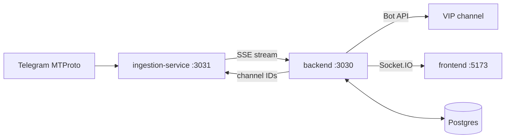

# Alpha Meta Token Scanner

> Real-time pipeline that discovers, validates, and republishes on-chain token alpha-calls from Telegram KOL channels — with a live operations dashboard.

[](https://github.com/bryanstevensacosta/onchain-bot/actions/workflows/ci.yml)


One MTProto session ingests Telegram → SSE fan-out → NestJS pipeline (extract → enrich → score → gate → publish to a VIP channel) → React dashboard over REST + WebSocket.

---

## Index

- [Apps](#apps)
- [Quickstart](#quickstart)
- [Service URLs](#service-urls)
- [How it works](#how-it-works)
- [Commands](#commands)
- [Configuration](#configuration)
- [Testing](#testing)
- [Deploy](#deploy)
- [Health & monitoring](#health--monitoring)
- [Troubleshooting](#troubleshooting)
- [Glossary](#glossary)
- [Docs](#docs)
- [Contributing](#contributing)
- [Requirements](#requirements)
- [License](#license)

---

## Apps

| App                   | Stack                                                                                                                  | Port    | Version | Tests                  |
| --------------------- | ---------------------------------------------------------------------------------------------------------------------- | ------- | ------- | ---------------------- |
| **backend**           | NestJS 11 · TypeORM · Postgres · EventEmitter · Socket.IO — 22 modules, 41 entities, 35 controllers, 13 data providers | `:3030` | 1.3.2   | 173 Jest specs + 2 e2e |
| **ingestion-service** | NestJS 11 · MTProto (GramJS) → SSE fan-out — one session serves N backends                                             | `:3031` | 1.0.0   | 15 specs + 5 e2e       |
| **frontend**          | React 18 · Vite 5 · TanStack Query · Socket.IO · Tailwind — 6 routes, 12 features, 11 entities                         | `:5173` | 1.3.2   | 23 Vitest files        |

---

## Quickstart

```bash
npm install                  # workspaces install (apps/*)
npm run docker:up            # postgres :5432 + redis :6379 + pgAdmin :5050

npm run dev                  # backend :3030 + frontend :5173 (port-cleanup first)

# Ingestion runs separately (own terminal — single MTProto session):
cd apps/ingestion-service && npm run start:dev   # :3031
```

> First run needs env files: `apps/backend/.env` (or `.env.dev`) and `apps/ingestion-service/.env` with Telegram API credentials (`my.telegram.org`). Never commit them.
> No Telegram credentials yet? Run the backend in mock mode instead: `npm run dev:mock -w @alpha-meta-token-scanner/backend` — CLI fixtures in, no MTProto needed.

---

## Service URLs

| Service                    | URL                                                         |
| -------------------------- | ----------------------------------------------------------- |
| Backend API                | http://localhost:3030                                       |
| Ingestion SSE stream       | http://localhost:3031/api/ingestion/stream                  |
| Ingestion health           | http://localhost:3031/api/health                            |
| Frontend                   | http://localhost:5173                                       |
| Postgres / Redis / pgAdmin | `localhost:5432` / `localhost:6379` / http://localhost:5050 |

---

## How it works



```text
Telegram MTProto ──► ingestion-service :3031 ──SSE──► backend :3030 ──Bot API──► VIP channel
                                                          │  ▲                     ▲
                                              channel IDs │  │ media/HTTP          │ Socket.IO
                                                          ▼  │                     ▼
                                                     Postgres              frontend :5173
```

**Alpha-call path** — KOL message → extraction → parsing (direct calls, no event bus: raw text never crosses it) → normalization → chain detection + enrichment → classification → scoring (0–100) → vip-call approval (8 fail-fast gates) → reserve → `sendMessage` → finalize → call-tracking + achievements.

**Crypto-news path** — opaque persist → keyword/phrase/blacklist match → queue → LLM → Bot API (1-minute publisher cron).

**Scoring v1** — base 50, signal-weighted penalties, 0.85–1.15 reputation multiplier; tiers `STRONG 80 / DECENT 60 / NEUTRAL 40 / RISKY 20 / AVOID`.

**Key design decisions** — raw Telegram text never crosses the event bus (ToS, fix-1: extraction/parsing run as direct calls); exactly one MTProto session exists (ingestion-service) with SSE fan-out to N backends; the stream is lossy by design (no replay, 30 s heartbeats); publishing is Bot API only (rate-limited, idempotent reservations); backend DB is the channel-list source of truth.

**Published output** — approved calls land in the VIP channel (`🟣 $CHAIN | $TICKER` + market cap + contract + Dexscreener link), milestones follow as `🚀 MILESTONE 86x`, and call-tracking evaluates every position at 24 h / 7 d / 30 d horizons.

---

## Commands

```bash
# Dev
npm run dev                  # backend + frontend
npm run dev:backend-only | dev:frontend-only
cd apps/ingestion-service && npm run start:dev   # :3031 (not in root scripts)

# Quality
npm run build | test | test:backend | test:frontend | lint | format
npm run docs:check           # AGENTS.md staleness warning (pre-commit)

# Backend (cd apps/backend)
npm run dev:mock             # no-Telegram mode (mock ingestion)
npm run cli:inject | :record | :replay          # message fixtures / live capture
npm run db:migrate | :migrate:dry-run | :status # idempotent backfill runner
npm run migration:generate -- -n X | :run | :revert | :show   # TypeORM (staging/prod)
npm run db:backup            # via scripts/backup-db.sh

# Ingestion (cd apps/ingestion-service)
npm run telegram:gen-session # generate MTProto session string
npm test | test:e2e | test:cov
```

---

## Configuration

| App               | Env files (gitignored)                                      | Key vars                                                                                                     |
| ----------------- | ----------------------------------------------------------- | ------------------------------------------------------------------------------------------------------------ |
| backend           | `.env` (`.env.dev` wins), `.env.staging`, `.env.production` | `PORT`, `DATABASE_*`, `USE_SSE_INGESTION`, `INGESTION_SERVICE_URL`, `VIP_CALLS_BOT_TOKEN`, provider API keys |
| ingestion-service | `.env` (`.env.dev` wins)                                    | `INGESTION_TELEGRAM_MTPROTO_{API_ID,API_HASH,SESSION}`, `INGESTION_PORT`, `INGESTION_REDIS_*`                |
| frontend          | `.env`                                                      | `VITE_API_BASE_URL`, `VITE_WS_URL` (empty in Docker → same-origin)                                           |

Templates live next to the apps (`.env.example`, `.env.production.template`). MTProto credentials exist **only** in ingestion-service — a second session anywhere else triggers `AUTH_KEY_DUPLICATED`.

---

## Testing

| App               | Runner                     | What                                                                                 |
| ----------------- | -------------------------- | ------------------------------------------------------------------------------------ |
| backend           | Jest (`--forceExit`, 30 s) | 173 co-located `*.spec.ts` + `test/` e2e (incl. prod-vs-staging side-by-side parity) |
| ingestion-service | Jest                       | 15 specs + 5 e2e (stream reconnect, concurrent clients, metrics)                     |
| frontend          | Vitest                     | 23 `*.test.{ts,tsx}` (heaviest: crypto-news ads/page)                                |

```bash
npm test                      # backend + frontend workspaces
npm run test:backend | test:frontend
```

No coverage thresholds enforced. Conventions: conventional commits (commitlint), Husky pre-commit (lint + `tsc`, branch guard) and pre-push (branch naming, no direct `master` push, full tests).

---

## Deploy

Push to `master` → CI (Node 24) → GHCR images (`-backend`, `-frontend`) → self-hosted droplet: DB backup → migrations in a one-off container → recreate → healthcheck with **automatic rollback**. Staging deploys from `dev`; ingestion-service ships via its own path-triggered workflow (`deploy-ingestion.yml`, never cancelled mid-run).

Branch model: `dev` (integration) → PR squash → `master` (prod). See [GOVERNANCE.md](GOVERNANCE.md).

---

## Health & monitoring

| Check                 | Endpoint                                                  |
| --------------------- | --------------------------------------------------------- |
| Backend               | `GET :3030/api/health`                                    |
| Ingestion             | `GET :3031/api/health` (+ `/ready`, `/live`, `/channels`) |
| Ingestion metrics     | `GET :3031/metrics` (Prometheus)                          |
| Recent / failed calls | `GET :3030/api/vip-calls/calls/recent` · `…/calls/failed` |

```bash
# Droplet
docker compose -f /opt/onchain-bot/apps/backend/docker-compose.prod.yml logs backend --tail 100
curl -s http://localhost:3030/api/health
```

---

## Troubleshooting

| Symptom                                    | Cause → fix                                                                                                      |
| ------------------------------------------ | ---------------------------------------------------------------------------------------------------------------- |
| `AUTH_KEY_DUPLICATED` / session logged out | Two MTProto sessions alive → keep the single session in ingestion-service; backend MTProto mode is rollback-only |
| `npm run dev` exits immediately            | Strict Vite port — kill stale `:5173` holder (`npm run cleanup`)                                                 |
| Backend hangs at boot, no logs             | `DATABASE_SYNCHRONIZE=true` against a big schema → check `NODE_ENV`, run `migration:show`                        |
| Dashboard shows `0` KPIs / no live feed    | SSE disconnected (backend backoff 1 s→30 s) or dashboard module unwired; check `:3031/api/health`                |
| SSE `backfill:error`                       | Backfill is unimplemented end-to-end (ingestion-service gap) — use MTProto-legacy or re-seed                     |
| Stale types after pulling                  | `tsc --noEmit` per app (pre-commit runs it); ingestion-service isn't covered by root `tsc`                       |

---

## Glossary

| Term           | Meaning                                                                                               |
| -------------- | ----------------------------------------------------------------------------------------------------- |
| KOL            | Key Opinion Leader — a monitored Telegram channel author                                              |
| Alpha-call     | A token mention extracted from a KOL message (chain + address + context)                              |
| Canonical call | Deduped, merged view of one token (`${chain}:${address}`)                                             |
| Gate           | One fail-fast approval check (address, score, classification, blacklist, honeypot, risk, data, chain) |
| Milestone      | Post-publish price multiple event (2x, 5x…) tracked per call                                          |
| Backfill       | Historical message fetch per channel (MTProto-legacy only for now)                                    |
| Seed           | Static channel list used before DB-driven registration                                                |
| Reputation     | 0–1 KOL quality score from past call outcomes (drives scoring multiplier)                             |

---

## Docs

- **[AGENTS.md](AGENTS.md)** — contributor knowledge base (root; ports, commands, conventions, drift)
- **[apps/backend/AGENTS.md](apps/backend/AGENTS.md)** — pipeline, scoring & gates, 35 controllers, 41 entities, env inventory, 32 verified gaps
- **[apps/ingestion-service/AGENTS.md](apps/ingestion-service/AGENTS.md)** — SSE protocol, media, safety config, 25 verified gaps
- **[apps/frontend/AGENTS.md](apps/frontend/AGENTS.md)** — FSD slices, contract, polling, proxy, 11 verified gaps
- **[apps/backend/README.md](apps/backend/README.md)** · **[apps/frontend/README.md](apps/frontend/README.md)** — architecture overviews
- **[docs/deployment/](docs/deployment/)** — droplet checklists, ingestion runbook + FAQ + post-deploy
- **[docs-money/](docs-money/)** — Telegram ToS, monetization, KOL onboarding, rate limits
- **[GOVERNANCE.md](GOVERNANCE.md)** — branch model and protections

---

## Contributing

1. Branch from `dev` (`feat/*`, `fix/*`, … — hooks enforce naming).
2. Conventional commits (`feat:`, `fix:` …) — release-please versions from them.
3. Pre-commit runs lint + `tsc`; pre-push runs the full suite. Never commit on `master` (hook blocks it).
4. Open a PR to `dev` (1 approval + CI green), then squash to `master` for deploy.

---

## Requirements

Node 22+ (CI runs 24) · Postgres 16 · Redis 7 · Telegram API credentials (`my.telegram.org`, ingestion-service only) · Telegram bot tokens (publishing)

## License

Private — UNLICENSED. All rights reserved.
