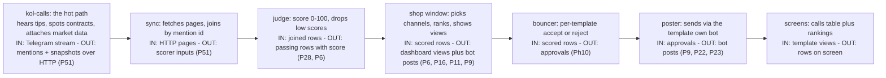

# apps/kol-calls-publisher/ — NestJS Knowledge Base

> Verified 2026-09-26 against code. v0.1.0 (source of truth: `package.json`;
> P51 split from kol-system — scoring/templates/approval/telegram moved via
> `git mv`, no behavior change; kol-calls HTTP contract + sync new).
> Decisions cited as Pxx come from `.omo/drafts/mega-refactor-tramos.md` §7.6.
> Cross-tramo contracts (C-DB-01, C-SSE-01, C-SHARED-01/C2, C-DATA-01, C-BOTS-01)
> pinned in `.omo/plans/mega-refactor-central.md` v2026-09-24.

Contents: OVERVIEW · HOW IT WORKS (non-technical) · COMMANDS · STRUCTURE ·
MODULES · CONTRACT · ENV INVENTORY · PORTS · HEALTH · TS/ESLINT CONVENTIONS ·
TESTS · GAPS · DECISIONS · STANDING RULE · NOTES

## OVERVIEW

NestJS 11 service (P51 split of kol-system, 2026-09-26) owning the
publish half of the KOL alpha-call path: upstream mentions+snapshots in
(over HTTP) → scoring → templates → approval → per-template bot
publishing → dashboard/rankings reads. Built today: Config +
`GET /api/health` (composite: kol-calls/database/scoring/templates/
approval/publishing) + `ScoringModule` (score v1 + 8 gates, P6 + G-08 +
P28 per-template config, MOVED unchanged) + `TemplatesModule` (templates
CORE without threads, Ph9 + C1, cron 1 min + 4-strategy ranking + 12
endpoints + threads 501 stub + `telegram_bots` catalog + `vip-calls`
seed, MOVED unchanged except the ingestion import) + `ApprovalModule`
(per-template bouncer, Ph10, MOVED unchanged) + `TelegramModule`
(per-template KOL-bot publishing + gateway dual-send, Ph11 + C2,
MOVED unchanged) + `KolCallsModule` (NEW: upstream HTTP client +
sync cron + health indicator, P51 contract) — all wired into
`AppModule`.

Design pivots inherited from kol-system (unchanged by the split):

- **P1 — repeats are first-class rows** (scoring/approval upsert by
  `templateId:mentionId`; no dedup layer added here).
- **P5 — extraction = contract × mention** (happens upstream in
  kol-calls; this app never extracts).
- **P6 — classification lives INSIDE templates** (no separate BC).
- **P14 — vip-calls is a template NAME** (default seed), never a module.
- **P28 — scoring configurable per template** (`scoring_config`,
  defaults = v1; scorer falls back to defaults when absent).
- **P51 — split kol-system → kol-calls + kol-calls-publisher**
  (2026-09-25, design approved): this app = templates, scoring (P28),
  approval, bot-of-gateway + channel/group target. Contracts between
  apps: mentions+snapshots (kol-calls → publisher, paginated + keyed +
  `x-api-key`), rating (publisher reads kol-calls tracking via
  `GET /api/kol-rankings`). OWN DB since split 2026-09-28
  (dev `onchain_bot_kol_calls_publisher` on single postgres `:5432`;
  staging/prod still `onchain_bot_kol_system[_staging]` until split). kol-calls keeps
  `:3050` + DB (hot path stable, staging untouched); this app takes
  NEW ports 3060/61/62. No behavior change in moved code.

## HOW THE SYSTEM WORKS (non-technical)

> Plain-words tour: what happens to one scored mention, from the
> upstream read to a bot post. Technical detail lives below.



- **Sync** — IN: HTTP pages, OUT: scorer inputs. Every minute (when
  `KOL_CALLS_SYNC_ENABLED=true`) pulls recent mentions + snapshots,
  joins by mention id, feeds the unchanged scorer. Upstream down =
  skipped tick, never a crash.
- **Judge** — IN: joined rows, OUT: passing rows with score. Same v1
  math as before the split (base 50 + bonuses − penalties × reputation,
  security caps, 8 gates); below-cut never reaches templates.
- **Shop window / bouncer / poster** — byte-identical to kol-system
  pre-split (moved via `git mv`): per-template channels, labels,
  rankings, approvals, bot posts. One divergence: rankings avatars
  resolve via the optional `AvatarResolver` port (unprovided = null,
  dashboard placeholder); a kol-calls HTTP-backed adapter is the
  follow-up.

## COMMANDS

```bash
# In apps/kol-calls-publisher/
npm run dev                # nest start --watch (port KOL_CALLS_PUBLISHER_PORT, default 3060)
npm run start:dev          # nest start --watch
npm run start:prod         # node dist/main (after build)
npm run build              # nest build
npm test                   # jest --forceExit --runInBand --testTimeout=30s (co-located *.spec.ts)
npm run test:e2e           # jest --config ./test/jest-e2e.json (.e2e-spec.ts)
npm run lint               # eslint "{src,test}/**/*.ts" --fix
npm run format             # prettier --write "src/**/*.ts" "test/**/*.ts"
```

```bash
# From repo root (no root-script changes per P51 read-only constraint):
npm test -w @onchain-bot/kol-calls-publisher
npm run build -w @onchain-bot/kol-calls-publisher
curl -s localhost:3060/api/health   # {"status":"ok",...}
```

## STRUCTURE

```text
src/
├── main.ts                       # bootstrap() — ValidationPipe whitelist/forbidNonWhitelisted/transform, listen KOL_CALLS_PUBLISHER_PORT ?? 3060
├── app.module.ts                 # Config (envFilePath ['.env.dev', '.env']) + SharedModule + HealthModule + ScoringModule + TemplatesModule + ApprovalModule + TelegramModule + KolCallsModule (all wired)
├── health/
│   ├── health.module.ts
│   ├── health.controller.spec.ts
│   └── api/http/health.controller.ts   # GET /api/health → { status: 'ok', components } (kol-calls/database/scoring/templates/approval/publishing)
├── kol-calls/                    # NEW (P51 contract reader)
│   ├── kol-calls.module.ts       # ScoringModule (scorer + repo); providers: client + sync + health (NO ScheduleModule.forRoot — uses the templates-registered explorer)
│   ├── kol-calls.dto.ts          # Mention/Snapshot/Ranking DTOs + PaginatedResponse
│   ├── kol-calls.client.ts (+ .spec.ts)  # GET mentions/snapshots (paginated) + mention/snapshot (keyed) + rankings; x-api-key when KOL_CALLS_API_KEY set; non-ok → throw (never silent null)
│   ├── kol-calls-sync.service.ts (+ .spec.ts)  # @Cron 1min (KOL_CALLS_SYNC_ENABLED=true): pages recent mentions+snapshots, joins by id, ScoreTokenUseCase (UNCHANGED), persists scored; upstream failure → skipped tick
│   └── health/kol-calls-health.indicator.ts (+ .spec.ts)  # check() → { component: 'kol-calls', status } (static up until the authenticated probe lands)
├── scoring/                      # MOVED unchanged from kol-system (todo 9 + todo 22 P28)
├── templates/                    # MOVED from kol-system (todo 10) — ONE divergence: IngestionModule import dropped; rankings avatars via optional AvatarResolver port (application/ports/avatar-resolver.port.ts, default NoopAvatarResolver → null)
├── approval/                     # MOVED unchanged from kol-system (todo 11, Ph10)
├── telegram/                     # MOVED unchanged from kol-system (todo 11 Ph11 + C2 + gateway todo 4)
├── target/                       # UNIFIED DELIVERY (threads-publisher Fase 2 todo 10, P38-bis, wired via AppModule, @Global):
│                                 # `TargetDispatcherPort` → `TargetDispatcherService` (telegram via gateway vault id,
│                                 # threads via threads-publisher HTTP `POST /threads-publisher/queue/enqueue`,
│                                 # `THREADS_PUBLISHER_URL` default `:4100`) + `ThreadsPublisherHttpClient` +
│                                 # `TargetHealthIndicator` (P21, in composite health) + `telegram-ports` barrel
│                                 # (only sanctioned import path for legacy ports) + caller-migration gate spec.
│                                 # `src/telegram/` + threads stub @deprecated (dual-leg only, todo 11 deletes).
│                                 # `PublishFromTemplateUseCase`/`ManualPublishUseCase` take `target`
│                                 # (`telegram` default unchanged; `threads` via dispatcher);
│                                 # `PublishingTemplate.targetBindings()` exposes links (telegram today).
├── shared/                       # COPIED from kol-system at split (same kernel; key names repointed: KOL_CALLS_PUBLISHER_API_KEY with KOL_SYSTEM_API_KEY fallback)
test/
├── health.e2e-spec.ts
├── publishing.e2e-spec.ts        # MOVED from kol-system (mirror-channel publish flow)
└── jest-e2e.json
Root: package.json (@onchain-bot/kol-calls-publisher v0.1.0), nest-cli.json (deleteOutDir),
tsconfig{,.build}.json, Dockerfile (EXPOSE 3060, CMD dist/main.js),
docker-compose.yml (app-only, reuses kol-system dev pg/redis — SAME DB initially),
docker-compose.staging.yml (host :3061, DRY-RUN), .env.example,
.env.development, .env.staging.template, .env.production.template
```

## MODULES (app.module.ts — wired list)

Wired today: `ConfigModule` (global, `.env.dev` > `.env`) +
`SharedModule` (@Global: config + ApiKeyGuard) + `HealthModule`
(composite) + `ScoringModule` (moved) + `TemplatesModule` (moved,
`ScheduleModule.forRoot()` lives here) + `ApprovalModule` (moved,
forwardRef both ways with Templates) + `TelegramModule` (moved) +
`KolCallsModule` (new, imports ScoringModule for scorer + repo).

## CONTRACT (P51 — kol-calls → publisher)

Upstream base `KOL_CALLS_URL` (dev `:3050`, staging `:3051`, prod
`:3052`); key `KOL_CALLS_API_KEY` sent as `x-api-key` (empty = keyless
dev, upstream fails open).

| Endpoint                                          | Shape                                                                                                                                              | Errors                                |
| ------------------------------------------------- | -------------------------------------------------------------------------------------------------------------------------------------------------- | ------------------------------------- |
| `GET /api/mentions?limit=&offset=`                | `{ items: [{id, kolId, messageId, contractIndex, chain, address, ticker}], total, limit, offset }` (limit 1..500 default 50, offset ≥ 0 default 0) | 401 no/wrong key · 400 bad pagination |
| `GET /api/mentions/:id`                           | single mention                                                                                                                                     | 401 · 404 unknown id                  |
| `GET /api/snapshots?limit=&offset=`               | `{ items: [{mentionId, marketCapUsd, priceUsd, liquidityUsd, holders, symbol}], total, limit, offset }`                                            | 401 · 400                             |
| `GET /api/snapshots/:mentionId`                   | single snapshot                                                                                                                                    | 401 · 404                             |
| `GET /api/kol-rankings?window=30d\|7d\|1d&sort=…` | `[{caller, window, totalX, callsCount, strongCalls, display, avatarUrl}]` (rating reads tracking, stays in kol-calls)                              | 401 · 400                             |

Broken contract is loud: non-ok upstream throws (sync skips the tick);
unknown ids 404 (never empty 200).

## ENV INVENTORY (`.env.example` — verified)

| Var                             | Default                                            | Notes                                                                                                   |
| ------------------------------- | -------------------------------------------------- | ------------------------------------------------------------------------------------------------------- |
| `KOL_CALLS_PUBLISHER_ENABLED`   | `false`                                            | master switch                                                                                           |
| `TEMPLATE_ORCHESTRATOR_ENABLED` | `false`                                            | kill-switch (publishing off when absent)                                                                |
| `KOL_CALLS_URL`                 | `http://localhost:3050`                            | upstream kol-calls per env (`:3050`/`:3051`/`:3052`)                                                    |
| `KOL_CALLS_API_KEY`             | empty                                              | upstream key, sent as `x-api-key` (copy `KOL_SYSTEM_API_KEY`, NEVER commit)                             |
| `KOL_CALLS_PUBLISHER_API_KEY`   | empty                                              | inbound key (fail-open empty); guard falls back to `KOL_SYSTEM_API_KEY` during the shared-DB transition |
| `ENCRYPTION_KEY`                | empty (Tier-1 required)                            | DISTINCT per env (P24)                                                                                  |
| `DATABASE_URL`                  | `…@localhost:5432/onchain_bot_kol_calls_publisher` | OWN DB since split 2026-09-28 (was shared P51)                                                          |
| `REDIS_URL`                     | `redis://localhost:6382/0`                         | reuses kol-calls dev redis initially                                                                    |
| `KOL_CALLS_PUBLISHER_PORT`      | `3060`                                             | triplet 3060/61/62                                                                                      |
| `KOL_CALLS_SYNC_ENABLED`        | `false`                                            | sync cron flag (safe default off)                                                                       |
| `KOL_CALLS_SYNC_INTERVAL_MS`    | `60000`                                            | reserved (cron expression is `*/1 * * * *`)                                                             |
| `KOL_CALLS_SYNC_LIMIT`          | `50`                                               | page size per tick                                                                                      |
| `BOTS_GATEWAY_URL`              | `http://localhost:4070`                            | gateway base per env (`:4070`/`:4071`/`:4072`)                                                          |
| `BOTS_GATEWAY_CLIENT_ID/SECRET` | empty                                              | DISTINCT per env, NEVER commit                                                                          |
| `KOL_PUBLISH_MODE`              | `dual`                                             | `direct` (deprecated) \| `dual` \| `gateway` (prod template pins `gateway`)                             |
| `PUBLISH_RATE_LIMIT_PER_MIN`    | `30`                                               | 429 over limit, pre-Telegram                                                                            |

Tier-1 validation: `ENCRYPTION_KEY` + `DATABASE_URL` non-empty.
P24 templates (tracked, placeholders, NO secrets): `.env.development`,
`.env.staging.template`, `.env.production.template`. Real files
gitignored, copied via `scp` on deploy (backend-mirror).

## PORTS

| Service                  | Dev                                                                                        | Staging (host)                                                      | Prod (host)                                    |
| ------------------------ | ------------------------------------------------------------------------------------------ | ------------------------------------------------------------------- | ---------------------------------------------- |
| kol-calls-publisher HTTP | `:3060`                                                                                    | `:3061`                                                             | `:3062`                                        |
| kol-calls (upstream)     | `:3050`                                                                                    | `:3051`                                                             | `:3052`                                        |
| DB/Redis                 | dev single pg `:5432` (`onchain_bot_kol_calls_publisher`) + reuses kol-calls redis `:6382` | reuses kol-calls staging (same `onchain_bot_kol_system_staging` DB) | same `onchain_bot_kol_system` DB (split later) |

No clashes with backend (`:3030`), ingestion (`:3031/32/33`), frontend
(`:5173`), kol-calls (`:3050/51/52`), feed-publisher (`:3040/41/42`),
market-data (`:4000/01/02`), dexter (`:4060/61/62`), gateway
(`:4070/71/72`).

Port discrepancy to know: `main.ts` listens on
`KOL_CALLS_PUBLISHER_PORT ?? 3060`, while `buildAppConfig().port` reads
`PORT ?? 3030`. Canonical runtime port is `KOL_CALLS_PUBLISHER_PORT`.

## HEALTH

`GET /api/health` → 200 + `{ status: 'ok', components }` with
`kol-calls` (upstream contract, static up + detail until the
authenticated probe lands), `database` (in-memory until the persistence
todo), `scoring`, `templates`, `approval`, `publishing` (via their P21
indicators) + `target` (unified delivery surface, threads-publisher
todo 10). Shape backward compatible (`status: 'ok'`).

## TS/ESLINT CONVENTIONS

- TypeScript 5.9, `strictNullChecks`, `noImplicitAny`,
  `noFallthroughCasesInSwitch`, `forceConsistentCasingInFileNames`,
  `isolatedModules` (`strict` NOT enabled globally).
- Path aliases: `@/*` (= `src/*`, for 2+-level imports; 2026-09-27 migration),
  `shared/*`, `telegram/*`, `src/*` rooted at `src/`.
- ESLint (flat config, backend-mirror): `no-explicit-any` off,
  `require-await` off, `no-floating-promises`/`no-unsafe-*` warn,
  unused vars warn (`^_`), `prettier/prettier` error.
- Prettier: `singleQuote: true`, `trailingComma: "all"`.
- NestJS: `deleteOutDir: true`; `process.noDeprecation = true`.
- `ConfigModule.envFilePath: ['.env.dev', '.env']` — `.env.dev` wins.
- DDD: no `@Entity` in domain layer; never update DB directly;
  never publish events before `commit()`.

## TESTS

```bash
npm test            # jest --forceExit --runInBand --testTimeout=30s
npm run test:e2e    # jest --config ./test/jest-e2e.json
```

Strategy (kol-system-mirror): co-located `*.spec.ts`; e2e in
`test/*.e2e-spec.ts`; in-memory repos; no coverage thresholds.
Failing-first for contract/sync code (specs red on missing
ports/modules, then green).

Test tally (2026-09-26, P51 split): 63 suites / 235 tests green —
46 moved byte-identical (scoring/templates/approval/telegram) + 14
shared copies + health + kol-calls client/sync/indicator (4 new).
No moved suite lost (verified: every renamed `*.spec.ts` present).
Test tally (2026-09-27, threads-publisher todo 10 `src/target/`):
68 suites / 247 tests green (+5/+12: dispatcher, migration gate,
wiring, publish-via-target, template bindings).

## GAPS

1. No MTProto here by design (sessions live ONLY in ingestion-telegram).
2. No data providers here by design (market-data owns them; scoring
   reads snapshot fields only).
3. Rankings avatars are null without an adapter (placeholder downstream)
   — kol-calls HTTP-backed `AvatarResolver` follow-up.
4. `KolCallsHealthIndicator` is static up — authenticated upstream probe
   lands with the persistence todo.
5. Persistence entities/migrations (TypeORM wiring,
   `synchronize:false` outside dev) + DB split from kol-calls when
   volume demands it.
6. No deploy workflow yet (`deploy-kol-calls-publisher.yml` with
   path-filter `apps/kol-calls-publisher/**`); staging compose is DRY-RUN.
7. Root `package.json` has no `test/build:kol-calls-publisher` aliases
   (P51 read-only constraint — run via `-w @onchain-bot/kol-calls-publisher`).

## DECISIONS (P51 — one line each, 2026-09-26; rest inherited)

- P51 (2026-09-25/26): split kol-system → kol-calls (hot path, keeps
  `:3050` + dev DB now `onchain_bot_kol_calls` (consolidation 2026-09-28), staging untouched) +
  kol-calls-publisher (NEW `:3060`/`:3061`/`:3062`, OWN dev DB `onchain_bot_kol_calls_publisher` since split 2026-09-28; staging/prod shared until split); moved = templates/scoring(P28)/approval/
  telegram(publishing); kept = ingestion/extraction/parsing/
  normalization/snapshot/enrichment/tracking + rankings API; contracts =
  mentions+snapshots (paginated, keyed, `x-api-key`) + rating reads
  tracking; no behavior change in moved code.
- P51-execution: `git mv` (history kept) + import fix (avatar port) +
  contract tests + failing-first where behavior touches (contract
  controllers, sync join, client auth).
- P38-bis/target (threads-publisher Fase 2 todo 10, 2026-09-27):
  `src/target/` is the canonical delivery surface (`TargetModule`
  @Global: dispatcher + threads HTTP client + health + barrel);
  template/manual publishes take `target` (`telegram` default,
  `threads` via dispatcher); `PublishingTemplate.targetBindings()`
  exposes links; `src/telegram/` + threads stub deprecated
  (dual-leg only, todo 11 deletes — no deletion here).

## STANDING RULE

Every future todo ends with: **"update AGENTS.md if anything changed"**
(P25, mirrored from kol-system). Same living-doc pattern.

## NOTES

- `.env.dev` takes precedence over `.env`.
- Never commit secrets (`.env`, `.env.staging`, `.env.production`
  gitignored; templates carry placeholders only).
- Root `package.json` intentionally untouched (P51 read-only outside
  the two apps) — use `-w @onchain-bot/kol-calls-publisher`.
- Conventional commits (`feat:`, `fix:`, …); never commit on `master`;
  `git reset --hard` / `revert --no-commit` forbidden without approval.
- Staging deploy untouched (`:3051` kol-system keeps running; publisher
  staging compose is DRY-RUN until its deploy workflow exists).
