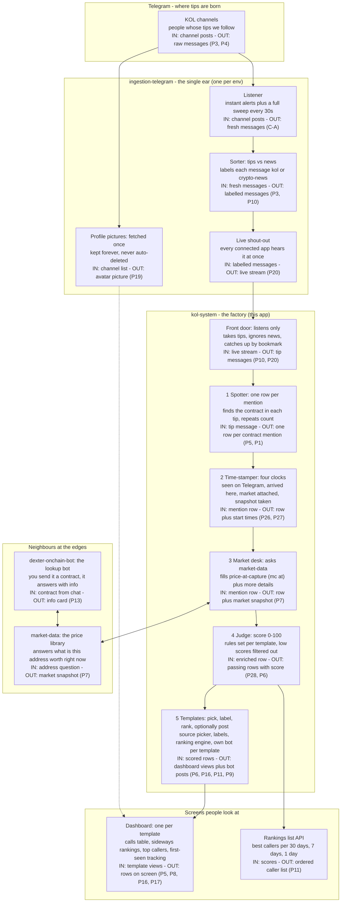

# apps/kol-system/ — NestJS Knowledge Base

> Verified 2026-09-25 against code. v0.1.0 (source of truth: `package.json`; Tramo 1 scaffold, todos 2+4+5+6+7+8+9+10+11+12+22 built).
> Decisions cited as Pxx come from `.omo/drafts/mega-refactor-tramos.md` §7.6 (2026-09-24).
> Cross-tramo contracts (C-DB-01, C-SSE-01, C-SHARED-01/C2, C-DATA-01, C-BOTS-01) pinned in
> `.omo/plans/mega-refactor-central.md` v2026-09-24; threads stub C1 lives in
> `.omo/plans/mega-refactor-content-publisher.md` todo 8; market-data bridge + dexter app in
> `.omo/plans/mega-refactor-market-data.md` todos 4-9.

Contents: OVERVIEW · HOW IT WORKS (non-technical) · PROGRAM INDEX · COMMANDS ·
STRUCTURE · MODULES · INGESTION · ENV INVENTORY · PORTS · HEALTH ·
TS/ESLINT CONVENTIONS · TESTS · MODULE MAP · SNAPSHOTS · GAPS ·
STANDING RULE · NOTES

## OVERVIEW

NestJS 11 service (Tramo 1 of the mega-refactor) that will own the whole KOL
alpha-call path: KOL mentions in → extraction → enrichment → scoring →
templates → dashboard/rankings (+ optional per-template publishing). Built today:
Config + `GET /api/health` + `IngestionModule` (SSE-only KOL client, P20) +
`ExtractionModule` (contract × mention, P5, direct call + P26 snapshot
bases, todo 5) + `ParsingModule` (structured call per mention, P5 1:1,
todo 6) + `NormalizationModule` (mention index, P1 + G-12, todo 7) +
`EnrichmentModule` (MarketDataPort dual: local-cascade default +
http-market-data stub, P7, direct call + P26 completion, todo 8) +
`SnapshotModule` (owns `mention_snapshots`, P27, same DB, todo 8) +
`ScoringModule` (score v1 + 8 gates per mention, classification as
per-template config, P6 + G-08, direct call + P26 completion, todo 9;
per-template `scoring_config` with v1 defaults, P28, todo 22) +
`TemplatesModule` (templates CORE without threads, Ph9 + C1, cron 1 min +
4-strategy ranking + 12 endpoints + threads 501 stub + `telegram_bots`
catalog + `vip-calls` seed, todo 10) + `ApprovalModule` (per-template
bouncer: `CallApproval` + `EvaluateApproval` + `GetPendingApprovals` +
`ApprovalsController`, todo 11, Ph10) + `TelegramModule` (per-template
KOL-bot publishing: `PublishingJob` + `PublishFromTemplate` +
`ManualPublish` + `MultiBotPublisherAdapter` on the DB catalog, first
C-SHARED-01 move, todo 11, Ph11 + C2) + `TrackingModule` (first-seen
`TrackedMention` + kol +5x rating + `kol_window_stats` cron +
`GET /api/kol-rankings`, todo 12, Ph12 + P8 + P11 + P17) wired into
`AppModule`.

Design pivots (2026-09-24) that govern every future todo:

- **P1 — NO dedup of any kind in kol-system**: repeats are first-class data
  (each mention = one row). Ingestion-telegram dedups source-side; kol-system
  adds no layer of its own.
- **P3 — ingestion by type**: consumes `kol`-type messages from
  ingestion-telegram, distinct from `crypto-news` (the `route(raw,
kol|crypto-news)` coordinator already exists over there).
- **P4 — identity/sources live in ingestion-telegram**: sources have 2 types
  (`kol` + `crypto-news`). kol-system stores NO profiles; it consumes sources
  over HTTP (`GET /api/feed/sources?type=kol`). KOL avatar is resolved once by
  ingestion-telegram (MTProto) and served from then on (see P19 note in GAPS).
- **P5 — extraction = contract × mention**: smart contract per KOL mention +
  timestamp + handle + url + channel info + own db-id. Repeated = valid
  (feeds "called from @handle 8min ago"). Frontend table: `caller | call | mc
at | time ago | more details +`.
- **P10 — strict type separation**: kol-system subscribes ONLY to
  `messageType==='kol'` (crude, unmixed). No todo may subscribe to the foreign
  type (`crypto-news` belongs to content-publisher).
- **P14 — vip-calls absorbed by templates**: `vip-calls` is NOT a module —
  it is the generic NAME of a default seed template. Backend
  `apps/backend/src/telegram/vip-calls/` is deleted at cleanup, never
  recreated under any name.
- **P16 — single dashboard with source selector**: each template has ONE
  dashboard; template stores `kolSourceIds: string[]` (empty = all).
- **P17 — horizontal dashboard layout** (planned, not built — gap 6): ranking
  performance HORIZONTAL 10 total (5 left + 5 right) with arrows toggling
  perf asc↔desc; horizontal top-10 callers strip by call COUNT with 30D/7D/1D
  selector; extended template-config section. Backend: `kol_window_stats`
  holds `total_x` + `calls_count` per (caller, window); ranking endpoint
  exposes both + `sort=perf_asc|perf_desc`.
- **P18 — gradual per-BC deprecation**: each completed BC deprecates its
  backend counterpart immediately (`@deprecated` header + pointer, pattern
  `scripts/add-deprecation-headers.js`); deletion only in todo 16.
- **P19 — avatar source of truth permanent** (ingestion-telegram owns it, no
  consumer here yet — gap 5): MTProto fetch-ONCE at source registration,
  stored PERMANENTLY, EXCLUDED from the 72h janitor; `avatarUrl` in the
  `GET /api/feed/sources` projection; no periodic refresh (explicit manual
  only); placeholder fallback.
- **P20 — SSE-only, no polling** (done 2026-09-24, was gap 2): listener
  filters `data.messageType==='kol'` client-side; reconnect catch-up by
  cursor (`GET /api/feed/messages?type=kol` from last messageId, NO periodic
  loop). The 1-min fallback built in todo 4 was removed the same day — do
  NOT add new polling citing anything but P20.
- **P21 — health per component + shared without duplicating**: every move-todo
  registers its indicator in `GET /api/health`; reuse `src/shared/`, extend it
  instead of copying.
- **P22/P23 — telegram config via DB, zero KOL env**: bot tokens + channels
  live in DB (`template_bot_tokens` / `telegram_bots` + `bot_id` +
  `channel_target`); NO `KOL_BOT_TOKEN` exists, not even as seed (P23
  follow-up removes it from validation if todos 2-3 added it).
- **P24 — multi-env envs**: distinct `ENCRYPTION_KEY` per env; tracked
  templates `.env.development` / `.env.staging.template` /
  `.env.production.template` (placeholders, NO secrets); real files gitignored,
  copied via `scp` to OracleDroplet on deploy. Backend-mirror pattern.
- **P26 — snapshot per extraction, 4 timestamps** (planned — see SNAPSHOTS):
  each ingestion → extraction emits a base snapshot, enrichment completes it
  in table `mention_snapshots` (`occurred_at_telegram`, `ingested_at_kol`,
  `enriched_at`, `snapshot_at` = `enriched_at`). Performance compares vs the
  LAST snapshot of (caller, contract).
- **P27 — snapshots in own module, SAME DB** (planned — see SNAPSHOTS):
  `src/snapshot/` with its own tables inside the kol-system DB (no separate
  DB; enrichment writes via port). Joins + single-transaction atomicity;
  split (timescale/partition) only if volume demands.
- **P28 — scoring configurable por template** (done 2026-09-25, todo 22):
  NOTHING hardcoded in the scorer — base score, market bonuses, signal
  penalties, security caps, reputation pivot/slope, tier thresholds and
  gate thresholds (min score, caps) live in `scoring_config` on the
  template (`src/scoring/domain/scoring-config.ts`, defaults = v1).
  `ScoreTokenUseCase` reads the mention's template config with fallback
  to defaults when absent; `PATCH /api/templates/:id/scoring` edits it
  with range validation (400 on invalid, stored config left intact).
- **P25 — this file is living**: created in todo 21, updated at the close of
  every task set (see STANDING RULE).
- **P6/P7/P8/P9 — templates own classification; enrichment bridges market-data;
  tracking is first-seen; bots are per-template optional**: no separate
  classification BC (channel picker + score viz + gem filters live in the
  template); enrichment consumes `apps/market-data` for `mc at` + `more details
+`; tracking = `First time` vs `Nx from last call`; each template may carry
  its own publishing bot token (BYO-token, viable publishing-only).
- **P11/P17 — rankings + horizontal layout**: `GET /api/kol-rankings?window=30d|7d|1d`
  over cron-fed `kol_window_stats(caller, window, total_x, calls_count)`;
  multiple per call = `last_mc / first_mc_at`, SUM per caller; performance rank
  horizontal 10 (5 left + 5 right, arrows flip asc/desc) + top-10 callers strip
  by call count with 30D/7D/1D selector.
- **P19/P20 — avatar fetch-once + SSE-only**: ingestion-telegram resolves the
  channel avatar once at source registration, stores it permanently (excluded
  from the 72h janitor), serves it via feed projection; kol-system consumes the
  URL only, never polls — SSE filtered client-side + catch-up by cursor.
- **P26/P27 — snapshots in own module, same DB**: every extraction emits a
  snapshot base with 4 dates (`occurred_at_telegram`, `ingested_at_kol`,
  `enriched_at`, `snapshot_at`); module `src/snapshot/` owns `mention_snapshots`
  inside the kol-system DB (no separate base); performance compares against the
  LAST snapshot of (caller, contract).
- **P12-bis/P13 — Dexter lookup is NOT here**: bot lookup lives in
  `apps/dexter-onchain-bot/` (Tramo 3), fed by `apps/market-data`; kol-system
  keeps only per-template publishing bots. C1: thread support is deferred —
  templates ship with `threadConfig: null` + 501 stub; v2 arrives with
  content-publisher.
- **P2 — verify each point separately**: plan Tramo 1 verifies P3–P9 with
  dedicated explore/librarian passes before implementing.
- **C-DB-01 — one DB per app**: kol-system owns `<base>_kol_system[_staging]`
  on the same server per env (12-DB table in the central plan); own
  `data-source.ts`, own migrations, `synchronize:false, migrationsRun:false`
  outside dev/test.
- **C-SSE-01 — strict type filtering**: SSE frames carry
  `data.messageType: 'kol'|'crypto-news'`; kol-system subscribes ONLY to
  `'kol'` client-side (+ `?type=kol` where the query param exists); subscribing
  to `crypto-news` is forbidden here (mirror rule binds content-publisher).

## HOW THE SYSTEM WORKS (non-technical)

> Plain-words tour for non-engineers: what happens to one tip, from a
> Telegram channel to a row on a screen. Every factual claim cites its
> P-decision (`.omo/drafts/mega-refactor-tramos.md` §7.6, 2026-09-24);
> the technical detail lives in the sections below.



What goes in and out at each stage, in plain words:

- **Listener (ear)** — IN: channel posts, OUT: fresh messages. Hears instantly, plus re-checks every channel every 30s so nothing slips through (C-A).
- **Sorter (ear)** — IN: fresh messages, OUT: messages labelled tip or news. Tips go to kol-system, news goes to content-publisher; each side ignores the other type (P3, P10).
- **Profile pictures (ear)** — IN: channel list, OUT: avatar picture. Each channel photo is fetched once, kept forever, and shown next to its calls (P19).
- **Live shout-out (ear)** — IN: labelled messages, OUT: live stream. One broadcast every connected app hears; each app has its own ear per env, never shared (C-SSE-01).
- **Front door (this app)** — IN: live stream, OUT: tip messages. Listens only, no repeated asking; after a dropout it catches up from its bookmark (P10, P20).
- **1 Spotter** — IN: tip message, OUT: one row per contract mention. Every mention gets its own row, even repeats — repeats are data, not noise (P5, P1).
- **2 Time-stamper** — IN: mention row, OUT: row plus four clocks. Stamps seen-on-Telegram, arrived-here, market-attached, snapshot-taken; later gains compare vs the last one (P26, P27).
- **3 Market desk** — IN: mention row, OUT: row plus market snapshot. Asks the market-data service for the price at capture (the `mc at` column) and the `more details` behind it (P7).
- **4 Judge** — IN: enriched row, OUT: passing rows with score. Scores 0-100 with rules each template configures; low scores are filtered out before anything is shown (P28, P6).
- **5 Templates** — IN: scored rows, OUT: dashboard views plus optional bot posts. Each template picks its channels (P16), labels calls its own way (P6), ranks callers (P11), and may post via its own bot to channels where that bot is admin-checked (P9, P23-bis). Bot secrets live in the database, not in files (P22, P23). The default view is named vip-calls (P14). No threads yet (C1).
- **Dashboard** — IN: template views, OUT: rows on screen. Calls table (`caller`, `call`, `mc at`, `time ago`, `more details`), rankings laid out sideways, top callers by number of calls, and first-seen tracking (`First time` vs `Nx from last call`) (P5, P8, P16, P17).
- **Rankings list API** — IN: scores, OUT: ordered caller list. Best callers per 30 days, 7 days, 1 day, refreshed by a background job — screens read, never compute (P11).
- **market-data (edge)** — IN: address question, OUT: market snapshot. The price library both the market desk and the lookup bot ask; it owns the data providers, nobody else touches them (P7).
- **dexter-onchain-bot (edge)** — IN: contract from chat, OUT: info card. A separate bot app: send it a contract and it answers with market info; fed by market-data (P13).

### PIPELINE POR BCS

> One node per kol-system BC in process order. `(BUILT)` = wired in
> `AppModule` today; `(PLANNED)` = per spec, not in `src/` yet — do not
> import until its todo lands. Aggregate/event/table names are exact only
> where the module exists; planned names are the spec intent.

```mermaid
flowchart LR
    ING["front door: hears the live tip stream, ignores news (BUILT)<br/>src/ingestion/ (KolIngestionClientService, SSE)<br/>IN: live stream - OUT: tip messages"]
    EXT["spotter: finds the contract in each tip, repeats count (BUILT)<br/>src/extraction/ (extract-from-message.use-case, regex-extractor.adapter)<br/>IN: tip message - OUT: ExtractionCandidate"]
    PAR["reader: turns each find into named fields (BUILT)<br/>src/parsing/ (parse-from-candidates.use-case, heuristic-parser.adapter)<br/>IN: candidates - OUT: ParsedCall"]
    NORM["librarian: files one card per mention, never merges (BUILT)<br/>src/normalization/ (normalize-call.use-case, normalized-mention.entity)<br/>IN: parsed calls - OUT: NormalizedMention"]
    SNAP["photo album: keeps the snapshot table (BUILT)<br/>src/snapshot/ (mention-snapshot.entity, mention-snapshot.repository)<br/>IN: base + market fill - OUT: MentionSnapshot"]
    ENR["market desk: asks market-data, fills price at capture (BUILT)<br/>src/enrichment/ (enrichment-orchestrator.service, market-data.port)<br/>IN: mention + base - OUT: completed snapshot"]
    SCORE["judge: scores 0-100, drops low scores (BUILT)<br/>src/scoring/ (score-token.use-case, score-gates, scored-call.entity)<br/>IN: enriched row - OUT: ScoredCall"]
    TMPL["shop window: picks channels, ranks, shows views (BUILT)<br/>src/templates/ (publishing-template.entity, template-orchestrator.service, ranking-engine.service)<br/>IN: scored rows - OUT: PublishingTemplate views"]
    APPR["bouncer: per-template accept or reject (BUILT)<br/>src/approval/ (call-approval.entity, evaluate + pending + manual decide)<br/>IN: scored rows - OUT: CallApproval"]
    PUB["poster: sends via the template own bot (BUILT)<br/>src/telegram/ (publishing-job.entity, multi-bot-publisher.adapter)<br/>IN: approvals - OUT: PublishingJob + bot posts"]
    TRACK["scoreboard: first-seen plus rankings per window (BUILT)<br/>src/tracking/ (TrackedMention, tracking-cron, kol-rankings)<br/>IN: posts + scores - OUT: kol_window_stats"]
    DASH["screen: calls table plus rankings on display (PLANNED, not in src/)<br/>served views (planned)<br/>IN: template views - OUT: rows on screen"]

    ING --> EXT --> PAR --> NORM --> SNAP --> ENR --> SCORE --> TMPL --> APPR --> PUB --> TRACK --> DASH

    style DASH stroke-dasharray:5
```



Per node — what enters, what it does (plain words), what exits:

- **ingestion (BUILT, `src/ingestion/`)** — IN: live SSE stream from its own ingestion-telegram. DOES: the front door that only listens (takes kol-type frames, catches up by cursor after disconnects) via `application/services/kol-ingestion-client.service.ts` (`KolIngestionClientService`) → `application/handlers/process-kol-message.handler.ts` → HTTP read through `infrastructure/http/ingestion-http-client.adapter.ts`. OUT: tip messages (P10, P20). No aggregate — transport only.
- **extraction (BUILT, `src/extraction/`, todo 5)** — IN: tip message. DOES: the spotter that finds the contract in each mention (`application/handlers/extract-from-message.use-case.ts` + `infrastructure/adapters/regex-extractor.adapter.ts`); every mention gets its own row, repeats count. OUT: `ExtractionCandidate` (`domain/entities/extraction-candidate.entity.ts`, id `kolId:messageId:contractIndex`) + P26 snapshot base via direct return (P5, P1, P26).
- **parsing (BUILT, `src/parsing/`, todo 6)** — IN: extraction candidates. DOES: the reader that turns each candidate into named fields (ticker, address, chain hint, kol ref) via `application/handlers/parse-from-candidates.use-case.ts` + `infrastructure/adapters/heuristic-parser.adapter.ts`. OUT: `ParsedCall` (`domain/entities/parsed-call.entity.ts`), 1:1 per candidate, db-id mirrors the candidate (P5).
- **normalization (BUILT, `src/normalization/`, todo 7)** — IN: parsed calls. DOES: the librarian that files one row per mention (`application/handlers/normalize-call.use-case.ts`; no merge, no dedup — repeats stay). OUT: `NormalizedMention` (`domain/entities/normalized-mention.entity.ts`, id `chain:address:kolId:messageId:contractIndex`) + event `normalization.call.normalized` (`domain/events/call-normalized.event.ts`) per mention (P1).
- **snapshot (BUILT, `src/snapshot/`, todo 8)** — IN: P26 base from extraction + market fill from enrichment (via `SnapshotWriterPort`). DOES: the photo album that keeps the snapshot table in the same kol-system DB (`application/ports/mention-snapshot.repository.ts` + `infrastructure/repositories/in-memory-mention-snapshot.repository.ts`). OUT: `MentionSnapshot` row (`domain/entities/mention-snapshot.entity.ts`, `mention_snapshots`, id = mentionId, 4 timestamps) (P26, P27).
- **enrichment (BUILT, `src/enrichment/`, todo 8)** — IN: mention + P26 base. DOES: the market desk that asks market-data (`application/services/enrichment-orchestrator.service.ts` through `domain/ports/market-data.port.ts`, local cascade `infrastructure/adapters/local-cascade-market-data.adapter.ts` default, http stub `infrastructure/adapters/http-market-data.adapter.ts` behind `USE_DATA_SERVICE_API`) and fills price-at-capture. OUT: completed `MentionSnapshot` (`marketCapUsd` = mc-at) (P7).
- **scoring (BUILT, `src/scoring/`, todo 9)** — IN: enriched row (market + rug-signal group). DOES: the judge that scores 0–100 (`application/handlers/score-token.use-case.ts`, base 50 v1) and runs the 8 fail-fast gates in `application/handlers/score-gates.ts`; below-cut never reaches templates; persists via `application/ports/scored-call.repository.ts`. OUT: `ScoredCall` (`domain/entities/scored-call.entity.ts`, id = mentionId) + event `scoring.token.scored` (`domain/events/call-scored.event.ts`) (P6, G-08). Classification note: `TemplateClassificationConfig` is a per-template value object (visible channels + display floor + gem filters) — NOT a table, NOT a BC (`grep -r classified_calls apps/kol-system/src` is empty); the templates module owns it (`src/templates/domain/template-classification.config.ts`, scoring path re-exports).
- **templates (BUILT, `src/templates/`, todo 10)** — IN: scored rows. DOES: the shop window that picks channels per template (`kolSourceIds`, empty = all), ranks with `application/services/ranking-engine.service.ts` (4 strategies), refreshes per template on a 1 min cron via `application/services/template-orchestrator.service.ts`, seeds the default `vip-calls` view (`application/services/template-seed.service.ts`). OUT: `PublishingTemplate` aggregate (`domain/entities/publishing-template.entity.ts`; verified name is `.entity.ts`, not `.aggregate.ts`) + dashboard views (P6, P14, P16).
- **approval (BUILT, `src/approval/`, todo 11)** — IN: scored rows in template scope. DOES: the bouncer that accepts or rejects per template (`CallApproval` aggregate, id `templateId:mentionId`, P1 upsert guard; `EvaluateApprovalUseCase` auto-decides active + source-visible (P16) + score-floor, `RequestApprovalUseCase` enqueues pending rows, manual approve/reject endpoints; `GET /api/templates/:id/pending-approvals` delegates here — the todo-10 stub is gone). OUT: `CallApproval` + `approval.call.decided` events (direct return, fix-1).
- **publishing (BUILT, `src/telegram/`, todo 11)** — IN: approvals. DOES: the poster that sends via the template's own DB-catalog bot (`MultiBotPublisherAdapter`, token per call from `BotTokenResolverPort`, P23 — no env token; `VipMessageFormatter` card; ticker non-null enforced pre-publisher; missing bot/channel/verification degrades to dashboard-only, unknown bot → 401 with no post). OUT: `PublishingJob` (reserved→published/failed) + `publishing.telegram.published|failed` + bot posts (P9, P22, P23, first C-SHARED-01 move — backend `vip-channel`/`telegram/shared` sender code now lives here, backend untouched).
- **tracking/rankings (BUILT, `src/tracking/`, todo 12)** — IN: mentions + mc observations. DOES: the scoreboard that tracks first-appearance per (kol, contract) (`TrackedMention`, own `first_mc_at` column) + runs the background ranking job per window (`TrackingCronService`, 1 min cron) + kol +5x rating (`domain/kol-rating.ts`, backend `Outcome.STRONG>=5x` mirror). OUT: `kol_window_stats` rows (`total_x` + `calls_count` + `strongCalls` per caller/window) + `GET /api/kol-rankings?window=30d|7d|1d&sort=perf_desc|perf_asc|calls_desc` (P8, P11, P17).
- **dashboard (PLANNED, not in `src/`, served views)** — IN: template views. DOES: the screen that shows the calls table + sideways rankings + top callers. OUT: rows on screen (P5, P16, P17).

### UN MENSAJE KOL, DE PUNTA A PUNTA

> One kol-type frame followed row by row: every DB write is a pipeline
> step. Table names are the snake_case plural of their entity class in
> `src/` (all 9 classes verified by grep; no `@Entity` decorators exist
> yet — repos are in-memory, TypeORM lands with the persistence todo —
> so names after `mention_snapshots` / `kol_window_stats` /
> `telegram_bots` are the spec intent for that todo).

```mermaid
flowchart LR
    SSE["live tip frame from its own ingestion-telegram<br/>SSE message:telegram, messageType kol, no DB write<br/>IN: stream - OUT: one kol frame (P10, P20)"]
    EXT["spotter writes one row per contract mention<br/>table extraction_candidates (ExtractionCandidate)<br/>plus snapshot base: occurred_at_telegram + ingested_at_kol (P5, P1, P26)"]
    PAR["reader writes one structured row per candidate<br/>table parsed_calls (ParsedCall, 1:1, id mirrors candidate) (P5)"]
    NORM["librarian files one card per mention, never merges<br/>table normalized_mentions (NormalizedMention) (P1)"]
    ENR["market desk completes the snapshot row<br/>table mention_snapshots (MentionSnapshot, enriched_at = snapshot_at, marketCapUsd = mc at) (P7, P26, P27)"]
    SCORE["judge writes one row per passing mention<br/>table scored_calls (ScoredCall, score 0-100, below-cut discarded) (P6, P28)"]
    APPR["bouncer writes one row per template decision<br/>table call_approvals (CallApproval, id templateId:mentionId) (Ph10)"]
    PUB["poster writes one row per send<br/>table publishing_jobs (PublishingJob, reserved to published or failed) (Ph11)"]
    TRACK["scoreboard folds the mention and refreshes windows<br/>table tracked_mentions (TrackedMention, first_mc_at pinned)<br/>plus table kol_window_stats (total_x + calls_count per caller, window) (P8, P11, P17)"]
    READ["screens read, never compute<br/>dashboard calls table plus GET /api/kol-rankings (P5, P16, P17)"]

    SSE --> EXT --> PAR --> NORM --> ENR --> SCORE --> APPR --> PUB --> TRACK --> READ
```



## PROGRAM INDEX (mega-refactor, branch `feat/mega-refactor-tramos`)

Order: kol-system → content-publisher → market-data (+ `dexter-onchain-bot`
as Tramo 3 final phase, P13). All paths verified 2026-09-24.

| Tramo            | Plan                                            | Scope                           |
| ---------------- | ----------------------------------------------- | ------------------------------- |
| central (index)  | `.omo/plans/mega-refactor-central.md`           | order, contracts, cutover       |
| 1 · kol-system   | `.omo/plans/mega-refactor-kol-system.md`        | this app (16 todos)             |
| 2 · content-pub. | `.omo/plans/mega-refactor-content-publisher.md` | crypto-news (12 todos)          |
| 3 · market-data  | `.omo/plans/mega-refactor-market-data.md`       | data service + Dexter (9 todos) |

Decisions source: `.omo/drafts/mega-refactor-tramos.md` §7.6 (P1–P28).
Target tree: `.omo/reference/mega-refactor-target-tree.md` — names
`apps/content-publisher/`, `apps/market-data/`, `apps/dexter-onchain-bot/`
as PLANNED (not yet scaffolded; only `apps/kol-system/` exists).

## COMMANDS

```bash
# In apps/kol-system/
npm run start:dev          # nest start --watch (port KOL_SYSTEM_PORT, default 3050)
npm run start:debug        # nest start --debug --watch
npm run start:prod         # node dist/main (after build)
npm run build              # nest build
npm test                   # jest --forceExit --runInBand --testTimeout=30s (co-located *.spec.ts)
npm run test:watch         # jest --watch --forceExit
npm run test:cov           # jest --coverage → ./coverage
npm run test:e2e           # jest --config ./test/jest-e2e.json (.e2e-spec.ts)
npm run lint               # eslint "{src,test}/**/*.ts" --fix
npm run format             # prettier --write "src/**/*.ts" "test/**/*.ts"
```

Versions verified live 2026-09-24 (invocations, not full suites):

```text
$ npx tsc --version    → Version 5.9.3
$ npx jest --version   → 30.4.1
$ npx eslint --version → v9.39.4
$ curl -s localhost:3059/api/health → {"status":"ok"}
```

Health was verified by booting `node dist/main.js` with
`KOL_SYSTEM_PORT=3059` and curling `GET /api/health` → 200 +
`{"status":"ok"}` (process stopped afterwards; evidence log holds the output).

## STRUCTURE

```text
src/
├── main.ts                       # bootstrap() — ValidationPipe whitelist/forbidNonWhitelisted/transform, listen KOL_SYSTEM_PORT ?? 3050
├── app.module.ts                 # Config (envFilePath ['.env.dev', '.env']) + HealthModule + IngestionModule + ExtractionModule + ParsingModule + NormalizationModule + EnrichmentModule + SnapshotModule + ScoringModule + TemplatesModule + ApprovalModule + TelegramModule + TrackingModule (all wired)
├── health/
│   ├── health.module.ts
│   ├── health.controller.spec.ts
│   └── api/http/health.controller.ts   # GET /api/health → { status: 'ok' } (static shape)
├── ingestion/                    # BUILT (todo 4) + WIRED into AppModule (P20 SSE-only)
│   ├── ingestion.module.ts       # providers: ProcessKolMessageHandler, KolIngestionClientService, KolIngestionClientPort→Adapter
│   ├── domain/ports/ingestion-client.port.ts
│   ├── application/
│   │   ├── handlers/process-kol-message.handler.ts (+ .spec.ts)
│   │   └── services/kol-ingestion-client.service.ts (+ .spec.ts)  # SSE-only, catch-up by cursor, backoff 1s→30s
│   └── infrastructure/http/
│       ├── ingestion-http-client.adapter.ts (+ .spec.ts)
│       └── dto/kol-source.dto.ts, raw-kol-message.dto.ts
├── extraction/                   # BUILT (todo 5, P5+P26) + WIRED into AppModule
│   ├── extraction.module.ts      # providers: ExtractFromMessageUseCase, ExtractorPort→RegexExtractorAdapter,
│   │                             #   ExtractionCandidateRepository→InMemory, ExtractionHealthIndicator (hook point, P21)
│   ├── domain/entities/extraction-candidate.entity.ts (+ .spec.ts)  # contract × mention, db-id kolId:messageId:index
│   ├── domain/snapshot-base.ts   # P26 base: occurred_at_telegram + ingested_at_kol (no enriched_at)
│   ├── domain/ports/extractor.port.ts
│   ├── domain/value-objects/ticker.vo.ts, url.vo.ts
│   ├── application/handlers/extract-from-message.use-case.ts (+ .spec.ts)  # direct call fix-1, returns { candidates, snapshotBases }
│   ├── application/ports/extraction-candidate.repository.ts
│   ├── infrastructure/adapters/regex-extractor.adapter.ts (+ .spec.ts)     # NO Map-dedupe (P1): one entry per occurrence
│   ├── infrastructure/repositories/in-memory-extraction-candidate.repository.ts  # upsert by id = double-delivery guard
│   └── health/extraction-health.indicator.ts  # check() → { component: 'extraction', status } (unwired until composite health)
├── parsing/                      # BUILT (todo 6, P5 1:1) + WIRED into AppModule
│   ├── parsing.module.ts         # providers: ParseFromCandidatesUseCase, ParserPort→HeuristicParserAdapter,
│   │                             #   ParsedCallRepository→InMemory, ParsingHealthIndicator (hook point, P21)
│   ├── domain/entities/parsed-call.entity.ts  # 1:1 per candidate, db-id mirrors candidate (covered by use-case spec)
│   ├── domain/ports/parser.port.ts  # message-level fields only (ticker/name/chart) — no primary-contract decision
│   ├── application/handlers/parse-from-candidates.use-case.ts (+ .spec.ts)  # direct call fix-1, returns { parsed, discarded }
│   ├── application/ports/parsed-call.repository.ts
│   ├── infrastructure/adapters/heuristic-parser.adapter.ts (+ .spec.ts)  # explicit $XYZ > labeled; NO collapse (P5)
│   ├── infrastructure/repositories/in-memory-parsed-call.repository.ts  # upsert by id = double-delivery guard
│   └── health/parsing-health.indicator.ts  # check() → { component: 'parsing', status } (unwired until composite health)
├── normalization/                # BUILT (todo 7, P1 + G-12) + WIRED into AppModule
│   ├── normalization.module.ts   # providers: NormalizeCallUseCase,
│   │                             #   NormalizedMentionRepository→InMemory, NormalizationHealthIndicator (hook point, P21)
│   ├── domain/entities/normalized-mention.entity.ts  # one row per mention, id chain:address:kolId:messageId:contractIndex (covered by use-case spec)
│   ├── domain/events/call-normalized.event.ts  # eventName normalization.call.normalized, aggregateId = mention id
│   ├── application/handlers/normalize-call.use-case.ts (+ .spec.ts)  # direct call fix-1, returns { normalized, events, discarded }
│   ├── application/ports/normalized-mention.repository.ts
│   ├── infrastructure/repositories/in-memory-normalized-mention.repository.ts  # upsert by id = double-delivery guard
│   └── health/normalization-health.indicator.ts  # check() → { component: 'normalization', status } (unwired until composite health)
├── enrichment/                   # BUILT (todo 8, P7 + C-DATA-01 + G-17) + WIRED into AppModule
│   ├── enrichment.module.ts      # MARKET_DATA_PROVIDERS → [LocalCascade] default, [HttpMarketData] iff USE_DATA_SERVICE_API=true;
│   │                             #   SnapshotWriterPort→useExisting MentionSnapshotRepository (P27); exports orchestrator + port + health
│   ├── enrichment.tokens.ts      # MARKET_DATA_PROVIDERS + LOCAL_CASCADE_DELEGATES + MARKET_DATA_BASE_URL/TIMEOUT_MS
│   ├── domain/ports/market-data.port.ts  # MarketData (read-only backend mirror) + MarketDataPort.fetch → null|throw = no-data
│   ├── domain/ports/snapshot-writer.port.ts  # save() — enrichment writes snapshots ONLY via this port (P27)
│   ├── application/services/enrichment-orchestrator.service.ts (+ .spec.ts)  # parallel allSettled, first-non-null merge, silent-null; { snapshot, errors }
│   ├── infrastructure/adapters/local-cascade-market-data.adapter.ts (+ .spec.ts)  # default leaf; [] → null, delegates in order, throw → next
│   ├── infrastructure/adapters/http-market-data.adapter.ts (+ .spec.ts)  # stub: GET /api/market-data/snapshot, AbortController timeout, non-ok/err → null; p95<500ms SLO
│   └── health/enrichment-health.indicator.ts  # check() → { component: 'enrichment', status } (unwired until composite health)
├── snapshot/                     # BUILT (todo 8, P26/P27) + WIRED into AppModule
│   ├── snapshot.module.ts        # provides MentionSnapshotRepository→InMemory + SnapshotHealthIndicator; exports both
│   ├── domain/entities/mention-snapshot.entity.ts (+ .spec.ts)  # 4 timestamps (snapshot_at = enriched_at) + mc-at + rug-signal group
│   ├── application/ports/mention-snapshot.repository.ts  # save/findByMentionId/count (same kol-system DB, no separate DB)
│   ├── infrastructure/repositories/in-memory-mention-snapshot.repository.ts (+ .spec.ts)  # upsert by mentionId = double-delivery guard
│   └── health/snapshot-health.indicator.ts  # check() → { component: 'snapshot', status } (unwired until composite health)
├── scoring/                      # BUILT (todo 9, P6 + G-08) + WIRED into AppModule
│   ├── scoring.module.ts         # providers: ScoreTokenUseCase, ScoredCallRepository→InMemory, ScoringHealthIndicator (hook point, P21)
│   ├── domain/entities/scored-call.entity.ts  # one row per passing mention, id = mentionId, score + tier + breakdown (covered by use-case spec)
│   ├── domain/value-objects/score.vo.ts, score-tier.vo.ts  # 0-100 Score + 5-tier ScoreTier, thresholds 80/60/40/20
│   ├── domain/events/call-scored.event.ts  # eventName scoring.token.scored, aggregateId = mention id
│   ├── domain/template-classification.config.ts (+ .spec.ts)  # P6: per-template classification config (NOT a table, NOT a BC)
│   ├── application/handlers/score-token.use-case.ts (+ .spec.ts)  # direct call fix-1, { scored, events, discarded }
│   ├── application/handlers/score-gates.ts  # 8 fail-fast gates (backend ApplyVipCallApprovalUseCase mirror)
│   ├── application/ports/scored-call.repository.ts  # save/findByMentionId/findRecent/count (findRecent added todo 10 for rankings)
│   ├── infrastructure/repositories/in-memory-scored-call.repository.ts  # upsert by mentionId = double-delivery guard
│   └── health/scoring-health.indicator.ts  # check() → { component: 'scoring', status } (unwired until composite health)
├── templates/                    # BUILT (todo 10, Ph9 + P6/P9/P14/P16/P22/P23/P23-bis + C1) + WIRED into AppModule
│   ├── templates.module.ts       # ScheduleModule.forRoot + ScoringModule (shared ScoredCallRepository); 3 controllers, 18 providers
│   ├── domain/template-classification.config.ts  # P6 VO moved here from scoring/ (old path re-exports; specs green)
│   ├── domain/entities/publishing-template.entity.ts (+ .spec.ts)  # kolSourceIds P16, threadConfig null (C1), botId + channelTarget nullable (P23), adminVerifiedAt (P23-bis)
│   ├── domain/entities/telegram-bot.entity.ts (+ .spec.ts)  # reusable catalog, ciphertext-only, toRedacted() → '***'
│   ├── domain/events/template-events.ts  # templates.template.created|activated|sources-updated
│   ├── domain/ports/template.repository.ts, telegram-bot.repository.ts, telegram-admin-verifier.port.ts, source-validator.port.ts
│   ├── application/services/ranking-engine.service.ts (+ .spec.ts)  # 4 strategies: score/engagement/recency (100→50/12h)/weighted
│   ├── application/services/template-orchestrator.service.ts (+ .spec.ts)  # @Cron 1min (TEMPLATE_ORCHESTRATOR_ENABLED=true), per-template fail-open
│   ├── application/services/template-seed.service.ts (+ .spec.ts)  # idempotent vip-calls seed (P14, dashboard-only, no bot)
│   ├── application/use-cases/create|update|set-sources|activate|get-rankings|assign-channel (+ specs)  # sources feed-validated (P16); channel getChatMember-verified (P23-bis)
│   ├── application/use-cases/create|list(+get)|update(+delete)-telegram-bot (+ spec)  # AES-256-GCM round-trip, redact, rotate
│   ├── infrastructure/repositories/in-memory-template.repository.ts, in-memory-telegram-bot.repository.ts
│   ├── infrastructure/security/encryption.service.ts (+ .spec.ts)  # AES-256-GCM via ENCRYPTION_KEY (hex64 direct, else sha256), fail-closed
│   ├── infrastructure/telegram/http-telegram-admin-verifier.adapter.ts (+ .spec.ts)  # getMe + getChatMember → administrator/creator, fail-closed
│   ├── infrastructure/ingestion/http-source-validator.adapter.ts (+ .spec.ts)  # GET /api/feed/sources?type=kol, fail-open
│   ├── api/http/templates.controller.ts (+ .spec.ts)  # 12 endpoints: CRUD + activate/deactivate + rankings + pending-approvals (delegates to approval, todo 11) + sources + channel + scoring(P28)
│   ├── api/http/telegram-bots.controller.ts (+ .spec.ts)  # redacted CRUD (GET → '***')
│   ├── api/http/threads-stub.controller.ts (+ .spec.ts)  # .../threads/* → 501 THREADS_NOT_IMPLEMENTED (C1, pinned)
│   ├── api/http/dto/template.dto.ts  # class-validator DTOs (RankingsQueryDto.limit has @Type(() => Number) for query strings)
│   └── health/templates-health.indicator.ts  # check() → { component: 'templates', status } (unwired until composite health)
├── approval/                     # BUILT (todo 11, Ph10) + WIRED into AppModule
│   ├── approval.module.ts        # ScoringModule + forwardRef TemplatesModule; controller + 4 providers, 4 exports
│   ├── domain/entities/call-approval.entity.ts (+ .spec.ts)  # id templateId:mentionId (P1 upsert), pending→approved|rejected, double-decide 409
│   ├── domain/events/call-approval.event.ts  # approval.call.decided (+ decidedBy + reason)
│   ├── application/handlers/evaluate-approval.use-case.ts (+ .spec.ts)  # auto active→source(P16)→floor, direct call fix-1
│   ├── application/handlers/request-approval.use-case.ts  # enqueue pending, idempotent (covered by controller spec)
│   ├── application/handlers/get-pending-approvals.use-case.ts (+ .spec.ts)  # newest-first, optional templateId, limit 1..500
│   ├── application/ports/call-approval.repository.ts
│   ├── infrastructure/repositories/in-memory-call-approval.repository.ts  # upsert by id = double-delivery guard
│   ├── api/http/approvals.controller.ts (+ .spec.ts)  # GET pending + POST request|evaluate + POST :id/approve|reject
│   ├── api/http/dto/approval.dto.ts  # class-validator DTOs (limit has @Type(() => Number) for query strings)
│   └── health/approval-health.indicator.ts  # check() → { component: 'approval', status } (unwired until composite health)
├── telegram/                     # BUILT (todo 11, Ph11 + C2, first C-SHARED-01 move) + WIRED into AppModule
│   ├── telegram.module.ts        # TemplatesModule (repos + EncryptionService) + ApprovalModule (rejected blocks); 3 use-case/adapter exports
│   ├── domain/entities/publishing-job.entity.ts (+ .spec.ts)  # ticker NON-NULL by construction (VALIDATION), reserved→published|failed
│   ├── domain/events/publishing-events.ts  # publishing.telegram.published|failed (backend wire names kept)
│   ├── domain/ports/telegram-publisher.port.ts  # sendMessage({ botToken per call, chatId, text }) — token-per-call divergence (P23)
│   ├── domain/ports/bot-token-resolver.port.ts  # resolveBotToken(botId) → plaintext, unknown → UNAUTHORIZED
│   ├── application/use-cases/publish-from-template.use-case.ts (+ .spec.ts)  # ticker-first guard + canPublish gate + dashboard-only degrade
│   ├── application/use-cases/manual-publish.use-case.ts (+ .spec.ts)  # ops hatch, explicit bot + channel, same guards
│   ├── application/ports/publishing-job.repository.ts
│   ├── infrastructure/repositories/in-memory-publishing-job.repository.ts  # newest-first reads
│   ├── infrastructure/formatters/vip-message-formatter.ts (+ .spec.ts)  # MOVED card (backend vip-channel read-only ref)
│   ├── infrastructure/telegram/multi-bot-publisher.adapter.ts (+ .spec.ts)  # MOVED sender, per-call token, 1 msg/min per bot, fetch
│   ├── infrastructure/security/bot-token-resolver.adapter.ts (+ .spec.ts)  # catalog + EncryptionService decrypt, fail-closed
│   ├── api/http/publishing.controller.ts (+ .spec.ts)  # POST publish|manual + GET recent|failed (P14: no vip-calls route)
│   ├── api/http/dto/publishing.dto.ts  # class-validator DTOs
│   └── health/telegram-health.indicator.ts  # check() → { component: 'publishing', status } (unwired until composite health)
├── tracking/                     # BUILT (todo 12, Ph12 + P8/P11/P17) + WIRED into AppModule
│   ├── tracking.module.ts        # controller + 3 use-cases/services + 2 repos + health; NO ScheduleModule.forRoot (uses the templates-registered explorer)
│   ├── domain/entities/tracked-mention.entity.ts (+ .spec.ts)  # id kolId:chain:address, own first_mc_at (no canonical assumption), last_call_mc_at = latest, times_called; tracking First time|Nx from last call|mc n/a
│   ├── domain/entities/kol-window-stat.entity.ts  # id caller:window, totalX + callsCount + strongCalls(>=5x), display +NX (30d/7d) / +% (1d) (covered by cron + controller specs)
│   ├── domain/kol-rating.ts (+ .spec.ts)  # classifyMultiple/outcomeWeight/rateKol — backend Outcome STRONG>=5x mirror (read-only ref), worked example score 0.3
│   ├── application/handlers/record-mention.use-case.ts (+ .spec.ts)  # direct call fix-1, first pins first_mc_at, later folds (P1 upsert guard)
│   ├── application/services/tracking-cron.service.ts (+ .spec.ts)  # @Cron 1min (TRACKING_CRON_ENABLED=true), rebuild(now): SUM last_mc/first_mc_at + SUM times_called per caller/window
│   ├── application/use-cases/get-kol-rankings.use-case.ts (+ .spec.ts, with controller)  # window 30d|7d|1d + sort perf_desc|perf_asc|calls_desc, ties by caller
│   ├── application/ports/tracked-mention.repository.ts, kol-window-stat.repository.ts
│   ├── infrastructure/repositories/in-memory-tracked-mention.repository.ts, in-memory-kol-window-stat.repository.ts
│   ├── api/http/rankings.controller.ts  # GET /api/kol-rankings → [{ caller, window, totalX, callsCount, strongCalls, display }]
│   ├── api/http/dto/rankings-query.dto.ts  # @IsIn window/sort (400 on unknown at HTTP layer)
│   └── health/tracking-health.indicator.ts  # check() → { component: 'tracking', status } (unwired until composite health)
├── shared/                       # kernel/config/guards/filters — REUSE, extend, never copy (P21)
│   ├── kernel/aggregate-root.ts, entity.ts, value-object.ts, domain-error.ts, domain-event.ts (+ specs)
│   ├── value-objects/chain-hint.vo.ts, normalized-address.vo.ts (+ spec)  # P21 identity VOs (EVM/Solana) — extraction/parsing/normalization share this home
│   ├── config/app.config.ts (+ spec)          # Tier-1: ENCRYPTION_KEY + DATABASE_URL required
│   ├── config/database.config.ts (+ spec)
│   ├── config/redis.config.ts (+ spec)
│   ├── config/telegram.config.ts (+ spec)     # botToken '' by design — DB catalog (P23), no env fallback
│   ├── guards/api-key.guard.ts (+ spec)       # fail-open when KOL_SYSTEM_API_KEY empty
│   ├── filters/domain-exception.filter.ts (+ spec)
│   └── shared.module.ts (+ spec)
test/
├── health.e2e-spec.ts
└── jest-e2e.json
Root: package.json (@alpha-meta-token-scanner/kol-system v0.1.0), nest-cli.json (deleteOutDir),
tsconfig{,.build}.json, docker-compose.yml (postgres :5435, redis :6382), Dockerfile,
.env.example, coverage/, dist/
```

## MODULES (app.module.ts — verified list)

Wired today: `ConfigModule` (global, `.env.dev` > `.env`) + `HealthModule` +
`IngestionModule` (todo 4, SSE-only KOL client per P20 — wired 2026-09-24) +
`ExtractionModule` (todo 5, contract × mention per P5 + P26 snapshot bases —
wired 2026-09-25) + `ParsingModule` (todo 6, 1:1 `ParsedCall` per candidate
per P5, direct call fix-1, no collapse — wired 2026-09-25) +
`NormalizationModule` (todo 7, mention index per P1 + G-12, direct call
fix-1, one `normalization.call.normalized` event per mention via direct
return — wired 2026-09-25) + `EnrichmentModule` (todo 8, MarketDataPort
dual per P7 + C-DATA-01, direct call fix-1, first-non-null merge with
silent-null fallback, completes the P26 snapshot via port — wired
2026-09-25) + `SnapshotModule` (todo 8, owns `mention_snapshots` per P27,
same kol-system DB — wired 2026-09-25) + `ScoringModule` (todo 9, score
v1 + 8 gates per mention per P6 + G-08, direct call fix-1, classification
as per-template config — wired 2026-09-25) + `TemplatesModule` (todo 10,
templates CORE without threads per Ph9 + C1, direct call fix-1, cron 1 min

- 4-strategy ranking + 11-endpoint controller + threads 501 stub +
  `telegram_bots` catalog + `vip-calls` seed — wired 2026-09-25) +
  `ApprovalModule` (todo 11, per-template bouncer per Ph10, direct call
  fix-1, `CallApproval` + evaluate/request/pending + manual decide —
  wired 2026-09-25) + `TelegramModule` (todo 11, per-template KOL-bot
  publishing per Ph11 + C2, first C-SHARED-01 move, catalog token per call,
  ticker non-null pre-publisher — wired 2026-09-25) + `TrackingModule`
  (todo 12, first-seen + rating + rankings per Ph12 + P8 + P11 + P17,
  direct call fix-1, `TrackedMention` + tracking cron + `GET
/api/kol-rankings` — wired 2026-09-25).

Planned (per spec, NOT built — do not import until their todos land):
dashboard (served views, todo 14).

## INGESTION — SSE-only (`ingestion/`)

`KolIngestionClientService` (`application/services/`) subscribes to `GET
{INGESTION_TELEGRAM_URL}/api/ingestion/stream` and accepts ONLY frames whose
`data.messageType==='kol'` — the top-level frame kind is `message:telegram`
for every telegram frame, so filtering MUST be client-side (P10). There is NO
periodic polling loop (P20): gaps while the stream is down are closed by an
explicit catch-up read (`GET /api/feed/messages?type=kol`, rows newer than
the per-channel cursor) on boot and after every disconnect. Disconnects back
off 1s doubling → 30s cap.

Do NOT add new polling without citing P20.

Base URL resolution: `INGESTION_TELEGRAM_URL` config → env → default
`http://localhost:3031` (dev default; per env it points at the OWN
ingestion-telegram instance — invariant 1:1, same as the backend).

## EXTRACTION — contract × mention (`extraction/`, todo 5)

`ExtractFromMessageUseCase` runs as a DIRECT call (fix-1, no event bus):
one `ExtractionCandidate` per contract occurrence — multi-tip messages do
NOT collapse (override of the backend collapse-to-one), repeats are valid
(each = own row, own db-id `kolId:messageId:contractIndex`). Regexes mirror
the backend adapter but its `Map`-dedupe is deliberately NOT copied (P1).
Text without contracts → empty arrays, never a throw; malformed addresses
are skipped with a debug log. The ONLY guard is double-delivery: the repo
upserts by deterministic id, so realtime + catch-up re-delivery overwrites
the same rows.

P26 handoff is a DIRECT return (`{ candidates, snapshotBases }`), not an
event. Justification: kol-system wires no event bus at this stage; the head
of the money-path stays synchronous/deterministic (no lossy pub/sub between
extraction and enrichment); the snapshot row itself belongs to the planned
`src/snapshot/` module (P27), which enrichment will write via port.
`enriched_at` is therefore absent from the base by design.

## PARSING — structured call per mention (`parsing/`, todo 6)

`ParseFromCandidatesUseCase` runs as a DIRECT call (fix-1, no event bus):
input `{ candidates, rawText? }` → output `{ parsed, discarded }` with
ONE `ParsedCall` per candidate (P5 1:1 — override of the backend
`ParsedContract.fromAddresses` collapse-to-`addresses[0]`, which emits one
`TokenCall` per message). `ParsedCall` carries ticker, address
(`NormalizedAddress` shared VO, P21), chain (from `chainHint`), and kol ref
(`kolId` + `handle` for the `caller` column); db-id mirrors the candidate
(`kolId:messageId:contractIndex`), so the repo upsert is the ONLY guard
(P1, same double-delivery pattern as extraction). Ticker is per-mention:
candidate context first, message-level heuristic fallback
(`HeuristicParserAdapter`: explicit `$XYZ` > labeled > null — patterns
mirror the backend reference, collapse logic NOT copied). An illegible
candidate is discarded with a warn log (`discarded` count); the batch keeps
going — one bad mention never kills the pipeline. Empty input → empty
output, never a throw. `ParsingHealthIndicator.check()` is the P21 hook
point (provided + exported, unwired until composite health — gap 3).

## NORMALIZATION — mention index (`normalization/`, todo 7)

`NormalizeCallUseCase` runs as a DIRECT call (fix-1, no event bus):
input `{ parsed }` → output `{ normalized, events, discarded }` with ONE
`NormalizedMention` per parsed call (P1 mention index, G-12, Ph6 spec —
the backend `CanonicalTokenCall.mergeWith` single-card-per-coin shape is
EXPLICITLY derogated here; there is no `mergeWith`, no collapse, no
dedup layer — the mentions table is a separate concept from any canonical
view). `NormalizedMention` carries ticker/name/chart (`ParsedCall` field
patterns, backend reference read-only), address (`NormalizedAddress`
shared VO, P21), chain (from `chainHint`), and kol ref (`kolId` +
`handle` for the `caller` column); id is
`chain:address:kolId:messageId:contractIndex`, so the repo upsert is the
ONLY guard (P1, same double-delivery pattern as extraction/parsing — a
realtime + catch-up re-delivery overwrites the same rows). One
`normalization.call.normalized` event per mention (`CallNormalizedEvent`,
`aggregateId` = mention id) is returned directly — kol-system wires no
bus, so there is no publisher on the way out. An illegible call is
discarded with a warn log (`discarded` count); the batch keeps going —
one bad mention never kills the pipeline. Empty input → empty output,
never a throw. `NormalizationHealthIndicator.check()` is the P21 hook
point (provided + exported, unwired until composite health — gap 3).

## ENRICHMENT — market-data bridge via dual port (`enrichment/`, todo 8)

`EnrichmentOrchestratorService` runs as a DIRECT call (fix-1, no event bus):
input `{ mentionId, kolId, messageId, contractIndex, chain, address,
occurred_at_telegram, ingested_at_kol }` (P26 base carried over) → output
`{ snapshot, errors }` with ONE `MentionSnapshot` per mention. Cascade
mirrors the backend `EnrichTokenUseCase` read-only: providers run in
parallel (`Promise.allSettled`), results merge first-non-null per field
(provider order wins), and every failure — throw OR null — lands in
`errors` while the cascade continues (silent-null fallback; adversarial:
provider down → null + next in cascade). All-null → snapshot still written
with null market fields + per-provider errors (the row is kept, `mc at`
stays empty). Empty cascade is a constructor throw (fail-fast wiring, same
as the backend). `MARKET_DATA_PROVIDERS` resolves to
`[LocalCascadeMarketDataAdapter]` by default, or `[HttpMarketDataAdapter]`
(stub: `GET {MARKET_DATA_URL}/api/market-data/snapshot?chain=&address=`,
AbortController timeout default 2000ms, non-ok/transport-error/timeout →
null; documented SLO p95<500ms once market-data is live in Tramo 3) only
when `USE_DATA_SERVICE_API=true` (default false — Tramo 1 makes NO
market-data calls, C-DATA-01: no providers moved, `MarketData` interface
copied read-only). Rug signals travel as a GROUP
(`lockedLiquidityPercent` + `burnedPercent` + `top10HolderPercent`) — never
gate on a single field (gates land in todo 9).

`mc at` semantics: `marketCapUsd` is the market cap AT `enriched_at`
(`snapshot_at` = same instant) — a snapshot at capture, NOT a live quote.
It lags the Telegram capture by the SSE-delivery + enrichment delay,
documented ≤30s (P20 reconnect catch-up is the noisy tail; steady-state
delivery is seconds). `EnrichmentHealthIndicator.check()` is the P21 hook
point (provided + exported, unwired until composite health — gap 3).

## SCORING — score + gates per mention, classification as config (`scoring/`, todo 9)

`ScoreTokenUseCase` runs as a DIRECT call (fix-1, no event bus):
input `{ mentions }` (market + rug-group fields mirroring the
`MentionSnapshot`, P26 base carried over) → output
`{ scored, events, discarded }` with ONE `ScoredCall` per passing
mention. Formula v1 mirrors the backend `ScoreTokenUseCase` read-only:
base 50 + market bonuses (liquidity/holders/mc/volume) + buzz −
signal penalties (CRITICAL −15 / HIGH −8 / MEDIUM −4 / LOW −1) ×
reputation multiplier (pivot 0.5, slope 0.3 → 0.85–1.15), floored by
security flag (SCAM→5, SUSPICIOUS→30, UNKNOWN→20, LEGITIMATE→100),
clamped 0–100 with per-factor `breakdown[]` (score display reads it).
Tiers: STRONG 80 / DECENT 60 / NEUTRAL 40 / RISKY 20 / AVOID.
Reputation arrives in-input (`avgKolReputation`, default 0.5 unknown —
no reputation BC here); buzz counts default 1/1 per mention.

Risk comes from the rug-signal GROUP (`lockedLiquidityPercent` +
`burnedPercent` + `top10HolderPercent` → composite `riskWeight`,
renormalized over available components; all-null → 0, unknown risk
surfaces via INSUFFICIENT_DATA instead) — never a single field.
Completeness = resolved market fields / 5. No market data at all →
`securityFlag` defaults UNKNOWN (cap 20 → discarded by SCORE_TOO_LOW
under default gates); any market field → LEGITIMATE.

Per-template scoring (todo 22, P28): `src/scoring/domain/scoring-config.ts`
holds `TemplateScoringConfig` (base + bonuses + signal penalties +
security caps + multiplier pivot/slope + tiers + gates) with
`DEFAULT_SCORING_CONFIG` = the v1 values above (single source of truth —
the old module-level consts were removed). `ScoreMentionInput.scoringConfig`
is a deep-partial patch merged over defaults by `resolveScoringConfig`
(absent = v1 math untouched; legacy gate-only `config` still wins for
gates when both are given); `ScoredCall` receives the effective `tiers`
via its existing `tierThresholds` prop. `validateScoringConfig` enforces
ranges + threshold-ladder/tiers ordering (VALIDATION → 400); the merge
strips explicit-`undefined` keys so class-transformer DTO instances never
clobber base values on spread (real 400 bug found in review, pinned by
spec).

Gates (`score-gates.ts`, backend `ApplyVipCallApprovalUseCase` mirror,
G-08) run after scoring, in order: INVALID_ADDRESS → SCORE_TOO_LOW
(default min 50) → CLASSIFICATION_BLOCKED (default `['SCAM']`) →
BLACKLISTED (inline list, default on-but-empty) → HONEYPOT_SUSPECTED
(score < 10 + group risk ≥ 80, cheap heuristic) → RISK_WEIGHT_EXCEEDED
→ INSUFFICIENT_DATA → CHAIN_UNSUPPORTED (`evm|solana`, kol-system
`ChainHint` terms where the backend says `ethereum|solana`). Any reason
= discarded pre-publisher (not persisted, no event — adversarial:
below-cut never reaches templates). Repo upserts by mentionId =
double-delivery guard (P1). `ScoringHealthIndicator.check()` is the P21
hook point (provided + exported, unwired until composite health — gap 3).

Classification is per-template config (`TemplateClassificationConfig`,
P6): `kolSourceIds` (visible channels, empty = all, P16 seed default) +
`minVisibleScore` (score display floor) + gem filters (`gemMinScore` +
`gemPatterns` regexes over enrichment text, AND semantics — score ≥
threshold AND every pattern matches). Pure value object: NO
classification table, NO standalone BC (acceptance:
`grep -r classified_calls apps/kol-system/src` is empty). The full
templates module (todo 10) owns it from here — the VO moved there
unchanged (`templates/domain/template-classification.config.ts`; the old
`scoring/` path re-exports it so scoring specs stay green).
Flow: `enrichment → scoring → templates`.

## TEMPLATES — templates CORE without threads (`templates/`, todo 10)

`PublishingTemplate` aggregate (Ph9 CORE + P6/P14/P16/P22/P23/P23-bis +
C1): `kolSourceIds` source selector (empty = all, P16 single dashboard) +
classification config from todo 9 + ranking config (strategy + limit 50 +
weights 0.5/0.2/0.3) + `threadConfig: null` ALWAYS (C1 — threads deferred
to Tramo 2, no thread domain/service/repo exists here) + `botId` +
`channelTarget` nullable (P23 catalog reference; null = dashboard-only) +
`adminVerifiedAt` nullable (P23-bis). Publishing requires active + bot +
channel + verification (`canPublish()`); anything less is dashboard-only
by design. Seed `vip-calls` (P14 — a datum, not a module) boots active,
bot-less, all-sources via idempotent `TemplateSeedService`.

`TemplateOrchestratorService` (`@Cron('*/1 * * * *')`, gated by
`TEMPLATE_ORCHESTRATOR_ENABLED=true`): per active template, recent scored
calls (limit 100, gate-passing only) → source + score filters → ranking
engine → `{ ranked, publishingEnabled, skippedPublishingReason? }`.
Adversarial rule: a missing token/bot/unverified channel degrades THAT
template to dashboard-only while the rest continue; one throwing template
is caught per template and surfaced as `error` (never kills the batch).

`RankingEngine` (pure, 4 strategies): `score` (score desc) ·
`engagement` (views + reactions, null = 0) · `recency` (exponential decay,
100 at 0h → 50 at 12h half-life) · `weighted` (configurable weights over
score/100 + engagement/max + decay/100, zero-sum rejected). One-based
`rank`, optional `limit` truncation, empty in → empty out.

Bot catalog (`telegram_bots`, P22/P23): `TelegramBot` stores ONLY
AES-256-GCM ciphertext (`EncryptionService` + per-env `ENCRYPTION_KEY`,
wire format `iv:tag:data` hex; hex64 key direct, else SHA-256; fail-closed
on empty key / tamper / wrong key). CRUD via
`GET/POST/GET :id/PATCH :id/DELETE :id /api/telegram-bots` — reads ALWAYS
redacted (`token: '***'`, ciphertext never leaves the repo). There is NO
`KOL_BOT_TOKEN` anywhere (code or env — only this doc names it, to say it
must not exist). Channel assign (`PATCH /api/templates/:id/channel`)
decrypts the catalog token and calls `getChatMember` (via `getMe` bot id):
only `administrator`/`creator` stores `admin_verified_at`; anything else
(incl. transport errors) rejects fail-closed with FORBIDDEN and stores
nothing. Source selector (`PATCH /:id/sources`) validates against
`GET /api/feed/sources?type=kol` (P16) — fail-open when the feed is
unreachable. Scoring rules (`PATCH /:id/scoring`, P28) merge a partial
`scoring_config` over the CURRENT template config and validate the
effective result (ranges + ordering → 400, stored config intact on
failure); `GET` responses embed the full `scoringConfig`.
`GET /:id/pending-approvals` delegates to `GetPendingApprovalsUseCase`
(todo 11 — the stub is gone). `TemplatesController` has 12 endpoints
(CRUD + activate/deactivate + rankings + pending-approvals + sources +
channel + scoring); `ThreadsStubController` answers 501
`THREADS_NOT_IMPLEMENTED` on `:id/threads` + `:id/threads/*` (pinned by
spec — no threads impl, Tramo 2). `TemplatesHealthIndicator.check()` is
the P21 hook point (provided + exported, unwired until composite health —
gap 3). Gotcha fixed here: never name an injected property `create` when
the controller has a `create()` route handler (the property clobbers the
prototype method → `callback.apply is not a function` 500). `TemplatesModule`
imports `ApprovalModule` via `forwardRef` (and vice versa) so the
pending-approvals endpoint reads live decisions; it also exports
`EncryptionService` so the telegram publisher resolves catalog tokens (P23).

## APPROVAL — per-template bouncer (`approval/`, todo 11)

`CallApproval` aggregate (Ph10, id `templateId:mentionId` — the repo upsert
is the P1 double-delivery guard): rows start `pending`, then approve
(manual/auto) or reject with a reason code (`TEMPLATE_INACTIVE` |
`SOURCE_NOT_VISIBLE` | `SCORE_BELOW_FLOOR` | manual text); double-decide →
409 CONFLICT. The ticker may be null HERE (approval tolerates it — the
non-null invariant lives at the publisher boundary only, backend gap-13
nuance).

`EvaluateApprovalUseCase` (direct call fix-1): loads the gate-passing
`ScoredCall` (404 when the mention never passed scoring — below-cut never
reaches the bouncer) + the template, applies active → source-visible
(`kolSourceIds`, empty = all, P16) → score ≥ `minVisibleScore`, persists,
returns `approval.call.decided` directly. `RequestApprovalUseCase`
enqueues the pending row (idempotent — re-requests return the existing
row). `GetPendingApprovalsUseCase` lists pending newest-first, optionally
scoped (`limit` 1..500, default 50).

`ApprovalsController`: `GET /api/approvals/pending` (acceptance: `jq
length >= 0`) + `POST /api/approvals/request` + `POST
/api/approvals/evaluate` + manual `POST /api/approvals/:id/approve|reject`
(all 201; `DomainExceptionFilter` maps NOT_FOUND→404, VALIDATION→400,
CONFLICT→409). `ApprovalHealthIndicator.check()` is the P21 hook point
(provided + exported, unwired until composite health — gap 3).

## PUBLISHING — per-template KOL-bot sender (`telegram/`, todo 11)

First C-SHARED-01 move: `VipMessageFormatter` (publish card
`{emoji} $CHAIN | $TICKER` + MC + address + Dexscreener link + trade-button
keyboard + milestone format) and `MultiBotPublisherAdapter` (Bot API
`sendMessage`/`sendPhoto`, Markdown, 4096-char chunks, 1024-char captions,
1 msg/min throttle) are MOVED here from backend `vip-calls/vip-channel` +
`telegram/shared` (read-only reference — backend untouched in this todo;
deprecation companion comes later) with ONE divergence: the bot token
arrives PER CALL from the DB catalog instead of one env binding (P23 —
there is no `KOL_BOT_TOKEN`, no `VIP_CALLS_BOT_TOKEN` in this app, not even
as seed; `grep` for them finds only doc comments saying so). Throttling is
tracked per token, so N template bots send independently. Transport is
global `fetch` (no axios here — same as the admin verifier), 10 s timeout.

`PublishingJob` aggregate: ticker NON-NULL by construction (`create`
throws VALIDATION on null/blank — an unresolved ticker can never reach the
Bot API); lifecycle reserved→published (`telegramMessageId` backfilled) /
failed (reason kept); emits `publishing.telegram.published|failed`
(backend wire names kept).

`PublishFromTemplateUseCase` (direct call fix-1): ticker guard FIRST, then
the template gate — inactive / no bot / no channel / unverified channel →
dashboard-only `{ published: false, reason }` with NO Telegram call and NO
job (adversarial: missing token degrades the template, never the batch);
a REJECTED approval blocks with `NOT_APPROVED`; unknown catalog bot →
UNAUTHORIZED (HTTP 401, no post attempted — fail-closed). On success the
job is reserved→finalized and the mirror channel gets exactly 1 card.
`ManualPublishUseCase` is the ops escape hatch (explicit `botId` +
`channelTarget`, same guards, job provenance `templateId ?? 'manual'`).

`PublishingController`: `POST /api/publishing/publish` + `POST
/api/publishing/manual` (201) + `GET /api/publishing/recent|failed`
(`limit` 1..500, default 50). P14: no `vip-calls` route, controller, or
module exists anywhere — `vip-calls` is only a seed NAME passed as
`templateId`; the seed boots dashboard-only and `canPublish()` flips true
once a bot is assigned + admin-verified (pinned by spec). Ticker
resolution stays upstream (parsing heuristic — the 9-level provider
cascade is NOT moved, C-DATA-01 intact). `TelegramHealthIndicator.check()`
reports component `publishing` (the composite-health contract names the
pipeline stage — todo 15 asserts it) — provided + exported, unwired until
composite health (gap 3).

## TRACKING — first-seen + rating + rankings API (`tracking/`, todo 12)

`TrackedMention` aggregate (Ph12 + P8, id `kolId:chain:address` — the
repo upsert is the P1 double-delivery guard): owns `first_seen_at`,
`first_mc_at` (OWN column, pinned from the mention's own mc on creation,
never overwritten — no canonical `mcAtCall` assumption by construction:
this module holds no port to any snapshot/tracking table outside
`src/tracking/`), `last_call_mc_at` (LATEST observation per mention —
P26 X-vs-latest; null when the latest enrichment produced no market
data), `last_seen_at`, `times_called`. Dashboard `tracking` label:
`First time` (first mention) vs `Nx from last call`
(`last_call_mc_at/first_mc_at`, e.g. 100→200 = `2x from last call`) vs
`mc n/a` (either mc side null — enrichment failed — no crash).

`RecordMentionUseCase` (direct call fix-1): first mention creates the
row, later mentions fold into it (`{ tracked, isFirst, multiple,
mcDelta }`, `mcDelta` = latest − previous latest, null when either side
is missing). Different contracts of the same kol track independently.

Kol +5x rating (`domain/kol-rating.ts`, pure functions): `classifyMultiple`
reuses the backend `Outcome` ladder read-only
(`apps/backend/src/token/call-tracking/domain/value-objects/outcome.vo.ts`

- `dexscreener-call-outcome-evaluator.adapter.ts` `classifyOutcome` —
  STRONG ≥5x / GOOD ≥2x / NEUTRAL ≥0.5x / POOR below / null→NEUTRAL) and
  `outcomeWeight` reuses `Outcome.weight()` (1 / 0.5 / 0 / −0.3 / −0.8;
  FAILED reserved for a future rug-signal input, never produced here);
  `rateKol` returns `{ total, strong, good, neutral, poor, failed, score }`
  with score = mean weight (worked example pinned by spec: [10x, 3x, 1x,
  0.2x] → (1 + 0.5 + 0 − 0.3)/4 = 0.3).

`TrackingCronService` (`@Cron('*/1 * * * *')`, gated by
`TRACKING_CRON_ENABLED=true`): `rebuild(now)` maintains
`kol_window_stats(caller, window, total_x, calls_count)` for 30d/7d/1d
(P11 + P17) — rows enter a window by `last_seen_at`; per caller:
`total_x` = SUM of `last_call_mc_at/first_mc_at` (null-mc rows contribute
0, never poison the sum), `calls_count` = SUM of `times_called`,
`strongCalls` = pairs at ≥5x. Screens read, never compute.

`RankingsController`: `GET /api/kol-rankings?window=30d|7d|1d&
sort=perf_desc|perf_asc|calls_desc` (defaults 30d/perf_desc; unknown
values → VALIDATION → 400 at the HTTP layer) returns `[{ caller,
window, totalX, callsCount, strongCalls, display }]` with `display`
`+NX` for 30d/7d and `+%` for 1d (P11 table shape; acceptance `jq
'length >= 0'`). `TrackingHealthIndicator.check()` reports component
`tracking` — provided + exported, unwired until composite health (gap 3).
Scheduling note: no second `ScheduleModule.forRoot()` here — the
templates-registered explorer scans all providers app-wide.

## SNAPSHOT — own module, same DB (`snapshot/`, todo 8)

`MentionSnapshot` (id = mentionId) carries the 4 P26 timestamps
(`occurred_at_telegram`, `ingested_at_kol`, `enriched_at`,
`snapshot_at` = `enriched_at`) + market fields (`priceUsd`,
`marketCapUsd` = mc-at, `liquidityUsd`, `volume24hUsd`, `fdvUsd`,
`priceChange24h`, `holders`, `top10HolderPercent`, `symbol`, `name`,
`lockedLiquidityPercent`, `burnedPercent`) + kol ref
(`kolId`/`messageId`/`contractIndex`/`contractAddress`/`chain`).
`hasMarketData()` is true when price/mc/liquidity resolved. The entity is
OWNED here (P27): same kol-system DB as the mention index (joins stay
local, single-transaction atomicity; split only if volume demands),
persistence behind `MentionSnapshotRepository`
(`save`/`findByMentionId`/`count`, in-memory today — TypeORM entity +
migration land with the persistence todo). Enrichment writes ONLY via
`SnapshotWriterPort` (`useExisting` alias — never touches the table
directly). Repo upserts by mentionId = double-delivery guard (P1).
`SnapshotHealthIndicator.check()` is the P21 hook point (provided +
exported, unwired until composite health — gap 3).

## ENV INVENTORY (`.env.example`, 35 lines — verified)

| Var                             | Value / default in example                                        | Notes                                                                                                                                     |
| ------------------------------- | ----------------------------------------------------------------- | ----------------------------------------------------------------------------------------------------------------------------------------- |
| `KOL_SYSTEM_ENABLED`            | `false`                                                           | master switch                                                                                                                             |
| `TEMPLATE_ORCHESTRATOR_ENABLED` | `false`                                                           | template orchestrator flag                                                                                                                |
| `INGESTION_TELEGRAM_URL`        | `http://localhost:3031`                                           | OWN ingestion per env (dev `:3031`, twin `:3033`, prod `:3032`)                                                                           |
| `ENCRYPTION_KEY`                | ``(empty — generate`openssl rand -hex 32`, NEVER commit)          | Tier-1 required, DISTINCT per env (P24)                                                                                                   |
| `DATABASE_URL`                  | `postgres://…@localhost:5432/alpha_meta_token_scanner_kol_system` | Tier-1 required; logical DB owned by kol-system                                                                                           |
| `REDIS_URL`                     | `redis://localhost:6379/0`                                        | optional-with-warning (falls back to in-memory)                                                                                           |
| `KOL_SYSTEM_PORT`               | `3050`                                                            | dev default                                                                                                                               |
| `KOL_SYSTEM_API_KEY`            | (absent from example — guard reads it, fail-open when empty)      | optional-with-warning                                                                                                                     |
| `USE_DATA_SERVICE_API`          | `false`                                                           | enrichment leaf selector (P7): `false` = local-cascade (default, Tramo 1, NO market-data calls); `true` = http-market-data stub (Tramo 3) |
| `MARKET_DATA_URL`               | `http://localhost:3060`                                           | base URL of the market-data service (read ONLY when `USE_DATA_SERVICE_API=true`)                                                          |
| `MARKET_DATA_TIMEOUT_MS`        | `2000`                                                            | per-request timeout of the HTTP leaf (documented SLO p95<500ms once live)                                                                 |

Tier-1 validation (`validateKolSystemConfig`): `ENCRYPTION_KEY` +
`DATABASE_URL` must be non-empty or boot throws `ConfigValidationError`.
There is NO `KOL_BOT_TOKEN` and there never will be (P23 — dashboard-only
boot; bot resolution moves to the DB catalog `template.bot_id`).

P24 templates (tracked, placeholders, NO secrets): `.env.development`,
`.env.staging.template`, `.env.production.template`. Real files
(`.env.staging`, `.env.production`) are gitignored and copied via `scp` to
OracleDroplet on deploy — backend-mirror pattern. `scp` note: copy the
template to the real name ON the server, fill secrets by hand there, never
commit.

## PORTS

Spec triplet (kol-system): **3050 / 3051 / 3052** (dev / staging / prod —
`.omo/drafts/mega-refactor-tramos.md` §4 A6, validated §7.1).

| Service                      | Dev     | Staging twin | Prod      |
| ---------------------------- | ------- | ------------ | --------- |
| kol-system HTTP              | `:3050` | `:3051`      | `:3052`   |
| kol-system DB                | `:5435` | (per-env)    | (per-env) |
| kol-system Redis             | `:6382` | (per-env)    | (per-env) |
| ingestion (its own, per env) | `:3031` | `:3033`      | `:3032`   |

Local `docker-compose.yml`: postgres `5435:5432` (db
`alpha_meta_token_scanner_kol_system`), redis `6382:6379`. No clash with
backend (`:3030/:5432/:6379`) or ingestion (`:3031/:3032/:3033`).
DB naming follows `<base>_<app>` per env (contract C-DB-01):
`alpha_meta_token_scanner_kol_system[_staging]`.
One-DB-per-app (C-DB-01, central plan todo 2): dev local
`alpha_meta_token_scanner_kol_system`, Oracle prod same base name, twin staging
`alpha_meta_token_scanner_kol_system_staging` — 12 DBs total across the four
apps (kol/content/market/dexter × 3 envs) on the same server per env
(precedent: `<base>_ingestion`). Owner of migrations is kol-system itself (own
`data-source.ts` + `migration:run`); snapshot tables (`mention_snapshots`) live
in THIS db (P27), never a separate base.

Port discrepancy to know: `main.ts` listens on `KOL_SYSTEM_PORT ?? 3050`,
while `buildAppConfig().port` reads `PORT ?? 3030`. Canonical runtime port is
`KOL_SYSTEM_PORT=3050` (main.ts wins); do not set bare `PORT` expecting 3050.

## HEALTH

`GET /api/health` → 200 + `{ status: 'ok' }` (static shape, todo 2).
Per P21 each move-todo registers its indicator here (`ingestion.sse`,
`database`, `redis`, +1 per module:
extraction/parsing/normalization/enrichment/scoring/templates/approval/publishing/tracking).
`ExtractionHealthIndicator.check()` (`extraction/health/`, todo 5) +
`ParsingHealthIndicator.check()` (`parsing/health/`, todo 6) +
`NormalizationHealthIndicator.check()` (`normalization/health/`, todo 7) +
`EnrichmentHealthIndicator.check()` (`enrichment/health/`, todo 8) +
`SnapshotHealthIndicator.check()` (`snapshot/health/`, todo 8) +
`ScoringHealthIndicator.check()` (`scoring/health/`, todo 9) +
`TemplatesHealthIndicator.check()` (`templates/health/`, todo 10) +
`ApprovalHealthIndicator.check()` (`approval/health/`, todo 11) +
`TelegramHealthIndicator.check()` (`telegram/health/`, todo 11,
component `publishing`) +
`TrackingHealthIndicator.check()` (`tracking/health/`, todo 12,
component `tracking`)
are the per-module hook points — provided + exported, NOT yet consumed
(no composite health system exists; wiring lands with the composite-health
todo, gap 3).
Staging verification (todo 15): health with ALL components `up`.

## TS/ESLINT CONVENTIONS

- TypeScript 5.9 (verified `5.9.3`), `strictNullChecks`, `noImplicitAny`,
  `noFallthroughCasesInSwitch`, `forceConsistentCasingInFileNames`,
  `isolatedModules` — mirroring the backend `tsconfig.base.json` set
  (`strict` NOT enabled globally). Backend uses `nodenext`; this app follows
  the same NestJS layout.
- Path aliases (`package.json` jest `moduleNameMapper`, `tsconfig.json`):
  `shared/*`, `telegram/*`, `src/*` rooted at `src/`. No `@/*` (frontend-only).
- ESLint (flat config, backend-mirror): `@typescript-eslint/no-explicit-any`
  off, `require-await` off, `no-floating-promises`/`no-unsafe-*` warn,
  unused vars warn (`^_`), `prettier/prettier` error.
- Prettier: `singleQuote: true`, `trailingComma: "all"` (root config).
- NestJS: `deleteOutDir: true` in `nest-cli.json`;
  `process.noDeprecation = true` in `main.ts` (pg + TypeORM noise).
- `ConfigModule.envFilePath: ['.env.dev', '.env']` — `.env.dev` wins.
- DDD: `AggregateRoot`/`Entity`/`ValueObject`/`DomainEvent`/`DomainError`
  base classes in `src/shared/kernel/` (mirroring backend `shared/kernel/`).
  No `@Entity` in domain layer; never update DB directly (through aggregate);
  never publish events before `commit()`.

## TESTS

```bash
npm test            # jest --forceExit --runInBand --testTimeout=30s
npm run test:e2e    # jest --config ./test/jest-e2e.json
npm run test:cov    # → ./coverage
```

Strategy (backend-mirror): co-located `*.spec.ts` (`testRegex:
.*\.spec\.ts$`); e2e in `test/*.e2e-spec.ts` (separate `jest-e2e.json`,
moduleNameMapper into `../src/`). In-memory repos when DB disabled; no
coverage thresholds enforced. MTProto restriction applies transitively: never
init a `TelegramClient` in tests (single session per env lives in
ingestion-telegram; duplicates cause `AUTH_KEY_DUPLICATED`).

## MODULE MAP (as built + planned)

Built (wired): `HealthModule` (`GET /api/health`) + `IngestionModule`
(SSE-only, P20) — `KolIngestionClientService` (realtime SSE + catch-up by
cursor, backoff 1s→30s) + `ProcessKolMessageHandler` +
`KolIngestionClientPort → IngestionHttpClientAdapter` (feed reads
`?type=kol`) + DTOs (`kol-source.dto`, `raw-kol-message.dto`).
Built (infra): `SharedModule` pieces — kernel, 4 configs, api-key guard,
domain-exception filter.
Built (domain): `ExtractionModule` (todo 5, P5+P26 — `ExtractFromMessageUseCase`
direct call fix-1, `ExtractionCandidate` per occurrence, snapshot bases via
direct return; identity VOs `ChainHint`/`NormalizedAddress` extended in
`src/shared/value-objects/`, P21).
Built (domain): `EnrichmentModule` (todo 8, P7 + C-DATA-01 —
`EnrichmentOrchestratorService` direct call fix-1 against `MarketDataPort`,
local-cascade default + http-market-data stub behind
`USE_DATA_SERVICE_API`, first-non-null merge + silent-null, completes the
P26 snapshot writing via port; `mc at` = snapshot at capture, ≤30s delay).
Built (domain): `SnapshotModule` (todo 8, P26/P27 — owns
`MentionSnapshot` + `MentionSnapshotRepository`, SAME kol-system DB,
in-memory today, TypeORM later; enrichment writes via `SnapshotWriterPort`).
Built (domain): `ScoringModule` (todo 9, P6 + G-08 —
`ScoreTokenUseCase` direct call fix-1, base-50 v1 formula + 8 gates,
below-cut discarded pre-publisher; `ScoredCall` per passing mention +
`breakdown` for score display; classification as `TemplateClassificationConfig`
per-template VO — visible channels + display floor + gem filters — NO
table, NO BC; flow `enrichment→scoring→templates`; VO moved to
`templates/` in todo 10, old path re-exports).
Built (domain): `TemplatesModule` (todo 10, Ph9 + C1 — `PublishingTemplate`
aggregate, orchestrator cron 1 min, 4-strategy `RankingEngine`, 12-endpoint
controller, threads 501 stub, `telegram_bots` catalog with AES-256-GCM +
redact + admin verify, `vip-calls` seed; flow `scoring→templates`).
Built (domain): `ScoringConfig` (todo 22, P28 — `TemplateScoringConfig` +
v1 `DEFAULT_SCORING_CONFIG` + merge/validate in `src/scoring/domain/`;
stored as `scoring_config` on the template, edited via
`PATCH /api/templates/:id/scoring` with 400-on-invalid; scorer fallback
to defaults when absent).
Planned: dashboard (P8 tracking display + P16 single + source selector,
todo 14 — served views).

Explicitly NOT in kol-system: `crypto-news` (content-publisher, P10),
`vip-calls` as code (template name only, P14), Dexter lookup
(`apps/dexter-onchain-bot`, P13), data providers (Tramo 3 owns extraction,
contract C-DATA-01 — consume via ports, never move).

## SNAPSHOT MODULE (P26/P27 — own module, same DB)

`src/snapshot/` owns `mention_snapshots` (+ future aggregates) inside the
kol-system DB. Extraction emits the snapshot base per mention (contract +
`occurred_at_telegram` from ingestion + `ingested_at_kol=now`); enrichment
completes it (`enriched_at=snapshot_at` + market data) and writes via port so
snapshot+mención stay atomic in one transaction. Tracking joins
mención↔snapshot locally; performance X of a call compares `last_mc` against
the LAST snapshot MC of that (caller, contract) (e.g. +55X). No separate base;
split (timescale/partitioning) only as a later phase if volume demands it.

## DASHBOARD LAYOUT (P16/P11/P17 — one dashboard per template)

Each template has ONE dashboard with a KOL source multi-select
(`kolSourceIds: string[]`, empty = all; picker fed by
`GET /api/feed/sources?type=kol`, mentions filtered locally). Columns:
`caller | call | mc at | tracking | time ago | more details +` (P5/P8; caller =
handle + url + db-id + avatar). Ranking block: performance horizontal 10 (5
left + 5 right, arrows toggle `sort=perf_asc|perf_desc`) over
`kol_window_stats.total_x`, plus a top-10 callers-by-count strip with
30D/7D/1D selector over `calls_count`; display +NX on 30D/7D, +% on 1D. Below:
extended template config section (sources, score display, gem filters, bot).
Legacy backend dashboard coexists until cutover — never break it early.

## BOTS CATALOG (P22/P23/P23-bis — DB, zero KOL_BOT_TOKEN)

No `KOL_BOT_TOKEN` exists, not even as seed (P23 follow-up removes it from
validation if todos 2-3 added it). Reusable catalog `telegram_bots` (id,
encrypted token, label) + template fields `bot_id` + `channel_target`; one bot
may publish for many templates/channels (A = bot X + channel 1, B = bot X +
channel 2); no `bot_id` = dashboard-only. Legacy per-template table
`template_bot_tokens` (P22) converges into this catalog. Target flow:
pick saved bot or add new → pick `channel_target` among channels where THAT
bot is admin (verified via Bot API `getChatMember`, stored
`admin_verified_at`); verified channels reusable as suggestions. Rotation = UI
update, no redeploy; tokens AES-256-GCM encrypted (shared pattern).

## EXTRACTION → ENRICHMENT → FRONTEND FLOW

- Extraction (P5) extracts the smart contract per mention (contract × mention,
  repeats valid) but does NOT serve it to the frontend directly.
- Each extraction passes to enrichment first; enrichment talks to
  `apps/market-data` to fetch the market snapshot that fills `mc at` and
  `more details +` in the dashboard (P7).
- Each enriched mention passes to scoring; scoring computes the 0–100
  score + tier and discards below-cut mentions pre-publisher — templates
  (todo 10) only ever see passing mentions with their breakdown (P6).
- Frontend only renders enriched mentions (contract + market data together).

## SNAPSHOTS (P26 base live in extraction, P27 table BUILT todo 8)

Each extraction emits a base snapshot (`ExtractionSnapshotBase`, via the
use-case direct return — no bus); enrichment completes it as a
`MentionSnapshot` row (owned by `src/snapshot/`, SAME kol-system DB — no
separate DB; enrichment writes via `SnapshotWriterPort`).

| Column                 | Set by             | Meaning                    |
| ---------------------- | ------------------ | -------------------------- |
| `occurred_at_telegram` | ingestion-telegram | capture in Telegram        |
| `ingested_at_kol`      | kol-system         | arrival here               |
| `enriched_at`          | enrichment         | market data attached       |
| `snapshot_at`          | enrichment         | = `enriched_at`, snap time |

Performance compares against the LAST snapshot of (caller, contract)
(e.g. +55X vs last snapshot MC). Rationale: mention↔snapshot joins +
single-transaction atomicity; split (timescale/partition) only if volume
demands.

## GAPS (verified 2026-09-24 — fix in their own todos, not opportunistically)

1. RESOLVED 2026-09-24 — `IngestionModule` wired into `AppModule`
   (Config + Health + Ingestion); SSE client boots at runtime.
2. RESOLVED 2026-09-24 (P20 done) — 1-min polling fallback removed;
   SSE-only with reconnect catch-up by cursor. No `setInterval`/`pollTimer`
   remains in non-spec source.
3. `GET /api/health` is a static stub — no per-component indicators yet (P21).
   `ExtractionHealthIndicator` (todo 5) + `ParsingHealthIndicator` (todo 6)
   - `NormalizationHealthIndicator` (todo 7) + `EnrichmentHealthIndicator`
     (todo 8) + `SnapshotHealthIndicator` (todo 8) + `ScoringHealthIndicator`
     (todo 9) + `TemplatesHealthIndicator` (todo 10) + `ApprovalHealthIndicator`
     (todo 11) + `TelegramHealthIndicator` (todo 11, component `publishing`)
     exist as unwired hook points; wiring lands with the composite-health todo.
4. `buildAppConfig().port` reads `PORT ?? 3030` while `main.ts` uses
   `KOL_SYSTEM_PORT ?? 3050` — bare `PORT` will mislead.
5. P19 avatar pipeline (ingestion resolves + serves permanently, excluded
   from 72h janitor, `avatarUrl` in feed projection, fetch-once) has no
   consumer here yet.
6. RESOLVED 2026-09-25 (todo 12) — `src/tracking/` + `TrackedMention`
   (first-seen, own `first_mc_at`) + kol +5x rating (backend
   `Outcome.STRONG>=5x` mirror) + `TrackingCronService` (1 min cron,
   `kol_window_stats` with `total_x` + `calls_count` + `strongCalls` per
   caller/window) + `GET /api/kol-rankings?window=30d|7d|1d&
sort=perf_desc|perf_asc|calls_desc`, wired (`TrackingModule` in
   `AppModule`); in-memory repos today, TypeORM entities + migrations
   land with the persistence todo.
7. No MTProto anywhere here by design (sessions live ONLY in
   ingestion-telegram, one triple per env). No data providers here by design
   (Tramo 3, C-DATA-01).
8. P24 templates `.env.development` / `.env.staging.template` /
   `.env.production.template` do not exist yet — only `.env.example`.
9. RESOLVED 2026-09-25 (todo 8) — `src/snapshot/` + `MentionSnapshot`
   built and wired (`SnapshotModule` in `AppModule`); enrichment completes
   the P26 base via `SnapshotWriterPort`. In-memory repo today; TypeORM
   entity + migration land with the persistence todo.
10. `bs58` is a declared kol-system dep (Solana validation, backend-mirror
    `^6.0.0`, resolved via hoisted root `node_modules`).
11. RESOLVED 2026-09-25 (todo 10) — `src/templates/` + `PublishingTemplate`
    (threadConfig null, bot/channel nullable) + orchestrator cron 1 min +
    4-strategy ranking + 11-endpoint controller + threads 501 stub +
    `telegram_bots` catalog (AES-256-GCM, redacted) + `vip-calls` seed,
    wired (`TemplatesModule` in `AppModule`); classification VO moved here
    from scoring (re-export keeps scoring green). In-memory repos today;
    TypeORM entities + migrations land with the persistence todo. No
    `eslint.config.*` in kol-system yet — `npm run lint` errors repo-wide
    (pre-existing; gates here are prettier + tsc + jest).

## DECISIONS (P1–P27 + contracts — one line each, 2026-09-24)

- P1 (2026-09-24): no dedup of any kind in kol-system; repeats are first-class rows.
- P2 (2026-09-24): Tramo 1 plan verifies P3–P9 with separate explore/librarian passes.
- P3 (2026-09-24): ingestion consumes `kol`-type messages, distinct from `crypto-news`.
- P4 (2026-09-24): identity/sources live in ingestion-telegram (`kol` + `crypto-news` types); no profiles stored here.
- P5 (2026-09-24): extraction = contract × mention (+ timestamp, handle, url, channel, db-id).
- P6 (2026-09-24): classification lives INSIDE templates (channel picker + score viz + gem filters).
- P7 (2026-09-24): enrichment bridges `apps/market-data` → `mc at` + `more details +`.
- P8 (2026-09-24): tracking = `First time` vs `Nx from last call` (first `mc at` as reference).
- P9 (2026-09-24): optional per-template publishing bot (BYO-token, publishing-only, viable).
- P10 (2026-09-24): strict type separation — subscribe ONLY to `messageType==='kol'`.
- P11 (2026-09-24): KOL caller ranking `GET /api/kol-rankings?window=30d|7d|1d` over cron-fed `kol_window_stats`.
- P12-bis (2026-09-24): per-template publishing bots stay in kol-system (unchanged by P13).
- P13 (2026-09-24): Dexter lookup SUPERSEDES P12a → own app `apps/dexter-onchain-bot` (Tramo 3).
- P14 (2026-09-24): `vip-calls` is a template NAME (default seed), never a module; backend dir deleted at cleanup.
- P15 (2026-09-24): SUPERSEDED by P16 — no multi-dashboard CRUD.
- P16 (2026-09-24): one dashboard per template with source selector (`kolSourceIds: string[]`).
- P17 (2026-09-24): horizontal-10 performance rank (5+5, arrows) + top-10 by count strip + extended config section.
- P18 (2026-09-24): gradual per-BC deprecation (`@deprecated` headers now, deletion in todo 16).
- P19 (2026-09-24): avatar resolved once by ingestion-telegram, permanent (janitor-excluded), consumed as URL.
- P20 (2026-09-24): SSE-only ingestion, no polling loop (catch-up by cursor; remove 1-min fallback).
- P21 (2026-09-24): health indicator per component; reuse/extend `src/shared/`, never copy.
- P22 (2026-09-24): telegram config in DB (`template_bot_tokens`); no new `*_BOT_TOKEN` env per template.
- P23 (2026-09-24): reusable `telegram_bots` catalog + `bot_id`/`channel_target`; zero `KOL_BOT_TOKEN`.
- P23-bis (2026-09-24): `channel_target` admin-verified via `getChatMember` (`admin_verified_at`).
- P24 (2026-09-24): multi-env envs — distinct `ENCRYPTION_KEY` per env; tracked templates + `scp` deploy.
- P25 (2026-09-24): this AGENTS.md is living — updated at the close of every task set.
- P26 (2026-09-24): snapshot per extraction with 4 dates (`occurred_at_telegram`, `ingested_at_kol`, `enriched_at`, `snapshot_at`).
- P27 (2026-09-24): snapshots in own module `src/snapshot/`, SAME kol-system DB (default, a veto).
- C-DB-01 (2026-09-24): one-DB-per-app `<base>_<app>` same-server per env (12 DBs; central todo 2).
- C-SSE-01 (2026-09-24): frames carry `data.messageType`; filtering is mandatory client-side (central todo 5).
- C1 (2026-09-24): threads deferred — templates ship `threadConfig: null` + 501 stub; v2 with content-publisher.
- C2 (2026-09-24): C-SHARED-01 inverted — Tramo 1 moves the KOL bot first, Tramo 2 the crypto adapters.
- C3/C4 (2026-09-24): pilot risk on money-path (shadow/staging-14d/rehearsal/kill-switch); T2←T1, T3←T2 gates.

## STANDING RULE

Every future todo ends with: **"update AGENTS.md if anything changed"**
(P25). If commands, ports, envs, modules, routes, or decisions moved, this
file moves with them — same living-doc pattern as the other `apps/*/AGENTS.md`.

## NOTES

- `.env.dev` takes precedence over `.env` (both this service and the backend).
- Never commit secrets (`.env`, `.env.staging`, `.env.production` gitignored;
  templates carry placeholders only).
- Dirty-worktree caution: branch/topology decisions for the mega-refactor
  live in the drafts doc §6 (new `feat/mega-refactor-tramos` branch from
  `dev`); `M .omo/boulder.json` is out of scope — do not drag it into the
  branch.
- Conventional commits (`feat:`, `fix:`, …) enforced by commitlint; never
  commit on `master` (hook blocks); `git reset --hard` / `revert --no-commit`
  forbidden without explicit approval.
