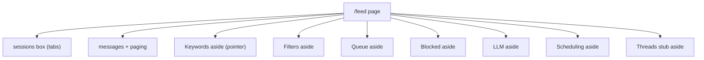
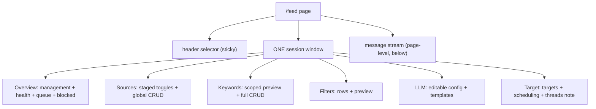

# Feed sessions (`/feed`)

**What a session is, in plain words:** a named bundle of rules that decides
which incoming news gets posted automatically. It holds which channels to
watch, which words to look for, which words block a message, how to clean
up each channel's text, whether the automatic writer rewrites, and where
the result gets posted. You pick one session, it works; you switch
sessions, another set of rules works. Sessions can be saved as reusable
starting templates.

**The rule this file defines:** a session is a **header selector** plus
**one window with six tabs** — `Overview|Sources|Keywords|Filters|LLM|Target`.
Everything session-scoped lives inside those tabs. Nothing session-scoped
lives beside them.

## Header selector + window (already built)

- **Header picker** (`apps/frontend/src/widgets/feed-sessions/ui/feed-sessions-section.tsx:107`,
  `sessions-header`): `Session [name dropdown]` with a green/red dot per
  session (`●` active, `○` inactive at lines 119-124), the template name
  (`template: <name>|Ad-hoc` at lines 125-130), and the
  active/can-publish badges (lines 131-137). Sticky (`sticky top-0`, line 109).
- **Tab menu** (`feed-sessions-section.tsx:140`, `sessions-menu`): the six
  folders, sticky below the header (line 143). Switching sessions or tabs
  with unsaved changes asks first (lines 57-87, `confirmDiscard`).
- **Window** (`apps/frontend/src/widgets/feed-sessions/ui/session-window.tsx:184`,
  `session-window`): name editor with lowercase validation + `Unsaved
changes` flag + Save/Delete/Activate-Deactivate (lines 186-251,
  `handleSave` at 107-120), then the template bar — save-as/overwrite/load
  with confirms, delete behind a confirm (lines 253-315, snapshot at
  144-155, `applyTemplateToDraft` at 36-53). The active tab's panel renders
  below (lines 317-329).
- **Recent with badges** (`apps/frontend/src/widgets/feed-sessions/ui/recent-with-badges.tsx:98`,
  `RecentWithBadges`, rendered at `feed-sessions-section.tsx:185`): the 20
  newest messages, each with a coloured badge saying what the rules think
  of it (badge at lines 21-36), click Details for the reasons (modal at
  lines 61-96). Lives between the tab menu and the window — part of the
  session block, not a tab.
- **Tab ids** (`apps/frontend/src/widgets/feed-sessions/ui/session-tabs.tsx:24`):
  `SESSION_TABS = overview|sources|keywords|filters|llm|target`. Panels are
  chosen in `SessionTabPanels` (`session-tabs.tsx:751`).

## The six tabs — purpose in plain words

| Tab      | Purpose (plain words)                                                                     | What it holds today (file:line)                                                                                                                                                                                                                                                                                                                                                                                                  |
| -------- | ----------------------------------------------------------------------------------------- | -------------------------------------------------------------------------------------------------------------------------------------------------------------------------------------------------------------------------------------------------------------------------------------------------------------------------------------------------------------------------------------------------------------------------------- |
| Overview | Who this session is and whether it works. Create/select sessions, see health at a glance. | `SessionManagementPanel` (create + list + activate/deactivate + delete, `session-tabs.tsx:439`, impl `session-management-panel.tsx:28`), status badges active/consuming/can-publish (`session-tabs.tsx:446`), staged flag switches (`FlagSwitches`, `session-tabs.tsx:80`), clickable target rows that jump to Target (`session-tabs.tsx:459`), queue summary + stats strip (`QueueSummary`, `session-tabs.tsx:365`)             |
| Sources  | Which channels this session watches.                                                      | Global source list with per-session staged toggles (`SourcesTab`, `session-tabs.tsx:112`; `useProfileSources` at `use-feed-sessions.ts:140`), `Manage global sources` button opening `ManageFeedSourcesModal` (`session-tabs.tsx:134`), `staged` marker for unsaved flips (`session-tabs.tsx:154`). Toggles flip the draft only — one Save PATCHes the session (`session-window.tsx:107`).                                       |
| Keywords | Which words select a message and which words block it.                                    | Scoped preview tables: allowed filtered by session `keywordIds`, blocked by session sources, compound AND-groups (`KeywordsTab`, `session-tabs.tsx:241`; `splitKeywordGroups` + `paginate` at lines 266-288), staged flag switches (line 298), full CRUD via `KeywordsSection` (`filterIds`, line 351) + `BlacklistManager` (`filterSourceIds`, line 355). Listens for `open-session-keywords` (`feed-sessions-section.tsx:43`). |
| Filters  | How to clean up each channel's text before matching.                                      | Channel picker (`filters-channel-select`, `session-tabs.tsx:608`), per-filter rows with on/off + `outside session scope` note (`session-tabs.tsx:625`), `Preview with latest message` dry-run with RAW/filtered badge (`session-tabs.tsx:665`; `useFiltersPreview` at `use-feed-sessions.ts:214`). Hooks: `useChannelFilters` (`use-feed-sessions.ts:193`), `useToggleChannelFilter` (`:202`).                                   |
| LLM      | Which automatic writer is used and whether it may rewrite or post.                        | Read-only config grid today (`LlmTab`, `session-tabs.tsx:693`; `useProfileLlm` at `use-feed-sessions.ts:233`): default template, target channel, llm/publishing switches, reject-non-latin, daily cap, max attempts, pipeline mode. Staged flag switches on top (line 719). Editable forms live beside the tabs today (see migration table) and move here.                                                                       |
| Target   | Where finished posts go.                                                                  | Telegram targets + Threads targets lists, empty = dashboard-only mode (`TargetTab`, `session-tabs.tsx:504`; rows `target-row-telegram-*` at 535, `target-row-threads-*` at 554), consuming/can-publish badges + staged switches (lines 515-523). Template bots API exists but is NOT wired (no UI calls it yet).                                                                                                                 |

## Migration table — every current `/feed` section mapped

Source of "today": `apps/frontend/src/pages/feed/index.tsx` (601 lines).
"Proposed" files already exist — the move is markup relocation, not new
data plumbing.

| #   | Current section (today)                                                                                                                                                                    | Proposed home                                                                                                                                                                                                                                                               | Status           |
| --- | ------------------------------------------------------------------------------------------------------------------------------------------------------------------------------------------ | --------------------------------------------------------------------------------------------------------------------------------------------------------------------------------------------------------------------------------------------------------------------------- | ---------------- |
| 1   | `FeedSessionsSection` at top (`index.tsx:138`) — picker + six tabs + window + recent                                                                                                       | Stays. It IS the session block (`feed-sessions-section.tsx:19`).                                                                                                                                                                                                            | Done             |
| 2   | Header `Feed` title + `Manage Sources` button (`index.tsx:140-154`) + `ManageFeedSourcesModal` (`index.tsx:156`)                                                                           | Button retires; the modal is already reachable inside Sources (`sources-manage-button`, `session-tabs.tsx:134`). Title stays page-level.                                                                                                                                    | To do            |
| 3   | Stat cards: active/total sources, messages 24h (`index.tsx:163-188`, from `useFeedSources`/`useFeedMessages`)                                                                              | Overview tab summary row (counts already feed `QueueSummary`'s `N session keyword(s) · M entries` line, `session-tabs.tsx:381`).                                                                                                                                            | To do            |
| 4   | Source filter dropdown + message search (`index.tsx:190-213`)                                                                                                                              | Stay page-level with the message stream (they drive the stream, not a session).                                                                                                                                                                                             | Keep (not a tab) |
| 5   | Phrase search (`index.tsx:215-276`, `useSearchPhrases` at `use-phrases.ts:23`)                                                                                                             | Keywords tab (it searches keywords + blacklist; results chips KW/BL at `index.tsx:249`).                                                                                                                                                                                    | To do            |
| 6   | Recent messages + album grouping + paging (`index.tsx:278-476`, `msgPerPage = 10` at `:113`, controls at `:451`) + `Lightbox` (`:478`)                                                     | Stay page-level below the session block (the newsroom reading surface; endless-scroll plan in `feed.md` owns this).                                                                                                                                                         | Keep (not a tab) |
| 7   | Keywords moved-notice + `Open Session → Keywords` button (`index.tsx:488-517`, dispatches `open-session-keywords` at `:506`)                                                               | Already a pointer, not content. Delete when §5 lands; Keywords tab is the content (`session-tabs.tsx:241`).                                                                                                                                                                 | Delete after §5  |
| 8   | Content Filters aside (`index.tsx:519-535`, `ContentFilterManager` at `content-filter-manager.tsx:32`)                                                                                     | Filters tab (`session-tabs.tsx:568`) — same rows + preview, session-scoped. Aside deletes.                                                                                                                                                                                  | To do            |
| 9   | Queue aside (`index.tsx:537-549`: `MatchingToggleButton` at `matching-toggle-button.tsx:11`, `FeedQueueStatsStrip` at `feed-queue-stats-strip.tsx:8`, `QueueView` at `queue-view.tsx:423`) | Overview tab: stats strip + queue list already there via `QueueSummary` (`session-tabs.tsx:365`); full `QueueView` rows + `DetailsModal` (`queue-view.tsx:69`) move in beside it. Matching switches already there as `FlagSwitches` (`session-tabs.tsx:80`). Aside deletes. | To do            |
| 10  | Blocked aside (`index.tsx:551-561`, `BlockedPostsList` at `blocked-posts-list.tsx:49`)                                                                                                     | Overview tab next to the queue (blocked = a queue status; `QueueSummary` badges already tone BLOCKED amber at `session-tabs.tsx:400`). Aside deletes.                                                                                                                       | To do            |
| 11  | LLM Configuration aside (`index.tsx:563-574`: `LlmConfigForm` at `llm-config.tsx:95`, `PromptTemplates` at `prompt-templates.tsx:474`)                                                     | LLM tab (`session-tabs.tsx:693`) — editable forms replace the read-only grid. Aside deletes.                                                                                                                                                                                | To do            |
| 12  | Scheduling aside (`index.tsx:576-587`: `SchedulingManager` at `scheduling-manager.tsx:1022`, `SchedulingRotationConfigForm` at `scheduling-rotation-config-form.tsx:26`)                   | Target tab (planned posts + rotation = when the target posts). Aside deletes.                                                                                                                                                                                               | To do            |
| 13  | Threads stub aside (`index.tsx:589-596`, `FeedThreadsStubSection` at `feed-threads-stub-section.tsx:11`, 501 `THREADS_NOT_IMPLEMENTED`)                                                    | Target tab under Threads targets (placeholder note until the v2 contract). Aside deletes.                                                                                                                                                                                   | To do            |

Orphan check: all 13 sections mapped — 1 done, 3 keep page-level
(4, 6 + the `Feed` title in 2), 1 pointer deleted after its target lands
(7), 8 relocated into tabs (2-partial, 3, 5, 8, 9, 10, 11, 12, 13). No
section is left without a home.

## Routes and APIs per tab

Single route: `/feed` (`routes.tsx:32`). Two old addresses redirect here:
`/profiles` and `/crypto-news` (`routes.tsx:33-34`). No per-tab routes —
tabs are window state (`useState<SessionTab>('overview')`,
`feed-sessions-section.tsx:23`), deep-linking is future work.

Feed-publisher path builder: `shared/api/feed-publisher-base.ts`
(`feedPublisherPath`, prefix `/feed-api`); all paths centralized in
`ENDPOINTS.feedPublisher` (`shared/api/endpoints.ts:170`).

| Tab      | What it reads / writes                                                                                                                                                                                                                                                                                                                                                                                                                                                                                                                | Polling / shape                         |
| -------- | ------------------------------------------------------------------------------------------------------------------------------------------------------------------------------------------------------------------------------------------------------------------------------------------------------------------------------------------------------------------------------------------------------------------------------------------------------------------------------------------------------------------------------------- | --------------------------------------- |
| All tabs | Sessions CRUD + activate/deactivate (`GET/POST/PATCH/DELETE /feed-api/api/sessions`, `POST …/:id/activate`, `POST …/:id/deactivate` — `endpoints.ts:186`; fetchers `feed-session-queries.ts:251`; hooks `useProfiles`/`useCreateProfile`/`useUpdateProfile`/`useActivateProfile`/`useDeactivateProfile`/`useDeleteProfile` at `use-feed-sessions.ts:35,83,91,100,108,116`); templates save/load/delete (`/feed-api/api/content-templates` — `endpoints.ts:198`; `feed-session-queries.ts:319`; hooks at `use-feed-sessions.ts:43-68`) | Lists poll via hooks, mutations refetch |
| Overview | Queue summary (`GET /feed-api/api/queue?limit=50` — `endpoints.ts:222`; `fetchFeedSessionQueue` at `feed-session-queries.ts:424`; `useProfileQueue` at `use-feed-sessions.ts:185`) + stats strip (`GET /feed-api/api/queue/stats` — `endpoints.ts:177`)                                                                                                                                                                                                                                                                               | Queue 10 s                              |
| Sources  | Session sources (`GET …/api/sessions/:id/sources` — `endpoints.ts:195`; `useProfileSources` at `use-feed-sessions.ts:140`) + global feed sources (`GET /ingestion-api/feed/sources?type=crypto-news` — `feed-queries.ts:120`; `useFeedSources` at `use-feed.ts:40`) + add/toggle/delete source clients (`features/manage-feed-sources/api/*`)                                                                                                                                                                                         | Sources on demand                       |
| Keywords | Allowed (`GET /feed-api/feed-publisher/keywords` — `endpoints.ts:203`; `usePublisherKeywords` at `use-feed-sessions.ts:169`) + blocked (`GET /feed-api/feed-publisher/blacklist` — `endpoints.ts:206`; `usePublisherBlacklist` at `:177`) + phrase search/conflict-check (`useSearchPhrases`/`useCheckConflict` at `use-phrases.ts:23,31`); per-message check (`GET …/matching/messages/:channelId/:messageId/status`, `POST …/matching/evaluate` — `endpoints.ts:227,230`; `useMessageStatus` at `use-feed-sessions.ts:156`)         | Phrases poll 10 s                       |
| Filters  | List/toggle per channel + server preview (`GET /feed-api/feed-publisher/sources/:channelId/filters`, `…/filters/:id/toggle`, `…/filters/preview` — `endpoints.ts:208`; `useChannelFilters`/`useToggleChannelFilter`/`useFiltersPreview` at `use-feed-sessions.ts:193,202,214`); legacy CRUD (`fetchFilters`/`createFilter`/`updateFilter`/`deleteFilter`/`toggleFilter` at `feed-queries.ts:136-177`)                                                                                                                                 | On demand + manual preview              |
| LLM      | Config + flags + models + templates + preview (`GET /feed-api/api/llm/{config,flags,models,templates,preview}` — `endpoints.ts:232`; `fetchFeedSessionLlmConfig`/`fetchFeedSessionPipelineFlags` at `feed-session-queries.ts:432,438`; `useProfileLlm` at `use-feed-sessions.ts:233`); matching config (`GET /feed-api/feed-publisher/matching/config` — `endpoints.ts:224`); `MatchingToggleButton` start/stop (`matching-toggle-button.tsx:11`)                                                                                     | On demand                               |
| Target   | Targets ride the session view (`telegramTargets`/`threadsTargets` on `FeedSessionView`, clicked through Overview rows at `session-tabs.tsx:469-493`); scheduling/ads + rotation + media library (`GET /scheduling-api/api/scheduling/{ads,rotation-config}` + `/media/library` — `endpoints.ts:241`; owned by publishing-queue, see §PROXY); threads root 501 (`GET /feed-api/api/threads` — `endpoints.ts:274`)                                                                                                                      | Scheduling poll 10 s                    |

Page-level (not tabs): messages + media from the env's own
ingestion-telegram (`GET /ingestion-api/feed/messages?limit=…&type=crypto-news`
at `feed-queries.ts:99`, `useFeedMessages` at `use-feed.ts:24`, 15 s;
`GET /ingestion-api/media/:channelId/:messageId/:index`).

## Deprecation of standalone sections

1. The sidebar `Keywords` aside (`index.tsx:488`) is already a
   moved-notice (`keywords-moved-notice`, `:495`) — delete it once the
   phrase search (§5) lands in the Keywords tab. The `KeywordsManager`
   barrel export stays `@deprecated` (no page renders it).
2. The standalone Content Filters / Queue / Blocked / LLM / Scheduling /
   Threads asides (`index.tsx:519-596`) are marked for deletion at the
   tab cutover: each gets `@deprecated` pointing at its tab as soon as
   its content renders inside the window, both live side by side for one
   release at most, then the aside is deleted.
3. The header `Manage Sources` button (`index.tsx:147`) retires with §2 —
   `sources-manage-button` (`session-tabs.tsx:134`) is the replacement.
4. `pages/profiles/index.tsx` stays a deprecated `<Navigate to="/feed">`
   stub; legacy `Profile*` names in `entities/feed-session` stay as
   `@deprecated` aliases (`feed-session-queries.ts:495-555`; hooks still
   named `useProfiles`/`useProfile*`, rename pending).
5. The page buttons (`msgPage`, `msgPerPage`, Previous/Next at
   `index.tsx:49,113,451`) belong to the `feed.md` endless-scroll plan,
   not to sessions — untouched by this file.

## Diagrams

### Today — scattered

Nine blocks on one page: the session window holds six tabs, but the same
concepts (keywords, filters, queue, LLM) are repeated as standalone
asides below it. Two sources of truth for one session.

### Proposed — tabbed

One window, six tabs, zero duplicate asides. The message stream stays
below as the page-level reading surface.

> Two old addresses send you here automatically: `/profiles` and
> `/crypto-news`. They exist only so old saved links do not break.
