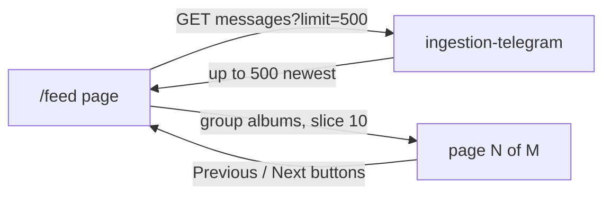
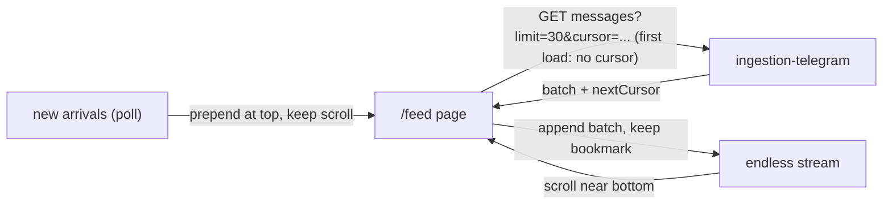

# Newsroom (`/feed`)

**What it is for:** the biggest screen. Reading incoming news messages,
choosing which ones get posted automatically, and setting the rules for
that.

**What you see (top to bottom):**

- **Work sessions box:** a picker at the top lets you choose which work
  session is active. A session is a bundle of rules (which channels to
  watch, which words to look for, where to post, whether the automatic
  writer is on). You can create a new session, open one, save its rules
  as a reusable starting template, turn it on or off, or delete it. The
  session window has six folders: Overview, Sources, Words, Filters,
  Writer, Target.
- **Messages:** the newest incoming news messages with pictures, which
  channel each came from, and a search box. Long messages can be
  unfolded. Pictures open full-screen with arrow keys to move between
  them.
- **Waiting line:** messages that matched the rules and are waiting to
  be posted, with their state (waiting, scheduled, posting, posted,
  failed, blocked) and a button to cancel one.
- **Schedules and ads:** planned posts and adverts, when each goes out,
  and the photo library they use.
- **Word lists:** the watchwords that select messages, the must-appear-
  together word groups, and the banned words that block a message.
- **Writer settings:** which automatic writer is used, its instructions,
  and three on/off switches: keep looking for matches, let the writer
  rewrite, allow posting.

**Trips you can take here:**

- _View the feed:_ open the screen → scroll the messages → click a
  picture to see it big.
- _Manage sessions:_ open the screen → pick a session from the picker →
  change its words or channels → press Save → press Activate so it
  starts working.
- _Set up automatic posting:_ pick a session → add watchwords in the
  Words folder → choose the target channel in the Target folder → turn
  on all three switches.

## Current state: pages of 10 (being replaced)

Today the message list works like a book with pages. The screen asks
for up to 500 messages at once, groups photo albums together so each
article counts as one, then shows 10 at a time with
Previous / page-number / Next buttons at the bottom. Changing the
channel filter or the search text jumps back to page 1.

Where this lives in the code:

- Fetch: `apps/frontend/src/entities/feed/api/feed-queries.ts:99`
  (`fetchFeedMessages`, asks for `limit`, optional `channelId`, `type`).
- Auto-refresh: `apps/frontend/src/entities/feed/model/use-feed.ts:24`
  (`useFeedMessages`, re-asks every 15 seconds).
- Page buttons and page math:
  `apps/frontend/src/pages/feed/index.tsx:113`
  (`msgPerPage = 10`, `msgTotalPages`, `pagedGroups`) and
  `apps/frontend/src/pages/feed/index.tsx:451`
  (Previous / `N / M` / Next controls).
- Page memory: `apps/frontend/src/pages/feed/index.tsx:49`
  (`msgPage` state, reset on filter/search change at lines 124-130).
- Photo-album grouping: `apps/frontend/src/pages/feed/index.tsx:75`
  (messages sharing a `groupedId` merge into one article before paging).

Why this goes away: page buttons break the reading flow (you lose your
place every time you turn the page), and asking for 500 messages just
to show 10 wastes the trip. The agreed decision is **endless scroll
with a bookmark** (infinite scroll, no pages at all).

## Proposed: endless scroll with a bookmark

Instead of pages, the list grows as you scroll down, like any chat or
social feed. The screen remembers a bookmark (a cursor: the oldest
message already shown) and asks for "the next batch older than this
bookmark". New arrivals appear at the top without moving what you are
reading.

What the new screen looks like (top to bottom):

1. **Sticky work-sessions bar, always visible.** The session picker
   header (`apps/frontend/src/widgets/feed-sessions/ui/feed-sessions-section.tsx:107`)
   and the six-folder menu
   (`apps/frontend/src/widgets/feed-sessions/ui/feed-sessions-section.tsx:140`)
   stay pinned to the top while the messages scroll underneath, so you
   can switch sessions or folders without scrolling back up.
2. **Session section on top.** The sessions box
   (`apps/frontend/src/widgets/feed-sessions/ui/feed-sessions-section.tsx:19`,
   `FeedSessionsSection`) keeps living at the top of `/feed`: picker +
   template name + session window + management inside the Overview
   folder. Nothing about sessions moves; only the messages below it
   change.
3. **Recent messages stream with status badges.** The session window
   already shows a short recent list where every message carries a
   coloured badge telling you what the rules think of it
   (`apps/frontend/src/widgets/feed-sessions/ui/recent-with-badges.tsx:98`,
   `RecentWithBadges`, 20 newest, badge per message at lines 10-36,
   click Details for the reasons at lines 38-96). The main message
   stream below adopts the same pattern: each article shows its status
   badge inline (waiting, matched, blocked, posted…), so you can see at
   a glance which messages the rules picked without opening the waiting
   line.
4. **One endless message stream, no page buttons.** Scrolling near the
   bottom automatically asks for the next older batch (using the
   bookmark). A small "loading more…" row appears while the next batch
   travels. When there is nothing older, the list says "You are all
   caught up" instead of showing an empty Next button.

Rules of the new stream (plain words):

- New messages slide in at the top; your scroll position stays where
  it was (the list never yanks you upward while reading).
- The channel filter and the search box keep working; changing either
  restarts the stream from the newest (bookmark cleared).
- Photo albums still count as one article (same `groupedId` merge as
  today, applied per batch).
- Unfolding a long message ("Show more") still works per article.

## Data flow

### Today (pages)

### Proposed (endless scroll)

## Routes and places the screen talks to

| What the screen shows or does                    | Where it gets it from                                                                                                                              | Status                                                        |
| ------------------------------------------------ | -------------------------------------------------------------------------------------------------------------------------------------------------- | ------------------------------------------------------------- |
| Messages (today: one big batch)                  | `GET /ingestion-api/feed/messages?limit=500&type=crypto-news`                                                                                      | Current, replaced below                                       |
| Messages (new: endless batches)                  | `GET /ingestion-api/feed/messages?limit=30&type=crypto-news&cursor=<bookmark>` → `{ data, nextCursor }`                                            | Proposed (new `cursor` + `nextCursor`; backend work required) |
| Channels                                         | `GET /ingestion-api/feed/sources?type=crypto-news`                                                                                                 | Unchanged                                                     |
| Pictures and videos                              | `GET /ingestion-api/media/:channelId/:messageId/:index`                                                                                            | Unchanged                                                     |
| Per-message rule badge                           | `GET /feed-api/feed-publisher/matching/messages/:channelId/:messageId/status`                                                                      | Unchanged (already used by the recent list)                   |
| Sessions (open, create, turn on/off, delete)     | `GET/POST/PATCH/DELETE /feed-api/api/sessions`, `POST /feed-api/api/sessions/:id/activate`, `POST /feed-api/api/sessions/:id/deactivate`           | Unchanged                                                     |
| Reusable starting templates (save, open, delete) | `GET/POST/DELETE /feed-api/api/content-templates`                                                                                                  | Unchanged                                                     |
| Waiting line                                     | `GET /feed-api/api/queue`, `GET /feed-api/api/queue/stats`                                                                                         | Unchanged                                                     |
| Watchwords / banned words in a session           | `GET /feed-api/feed-publisher/keywords`, `GET /feed-api/feed-publisher/blacklist`                                                                  | Unchanged                                                     |
| Per-channel clean-up rules                       | `GET /feed-api/feed-publisher/sources/:channelId/filters`, `GET /feed-api/feed-publisher/sources/:channelId/filters/preview`                       | Unchanged                                                     |
| Check one message against the rules              | `GET /feed-api/feed-publisher/matching/messages/:channelId/:messageId/status`, `POST /feed-api/feed-publisher/matching/evaluate`                   | Unchanged                                                     |
| Matching on/off                                  | `GET /feed-api/feed-publisher/matching/config`                                                                                                     | Unchanged                                                     |
| Writer settings + on/off switches                | `GET /feed-api/api/llm/config`, `GET /feed-api/api/llm/flags`, `GET /feed-api/api/llm/models`, `GET /feed-api/api/llm/templates`                   | Unchanged                                                     |
| Planned posts, ads, photo library                | `GET /scheduling-api/api/scheduling/ads`, `GET /scheduling-api/api/scheduling/rotation-config`, `GET /scheduling-api/api/scheduling/media/library` | Unchanged                                                     |

Notes on the new row: the bookmark (`cursor`) and the reply bookmark
(`nextCursor`) do not exist yet — today the ingestion side only
understands `limit` (default 50, max 200) and `type`
(`apps/ingestion-telegram/src/feed/api/http/feed.controller.ts:115`).
The frontend can ship the endless scroll first (bookmark = oldest shown
message id, asked with the existing `limit`), and the server-side
`cursor`/`nextCursor` lands as a follow-up without changing the screen
again.

## Goodbye plan for the page buttons

1. The page state (`msgPage`), the page math (`msgPerPage`,
   `msgTotalPages`, `pagedGroups`), and the Previous/Next bar in
   `apps/frontend/src/pages/feed/index.tsx` get marked `@deprecated`
   (pointing at the endless stream) as soon as the new stream renders
   behind them.
2. Both live side by side for one release at most: the endless stream
   is the default, the page buttons stay only as a fallback switch.
3. At cutover the page state, the page math, and the Previous/Next bar
   are deleted, and the fetch call drops from `limit=500` to small
   batches (`limit=30` per scroll trip).

## Small touches that keep it light (minimalist)

- **Loading placeholder rows:** while the first batch travels, show a
  few grey shimmer rows shaped like articles (no spinner in the middle
  of the screen). Same for the "loading more…" row at the bottom.
- **Back-to-top button:** a small floating button appears once you
  scrolled past a few batches; one tap returns to the newest messages
  (and to the sticky sessions bar).
- **Pause-live switch:** a tiny "pause new arrivals" toggle freezes
  prepending at the top while you read (new ones wait behind a "3 new
  ↓" pill); turning it off slides them in. Reading never jumps.
- **Only render what is on screen:** once the stream grows past a few
  hundred articles, rows far above the viewport are swapped for
  placeholders of the same height (virtualize beyond ~300). Scrolling
  back up re-renders them instantly.

> Two old addresses send you here automatically: `/profiles` and
> `/crypto-news`. They exist only so old saved links do not break.
